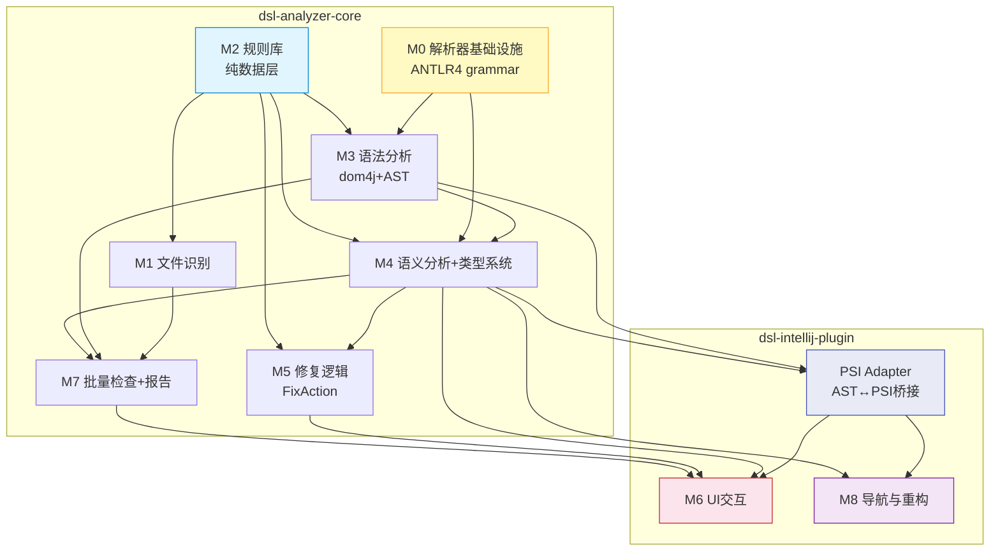
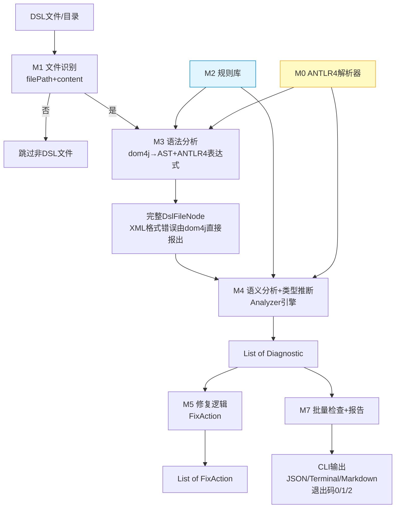
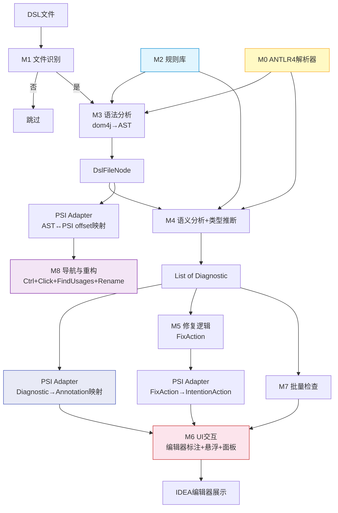

# 主题引擎DSL静态分析工具 - 软件架构总览

## 1. 架构设计原则

| # | 原则 | 定义 | 适用层级 |
|---|---|---|---|
| 1 | 高内聚低耦合 | 每个模块职责单一，内部功能紧密相关，模块间通过明确接口交互 | 全局 |
| 2 | 单一职责 | 每个模块只负责一个功能领域，变更原因唯一 | 全局 |
| 3 | 数据驱动+声明式规则 | 规则库为纯数据层，检测引擎通过规则数据驱动；新增检测逻辑通过constraints声明式条件实现，无需编写Analyzer代码 | 全局 |
| 4 | Core-Plugin隔离 | Core层无IDEA SDK依赖，CLI jar只打包core包；Plugin层依赖IDEA SDK+core层；编译期扫描core包内无com.intellij import | 全局 |
| 5 | 解析工具分层 | XML结构解析使用dom4j（不使用ANTLR4）；DSL表达式和规则DSL条件解析使用ANTLR4；纯字面量属性不走解析器 | Core层 |
| 6 | 原生集成 | UI模块复用IDEA原生交互模式与API（Annotator、DocumentationProvider、ToolWindow等） | Plugin层 |
| 7 | Core同步+Plugin事件 | Core层为同步分析管线，模块间通过接口方法调用；Plugin层保留Dispatcher事件机制用于UI刷新通知（M7→M6、M5-UI→M6） | 分层适用 |

## 2. 项目结构

```
feature/analysis/src/main/java/com/huawei/theme/analysis/
├── core/                       ← 无IDEA依赖，CLI jar只打包这部分
│   ├── shared/                  ← 跨模块共享数据模型
│   │   ├── ast/                 ← AST节点层级（M3产出，M4消费） + ExpressionAstNode接口 + ExpressionKind枚举
│   │   ├── type/                ← 类型系统层级（DslNumberType/DslStringType/DslArrayType）
│   │   └── diagnostic/          ← 诊断数据模型（跨模块共享） + DiagnosticSeverityAdapter
│   ├── expression/             ← M0: 表达式解析基础设施 + ExpressionNode + FunctionSignatureLibrary接口
│   ├── ruledsl/                ← M0: 规则DSL求值器 + EvaluationContext
│   ├── function/               ← M0: 函数签名库实现（JSON加载 + 索引构建，骨架阶段占位）
│   ├── fileidentification/     ← M1: DSL文件识别
│   ├── rulelibrary/            ← M2: 规则数据模型 + JSON加载 + RuleRepository
│   ├── syntaxanalysis/         ← M3: dom4j XML解析 + AST构建 + 语法错误
│   ├── semanticanalysis/       ← M4: 语义分析引擎 + 符号表 + DiagnosticProvider接口
│   ├── quickfix/               ← M5: 修复逻辑（纯文本操作描述）
│   ├── batchinspection/        ← M7: 批量扫描 + 报告导出
│   └── cli/                    ← CLI入口（不在模块总览中展示）
│
├── plugin/                     ← 依赖IDEA SDK + 依赖core层
│   ├── psiadapter/             ← PSI Adapter: DslAst ↔ PsiElement 双向桥接
│   ├── navigation/             ← M8: PsiReference + 跳转 + 查找引用 + 重命名
│   ├── ui/                     ← M6: Annotator + DocumentationProvider + ToolWindow + 右键菜单
│   ├── quickfixui/             ← M5-UI: IntentionAction桥接 + 候选对话框 + diff预览
│   └── language/               ← DslLanguage + DslParserDefinition注册
│
feature/analysis/src/main/resources/
├── rules/                      ← 规则库JSON文件
├── functions/                  ← 函数签名库JSON文件
└── META-INF/plugin.xml         ← IDEA插件配置（仅plugin层需要）
```

**构建策略**：
- CLI jar：自定义Gradle task，只打包core/**，排除plugin/**，不含IDEA SDK依赖。依赖dom4j+GSON+ANTLR4 runtime打包为fat jar。
- IDEA插件：标准intellij plugin build，包含全部代码（core+plugin）。
- 隔离保障：Gradle task扫描core包内无com.intellij import，编译期验证。

## 3. 模块总览

### dsl-analyzer-core（7个模块）

| 模块 | 职责 | 核心定位 | 子文档 |
|---|---|---|---|
| M0 解析器基础设施 | ANTLR4 grammar + 表达式解析器 + 规则DSL解析器 + 函数签名库 | 解析层基础设施 | [M0-ParserInfrastructure.md](architecture/M0-ParserInfrastructure.md) |
| M1 文件识别 | DSL文件识别与过滤（双重识别：扩展名+根元素标签） | 基础设施 | [M1-FileIdentification.md](architecture/M1-FileIdentification.md) |
| M2 规则库 | 规则条目存储+查询+声明式约束条件数据 | 纯数据层 | [M2-RuleLibrary.md](architecture/M2-RuleLibrary.md) |
| M3 语法分析 | dom4j XML解析+独立AST构建+ANTLR4表达式嵌入+语法错误检测 | 编译器前端 | [M3-SyntaxAnalysis.md](architecture/M3-SyntaxAnalysis.md) |
| M4 语义分析与类型系统 | 语义检查+类型推断+符号表+函数签名验证+约束检查+规则DSL解释器执行 | 编译器后端 | [M4-SemanticAnalysis.md](architecture/M4-SemanticAnalysis.md) |
| M5 修复逻辑 | 修复策略生成（纯文本操作描述FixAction，无UI，无PsiElement依赖） | 修复引擎 | [M5-QuickFix.md](architecture/M5-QuickFix.md) |
| M7 批量检查与报告 | 批量扫描+报告导出（JSON/Markdown/Terminal） | 批量分析引擎 | [M7-BatchInspection.md](architecture/M7-BatchInspection.md) |

### dsl-intellij-plugin（3个模块）

| 模块 | 职责 | 核心定位 | 子文档 |
|---|---|---|---|
| PSI Adapter | DslAst ↔ PsiElement双向桥接（offset映射+Diagnostic转换） | Core-Plugin桥梁 | [PSI-Adapter.md](architecture/PSI-Adapter.md) |
| M6 UI交互 | 编辑器标注+悬浮提示（含变量信息）+诊断面板+右键菜单+Quick Fix交互UI | IDEA集成层 | [M6-UIInteraction.md](architecture/M6-UIInteraction.md) |
| M8 导航与重构 | PsiReference+跳转定义+查找引用+重命名重构 | IDEA导航层 | [M8-Navigation.md](architecture/M8-Navigation.md) |

**M5-UI说明**：M5的Plugin层交互UI（IntentionAction桥接+候选对话框+diff预览）归属于M6 UI交互模块的Quick Fix交互部分，不单独成模块。原因：Quick Fix UI是IDEA交互能力，与M6其他UI共享Annotator注册通道，且FixAction→IntentionAction桥接逻辑量小，不值得独立模块。

## 4. 模块依赖关系



**依赖规则**：

| 模块 | 上游依赖 | 说明 |
|---|---|---|
| M0 | 无 | ANTLR4解析器基础设施，无上游依赖 |
| M1 | M2 | 从RuleRepository获取合法根元素名称集合 |
| M2 | 无 | 纯数据层，无上游依赖 |
| M3 | M0+M2 | M0提供表达式解析器，M2提供合法元素名+AttrTypeSpec |
| M4 | M0+M2+M3 | M0提供规则DSL解析器，M2提供规则+约束条件，M3提供AST；内含类型推断引擎+符号表+函数签名库 |
| M5 | M2+M4 | M2提供修复建议数据，M4提供诊断+符号表 |
| M7 | M1+M2+M3+M4 | 组合全管线 |
| PSI Adapter | M3+M4 | M3提供AST用于offset映射，M4提供符号表用于引用定位 |
| M6 | PSI Adapter+M4+M5+M7 | PSI Adapter桥接所有core数据，M4诊断、M5修复注册、M7批量检查触发 |
| M8 | PSI Adapter+M4 | PSI Adapter桥接符号解析，M4符号表 |

**Core层依赖链**：M0/M2(无依赖) → M1 → M3 → M4 → M5 → M7(组合入口)
**Plugin层依赖链**：PSI Adapter → M6/M8(终端交互层)
**隔离保障**：Plugin层所有模块通过PSI Adapter间接访问Core层，不直接依赖Core内部实现。

## 5. 三层划分说明

每个模块内部按功能完整程度划分三层：

| 层级 | 定义 | 交付要求 |
|---|---|---|
| **Core** | 核心必选功能，模块存在的最小可行集 | MVP必须交付 |
| **Extension** | 功能扩展，增强Core的完整度和实用性 | 正式版本交付 |
| **Optional** | 可选特性，锦上添花的高级功能 | 后续迭代交付 |

### dsl-analyzer-core 各模块三层概要

| 模块 | Core | Extension | Optional |
|---|---|---|---|
| M0 | DslExpression.g4 + DslRuleCondition.g4 + 自动生成代码 + 函数签名库JSON加载 | 函数签名库热更新 | 自定义运算符扩展 |
| M1 | 双重识别（扩展名+根元素标签） | FileType注册+自定义图标 | 用户可配置识别策略 |
| M2 | 数据模型+JSON加载+RuleRepository查询接口 | 缓存管理+热更新机制 | 规则编辑器UI接口（Plugin层实现） |
| M3 | dom4j解析→DslAstNode+语法错误检测+ANTLR4表达式嵌入 | 精细化Token类型+表达式缓存 | 自定义格式语法诊断输出 |
| M4 | 7个模式匹配Analyzer+Diagnostic模型+AnalyzerRegistry | TypeAnalyzer+SymbolTableBuilder+ConstraintAnalyzer | 继承链分析+重复ID检测+完整引用完整性 |
| M5 | 无需确认类FixAction | 需确认类FixAction（候选列表+diff预览描述） | 批量修复描述（同类型问题一键修复） |
| M7 | 批量扫描+Markdown报告导出 | JSON报告+Terminal输出 | 自定义报告模板+定时自动检查 |

### dsl-intellij-plugin 各模块三层概要

| 模块 | Core | Extension | Optional |
|---|---|---|---|
| PSI Adapter | DslPsiBridge offset双向映射+Diagnostic转换 | 缓存+增量映射更新 | 多文件映射管理 |
| M6 | Annotator标注+错误悬浮提示+诊断面板+右键菜单 | 变量信息悬浮+元素规则悬浮+Var声明悬浮+Quick Fix交互UI | 面板过滤/排序/搜索 |
| M8 | Ctrl+Click跳转定义(#varName/@varName→Var声明) | 查找所有引用+重命名重构 | 批量重命名预览 |

## 6. 模块间接口规范

### Core层接口

| 接口 | 提供方 | 消费方 | 功能概要 |
|---|---|---|---|
| `DslFileMatcher` | M1 | M7, CLI入口 | 判断文件是否为DSL文件（filePath+content参数） |
| `RuleRepository` | M2 | M1, M3, M4, M5, M7 | 提供规则条目查询、约束条件查询、根元素名称集合 |
| `DslAstProvider` | M3 | M4, M5, M7 | 提供独立AST访问，唯一方法 getDslAst(String filePath, String content) → DslFileNode |
| `DiagnosticProvider` | M4 | M5, M7 | 提供语义诊断结果（filePath → List&lt;Diagnostic&gt;） |
| `QuickFixProvider` | M5 | M7 | 提供FixAction修复策略（Diagnostic → List&lt;FixAction&gt;） |
| `BatchInspectionRunner` | M7 | CLI入口 | 提供批量检查执行入口（filePath/directoryPath → BatchInspectionResult） |
| `ReportExporter` | M7 | CLI入口 | 提供报告导出功能（BatchInspectionResult → JSON/Markdown/Terminal） |

### Plugin层接口

| 接口 | 提供方 | 消费方 | 功能概要 |
|---|---|---|---|
| `DslPsiBridge` | PSI Adapter | M6, M8, M5-UI | AST↔PSI双向映射：offset查找、Diagnostic→Annotation转换 |
| `PsiDslFileMatcherAdapter` | PSI Adapter | M6 | 将VirtualFile/PsiFile适配为DslFileMatcher的String参数 |

### 跨层接口（Core→Plugin桥接）

| Core接口 | Plugin桥接 | 桥接方式 |
|---|---|---|
| `DslFileMatcher` | `PsiDslFileMatcherAdapter` | VirtualFile/PsiFile → filePath+content |
| `DslAstProvider` | `DslPsiBridge` | DslAstNode → PsiElement (offset映射) |
| `DiagnosticProvider` | `DslPsiBridge.mapDiagnostic()` | Diagnostic(line+col) → PsiElement+offset |
| `QuickFixProvider` | `M5-UI IntentionAction桥接` | FixAction(TextRange) → WriteCommandAction(offset范围) |

**关键设计**：Core层所有接口使用纯字符串/基本类型参数（filePath, content, line, column），不依赖IDEA SDK类型。Plugin层通过Adapter/Bridge将IDEA类型转换为Core层参数。

## 7. 事件机制说明

**Core层：同步分析管线**

Core层模块间通过接口方法直接调用，不使用事件机制。分析管线为同步顺序执行：

```
文件输入 → M1识别 → M3构建AST → M4语义分析 → 产出Diagnostic列表
                                              → M5生成FixAction
                                              → M7组合报告
```

调用链清晰、无异步通知需求。CLI模式下单线程顺序执行，每步返回结果传递给下一步。

**Plugin层：Dispatcher事件机制**

Plugin层保留Dispatcher事件机制（基于IDEA SDK），用于UI刷新通知场景：

| 事件 | 发送方 | 接收方 | 触发时机 |
|---|---|---|---|
| `EventId.BATCH_INSPECTION_COMPLETED` | M7 Plugin触发器 | M6面板 | 批量检查完成，通知面板刷新 |
| `EventId.QUICK_FIX_EXECUTED` | M5-UI | M6标注 | Quick Fix执行完成，通知标注刷新 |

**事件不跨层**：Core层不发送也不接收Dispatcher事件。Plugin层的M7触发器和M5-UI在IDEA环境中发送事件，M6在IDEA环境中接收事件。

**为什么Core层不需要事件**：Core层的分析管线是确定性顺序流程——输入→AST→诊断→修复→报告，每步完成后自然传递给下一步，无需异步通知。事件机制仅在需要"某模块完成某操作后，通知另一个不直接调用的模块刷新UI"时才有价值，这个场景只存在于Plugin层。

## 8. 数据流总览

### CLI管线（Core层独立运行）



### IDEA Plugin管线（Core+Plugin协同）



### 两条管线对比

| 维度 | CLI管线 | Plugin管线 |
|---|---|---|
| 消费方 | CLI入口直接消费Diagnostic/FixAction/BatchInspectionResult | PSI Adapter桥接后由M6/M8/M5-UI消费 |
| 输入 | filePath+content（纯字符串） | VirtualFile/PsiFile（IDEA类型，经Adapter转换） |
| 输出 | JSON/Terminal/Markdown文本 + 退出码 | IDEA编辑器标注+悬浮+面板+导航+Quick Fix |
| 事件 | 无（同步管线） | Dispatcher事件（M7→M6, M5-UI→M6） |
| AST消费 | Core层直接消费DslAstNode | PSI Adapter映射为PsiElement后消费 |

## 9. 技术栈

| 技术 | 用途 | Core层 | Plugin层 |
|---|---|---|---|
| Java 17 | 开发语言 | ✓ | ✓ |
| Gradle 8.2 + gradle-intellij-plugin 1.13.3 | 构建工具 | ✓ | ✓ |
| dom4j 2.1.3 | XML结构解析 | ✓ | ✗ |
| ANTLR4 runtime | 表达式+规则DSL词法/语法分析 | ✓ | ✗ |
| GSON 2.9.0 | 规则库/函数签名库JSON反序列化 | ✓ | ✗ |
| Lombok 1.18.22 | @Data/@Builder数据模型简化 | ✓ | ✓ |
| IntelliJ Platform SDK | IDEA插件框架 | ✗ | ✓ |
| PSI API | 语法树交互（仅Plugin层桥接） | ✗ | ✓ |
| Annotator API | 实时标注 | ✗ | ✓ |
| LocalInspectionTool | 批量检查触发 | ✗ | ✓ |
| IntentionAction | Quick Fix注册 | ✗ | ✓ |
| ToolWindow API | 诊断面板 | ✗ | ✓ |
| PsiReference API | 导航与引用解析 | ✗ | ✓ |
| DocumentationProvider | 悬浮提示 | ✗ | ✓ |

dom4j/ANTLR4/GSON/Lombok打包进CLI fat jar，不依赖IDEA环境。IntelliJ SDK仅Plugin层使用，Core层编译期禁止import com.intellij.*

## 10. 相关文档

| 文档 | 说明 |
|---|---|
| [PRD.md](PRD.md) | 产品需求文档（双形态交付：CLI jar + IDEA插件） |
| [TDD.md](TDD.md) | 技术设计文档（10模块详细设计、接口签名、数据模型） |
| [DSL-Rule-Spec.md](DSL-Rule-Spec.md) | DSL规则规范、错误检测类型定义、规则库数据结构、声明式约束 |
| [UX-Design.md](UX-Design.md) | UX交互设计文档 |
| [Development-Plan.md](Development-Plan.md) | 开发计划与Phase划分 |
| [M0-ParserInfrastructure.md](architecture/M0-ParserInfrastructure.md) | M0解析器基础设施（待创建） |
| [M1-FileIdentification.md](architecture/M1-FileIdentification.md) | M1文件识别模块（待重构） |
| [M2-RuleLibrary.md](architecture/M2-RuleLibrary.md) | M2规则库模块（待重构） |
| [M3-SyntaxAnalysis.md](architecture/M3-SyntaxAnalysis.md) | M3语法分析模块（待重构） |
| [M4-SemanticAnalysis.md](architecture/M4-SemanticAnalysis.md) | M4语义分析与类型系统模块（待重构） |
| [M5-QuickFix.md](architecture/M5-QuickFix.md) | M5修复逻辑模块（待重构） |
| [M6-UIInteraction.md](architecture/M6-UIInteraction.md) | M6 UI交互模块（待重构） |
| [M7-BatchInspection.md](architecture/M7-BatchInspection.md) | M7批量检查与报告模块（待重构） |
| [M8-Navigation.md](architecture/M8-Navigation.md) | M8导航与重构模块（待创建） |
| [PSI-Adapter.md](architecture/PSI-Adapter.md) | PSI Adapter模块（待创建） |
