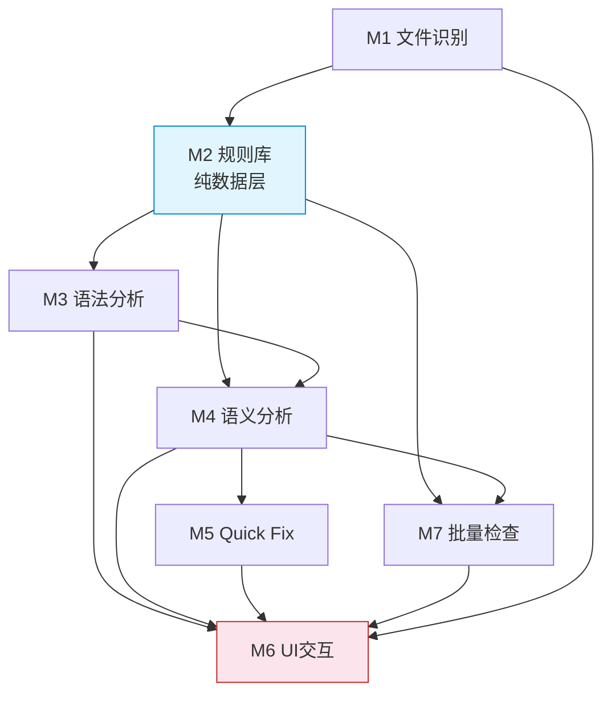
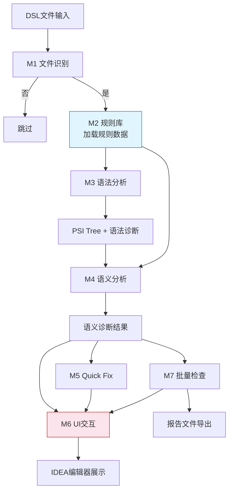

# 主题引擎DSL静态分析工具 - 软件架构总览

## 1. 架构设计原则

- **高内聚低耦合**：每个模块职责单一，内部功能紧密相关，模块间通过明确接口与Dispatcher事件交互
- **单一职责**：每个模块只负责一个功能领域，变更原因唯一
- **数据驱动**：规则库为纯数据层，检测引擎通过规则库数据驱动，不硬编码规则逻辑
- **可扩展性**：新增规则只需追加数据条目，新增检测类型只需实现Analyzer并注册
- **原生集成**：UI模块复用IDEA原生交互模式与API，不创造新的交互范式
- **事件驱动**：模块间异步通信通过Dispatcher事件机制，避免直接方法调用依赖

## 2. 模块总览

项目划分为7大功能模块，每个模块内部按Core/Extension/Optional三层划分：

| 模块 | 职责 | 核心定位 | 子文档 |
|---|---|---|---|
| M1 文件识别 | DSL文件识别与过滤 | 基础设施 | [M1-FileIdentification.md](architecture/M1-FileIdentification.md) |
| M2 规则库 | 规则条目定义与存储 | 纯数据层 | [M2-RuleLibrary.md](architecture/M2-RuleLibrary.md) |
| M3 语法分析 | Lexer/Parser/PSI Tree构建 | 编译器前端 | [M3-SyntaxAnalysis.md](architecture/M3-SyntaxAnalysis.md) |
| M4 语义分析 | 上下文约束检查与相似度匹配 | 编译器后端 | [M4-SemanticAnalysis.md](architecture/M4-SemanticAnalysis.md) |
| M5 Quick Fix | 修复逻辑与Quick Fix交互UI | 修复引擎 | [M5-QuickFix.md](architecture/M5-QuickFix.md) |
| M6 UI交互 | 编辑器标注/悬浮提示/诊断面板/右键菜单 | IDEA集成层 | [M6-UIInteraction.md](architecture/M6-UIInteraction.md) |
| M7 批量检查 | 批量扫描与报告导出 | 批量分析引擎 | [M7-BatchInspection.md](architecture/M7-BatchInspection.md) |

## 3. 模块依赖关系

**依赖规则：**
- M2规则库：纯数据层，无上游依赖，被M3/M4/M5/M7引用
- M1文件识别：无上游依赖，识别结果触发M6注册检查
- M3语法分析：依赖M2（语法规则），产出PSI Tree供M4/M6消费
- M4语义分析：依赖M2（语义规则）+ M3（PSI Tree），产出诊断结果供M5/M6消费
- M5 Quick Fix：依赖M2（修复建议数据）+ M4（诊断结果），包含自身交互UI
- M6 UI交互：依赖M3（PSI标注）+ M4（诊断结果）+ M5（Quick Fix注册）+ M7（批量检查触发）
- M7批量检查：依赖M2（规则）+ M3/M4（分析引擎），产出报告供M6展示

## 4. 模块间接口规范

模块间通过接口契约与Dispatcher事件双重机制交互，不直接引用内部实现：

| 接口 | 提供方 | 消费方 | 功能 |
|---|---|---|---|
| `DslFileMatcher` | M1 | M6 | 判断文件是否为DSL文件 |
| `RuleRepository` | M2 | M3/M4/M5/M7 | 提供规则条目查询（返回Optional防空） |
| `PsiTreeProvider` | M3 | M4/M6 | 提供DSL PSI Tree访问 |
| `DiagnosticProvider` | M4 | M5/M6/M7 | 提供语义诊断结果 |
| `QuickFixProvider` | M5 | M6 | 提供Quick Fix Action注册 |
| `BatchInspectionRunner` | M7 | M6 | 提供批量检查执行入口 |
| `ReportExporter` | M7 | M6 | 提供报告导出功能 |

| 事件 | 发送方 | 接收方 | 功能 |
|---|---|---|---|
| `EventId.BATCH_INSPECTION_COMPLETED` | M7 | M6 | 批量检查完成，通知面板刷新 |
| `EventId.QUICK_FIX_EXECUTED` | M5 | M6 | Quick Fix执行完成，通知标注刷新 |

## 5. 三层划分说明

每个模块内部按功能完整程度划分三层：

| 层级 | 定义 | 交付要求 |
|---|---|---|
| **Core** | 核心必选功能，模块存在的最小可行集 | MVP必须交付 |
| **Extension** | 功能扩展，增强Core的完整度和实用性 | 正式版本交付 |
| **Optional** | 可选特性，锦上添花的高级功能 | 后续迭代交付 |

## 6. 数据流总览

## 7. 技术栈

| 技术 | 用途 | 所属模块 |
|---|---|---|
| IntelliJ Platform SDK | 插件框架 | 全局 |
| Gradle | 构建工具 | 全局 |
| Java | 开发语言 | 全局 |
| PSI API | 语法树构建 | M3 |
| Annotator API | 实时标注 | M6 |
| LocalInspectionTool | 批量检查 | M6/M7 |
| IntentionAction | Quick Fix注册 | M5 |
| ToolWindow API | 诊断面板 | M6 |
| JSON | 规则库数据格式 | M2 |
