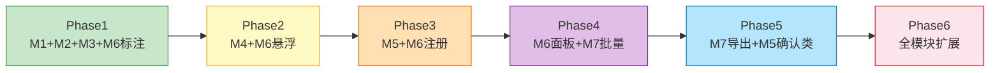
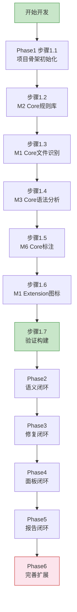

# 开发计划文档

## 1. 开发策略

### 1.1 核心原则

- **MVP最小闭环优先**：先打通能跑的最小功能闭环，再逐步扩展
- **增量可交付**：每完成一个模块Core层后构建可运行版本验证
- **标准化Prompt**：为每个模块准备标准化Prompt模板，agent可直接使用

### 1.2 开发阶段划分

| 阶段 | 目标 | 模块范围 | 闭环能力 |
|---|---|---|---|
| **Phase 1: 基础闭环** | 打开DSL文件→识别→语法检查→编辑器标注 | M1 Core + M2 Core + M3 Core + M6 Core(标注) | DSL文件可被识别并显示基础语法错误标注 |
| **Phase 2: 语义闭环** | 语义检查→诊断展示→悬浮提示 | M4 Core + M6 Core(悬浮提示) | DSL文件可显示语义错误+悬浮提示 |
| **Phase 3: 修复闭环** | Quick Fix一键修复 | M5 Core + M6 Core(注册) | 语法类错误可一键修复 |
| **Phase 4: 面板闭环** | 诊断面板+右键菜单批量检查 | M6 Extension + M7 Core | 可通过面板查看所有问题+批量检查 |
| **Phase 5: 报告闭环** | 报告导出+需确认类Quick Fix | M7 Extension + M5 Extension | 可导出报告+下拉候选修复 |
| **Phase 6: 完善扩展** | 各模块Optional层 + 全量Extension层 | 全模块 | 完整功能 |

### 1.3 模块间依赖与闭环关系



每个Phase完成后产出可运行的插件版本，具备该Phase描述的闭环能力。

## 2. 各Phase详细计划

### Phase 1: 基础闭环（M1 Core + M2 Core + M3 Core + M6 Core标注）

**目标**：打开DSL XML文件，插件识别其为DSL文件，解析PSI Tree，在编辑器中标注基础语法错误（标签未闭合、嵌套错误、属性引号缺失）。

**验收标准**：
- IDEA中打开DSL文件，项目树显示自定义图标
- 编辑器中出现语法错误的波浪线标注（Error红色）
- 非DSL XML文件不受影响

**开发顺序**：

| 步骤 | 模块 | 内容 | 验证点 |
|---|---|---|---|
| 1.1 | 项目骨架 | Gradle项目初始化，gradle-intellij-plugin配置，插件注册（plugin.xml） | `./gradlew clean build` 构建成功，IDEA可加载插件 |
| 1.2 | M2 Core | 规则条目数据模型（DslElementRule/AttrTypeSpec/RuleSource + @Data/@Builder），JSON规则文件，RuleRepository接口（Optional返回值），JsonRuleLoader | 单元测试：规则加载与查询正确 |
| 1.3 | M1 Core | DslFileMatcher接口 + DslFileIdentifier双重识别（扩展名+根元素），从M2获取根元素集合 | 单元测试：DSL文件识别为true，普通XML识别为false |
| 1.4 | M3 Core | DslLanguage + DslParserDefinition + PSI Tree结构 + ErrorElement语法错误标记，PsiTreeProvider接口 | DSL文件可被解析为PSI Tree，语法错误通过ErrorElement标记 |
| 1.5 | M6 Core(标注) | DslAnnotator（调用M1过滤+M3语法错误），编辑器标注展示 | 打开DSL文件可见语法错误波浪线 |
| 1.6 | M1 Extension | DslFileType注册 + 自定义图标 | 项目树DSL文件显示自定义图标 |
| 1.7 | 验证构建 | 构建可运行插件，在IDEA中完整测试闭环 | Phase 1验收标准全部通过 |

### Phase 2: 语义闭环（M4 Core + M6 Core悬浮提示）

**目标**：DSL文件中可显示语义错误标注（未知元素、必填属性缺失、未知属性、属性类型不匹配、枚举值不合法、父子结构不合法、作用域不支持），鼠标悬浮显示精简版Tooltip。

**验收标准**：
- 语义错误正确标注（对应严重级别配色）
- 悬浮Tooltip显示：错误摘要 + 建议修复 + 规则ID + 文档链接
- Alt+Enter可看到诊断描述（暂无Quick Fix动作）

**开发顺序**：

| 步骤 | 模块 | 内容 | 验证点 |
|---|---|---|---|
| 2.1 | M4 Core | Diagnostic数据模型（@Data/@Builder），DiagnosticProvider接口，DslAnalyzer接口 + AnalyzerRegistry（私有构造函数+静态方法），Core层Analyzer实现（UnknownElement/RequiredAttr/UnknownAttr/AttrType/EnumValue/ParentChild/Scope） | 单元测试：各Analyzer对模拟PSI元素产出正确Diagnostic |
| 2.2 | M6 Core(标注扩展) | DslAnnotator增加M4语义诊断标注 | 语义错误出现在编辑器波浪线 |
| 2.3 | M6 Core(悬浮) | DslDocumentationProvider精简版Tooltip（错误摘要+建议修复+规则ID+文档链接） | 悬浮波浪线处显示精简版信息 |
| 2.4 | 验证构建 | 构建可运行插件，完整测试语义闭环 | Phase 2验收标准全部通过 |

### Phase 3: 修复闭环（M5 Core + M6 Core注册）

**目标**：语法类错误可通过Alt+Enter一键修复（补闭合标签、补引号、插入必填属性等无需确认类Quick Fix）。

**验收标准**：
- 语法错误处Alt+Enter出现Quick Fix选项
- 选择修复项后文件立即更新
- 修复后标注消失

**开发顺序**：

| 步骤 | 模块 | 内容 | 验证点 |
|---|---|---|---|
| 3.1 | M5 Core | DslQuickFixAction基础模型，QuickFixProvider接口，无需确认类Quick Fix实现（CloseTag/RemoveExtraEndTag/AddAttrQuotes/InsertRequiredAttr/NormalizeFormat），IntentionAction注册 | 单元测试：各Quick Fix对模拟Diagnostic正确执行修复 |
| 3.2 | M6 Core(注册) | DslAnnotator为每个Annotation注册M5 QuickFixProvider.getQuickFixes() | Alt+Enter可看到Quick Fix选项并执行 |
| 3.3 | 验证构建 | 构建可运行插件，完整测试修复闭环 | Phase 3验收标准全部通过 |

### Phase 4: 面板闭环（M6 Extension + M7 Core）

**目标**：底部DSL诊断面板展示所有问题（按严重级别分组），右键菜单触发批量检查。

**验收标准**：
- DSL Analysis面板出现在IDEA底部
- 问题按Error/Warning/Info分组展示
- 点击问题条目跳转到编辑器对应位置
- 右键文件/目录/项目节点可触发批量检查
- 批量检查完成后面板刷新+通知气泡摘要

**开发顺序**：

| 步骤 | 模块 | 内容 | 验证点 |
|---|---|---|---|
| 4.1 | M6 Extension(面板) | DslAnalysisToolWindowFactory，面板JTree展示（按严重级别分组），底部工具栏（Run Analysis + Export按钮），点击跳转，右键菜单（Quick Fix/查看规则文档/复制），Dispatcher.register监听BATCH_INSPECTION_COMPLETED事件 | 面板展示当前文件诊断 |
| 4.2 | M7 Core | BatchInspectionRunner接口，批量扫描执行器（DumbService异步+CompletableFuture模式），BatchInspectionResult/FileDiagnosticResult（@Data/@Builder），Markdown报告导出，Dispatcher.send通知M6 | 右键触发批量检查，面板刷新 |
| 4.3 | M6 Extension(右键) | DslCheckActionGroup注册到ProjectViewPopupMenu，调用M7 BatchInspectionRunner | 右键菜单可触发批量检查 |
| 4.4 | 验证构建 | 构建可运行插件，完整测试面板闭环 | Phase 4验收标准全部通过 |

### Phase 5: 报告闭环（M7 Extension + M5 Extension）

**目标**：批量检查报告可导出为Markdown/JSON文件；未知元素/属性/枚举值可通过下拉候选列表+diff预览进行需确认类Quick Fix。

**验收标准**：
- 面板Export按钮可导出Markdown/JSON报告文件
- 未知元素处Alt+Enter出现下拉候选列表
- 选中候选后展示diff预览，确认后执行修复
- 修复后标注消失，Dispatcher通知M6刷新

**开发顺序**：

| 步骤 | 模块 | 内容 | 验证点 |
|---|---|---|---|
| 5.1 | M4 Extension | SimilarityMatcher接口实现（Levenshtein编辑距离匹配），ContextConstraintAnalyzer接口 | 未知元素/属性可获得候选推荐列表 |
| 5.2 | M5 Extension | 需确认类Quick Fix（ReplaceElement/ReplaceAttr/ReplaceEnum），CandidateSelectionDialog（下拉候选+Optional返回），CandidateItem（@Data/@Builder），FixPreviewUtil（diff预览），Dispatcher.send通知刷新 | 未知元素可通过候选列表+diff预览修复 |
| 5.3 | M7 Extension | JSON报告导出，IDEA原生进度条集成（BatchInspectionTask extends CompletableFuture），Dispatcher.send(BATCH_INSPECTION_COMPLETED) | 批量检查显示进度条+导出JSON |
| 5.4 | 验证构建 | 构建可运行插件，完整测试报告闭环 | Phase 5验收标准全部通过 |

### Phase 6: 完善扩展（各模块Extension + Optional层）

**目标**：完成所有模块的Extension和Optional层功能，达到完整产品形态。

**开发顺序**（各子步骤可并行）：

| 步骤 | 模块 | 内容 |
|---|---|---|
| 6.1 | M2 Extension | RuleCacheManager（工具类：私有构造+静态方法+缓存），热更新机制 |
| 6.2 | M3 Extension | 自定义Lexer + Token类型精细化 |
| 6.3 | M4 Optional | InheritanceAnalyzer + DuplicateIdAnalyzer + ReferenceAnalyzer |
| 6.4 | M5 Optional | BatchQuickFixProvider（Fix All按钮） |
| 6.5 | M6 Optional | 面板筛选/排序高级功能 |
| 6.6 | M6 Extension | LocalInspectionTool注册（供M7批量调用） |
| 6.7 | M7 Optional | 报告自定义模板 + 定时自动检查 |
| 6.8 | M1 Optional | DslRecognitionConfig（IDEA Settings配置） |
| 6.9 | M2 Optional | RuleEditorUI（IDEA Settings内可视化维护） |
| 6.10 | M3 Optional | 语法诊断自定义格式化输出 |

## 3. Agent辅助开发Prompt模板

### 3.1 标准化Prompt模板结构

每个模块开发时，向agent提供以下结构化Prompt：

```
## 任务目标
[具体模块+层级+功能的明确描述]

## 必读文档清单
- docs/AGENTS.md （代码风格规范，必须遵守）
- docs/architecture/[对应模块文档] （架构设计，必须遵循）
- docs/DSL-Rule-Spec.md （DSL规则规范，M2/M4/M5必读）
- docs/architecture/M2-RuleLibrary.md （规则库数据模型，所有模块需了解接口）
- docs/UX-Design.md （交互设计，M5/M6/M7必读）

## 规范约束（来自AGENTS.md）
- 类名大驼峰，方法名小驼峰，常量UPPER_SNAKE_CASE
- POJO使用@Data/@Builder（Lombok）
- 单元素查询返回Optional<T>
- 工具类：私有构造函数+静态方法
- 异步任务继承CompletableFuture<T, U>
- 模块间通信使用Dispatcher事件机制
- 使用LogUtil记录日志
- 缩进4空格，左括号不换行，行宽≤120字符

## 上游依赖接口（已实现）
[列出当前Phase已实现的可调用接口]

## 验收标准
[具体的功能验收点]

## 测试要求
- 编写单元测试覆盖核心逻辑
- 运行 ./gradlew :模块名:test 验证测试通过
```

### 3.2 各Phase的Prompt示例

#### Phase 1.2: M2 Core

```
## 任务目标
实现M2规则库模块Core层：规则条目数据模型、JSON规则文件加载、RuleRepository查询接口。

## 必读文档清单
- docs/AGENTS.md
- docs/architecture/M2-RuleLibrary.md
- docs/DSL-Rule-Spec.md （第6章规则库数据结构）

## 规范约束
- DslElementRule/AttrTypeSpec/RuleSource 使用 @Data/@Builder
- RuleRepository 单元素查询返回 Optional<T>
- 缩进4空格，左括号不换行

## 上游依赖接口
无（纯数据层）

## 验收标准
- DslElementRule可正确加载JSON规则数据
- getElementRule("Var") 返回 Optional.of(varRule)
- getElementRule("UnknownElement") 返回 Optional.empty()
- getRootElementNames() 返回合法根元素列表

## 测试要求
- 编写RuleRepositoryTest覆盖加载和查询
- ./gradlew :模块名:test 通过
```

#### Phase 3.1: M5 Core

```
## 任务目标
实现M5 Quick Fix模块Core层：无需确认类Quick Fix（补闭合标签、补引号、插入必填属性、类型归一化）。

## 必读文档清单
- docs/AGENTS.md
- docs/architecture/M5-QuickFix.md
- docs/DSL-Rule-Spec.md （第5章错误检测规则）

## 规范约束
- IntentionAction注册机制
- 修复完成后 Dispatcher.send(EventId.QUICK_FIX_EXECUTED, data)
- 使用LogUtil记录日志

## 上游依赖接口
- M2 RuleRepository.getElementRule() → Optional<DslElementRule>
- M4 Diagnostic → @Data/@Builder, 包含severity/ruleId/message/targetElement

## 验收标准
- CloseTagFix 对未闭合标签正确补全闭合标签
- InsertRequiredAttrFix 对缺失name属性的元素插入name=""
- 修复后PSI更新，标注消失

## 测试要求
- 编写QuickFixTest覆盖每种修复类型
- ./gradlew :模块名:test 通过
```

## 4. 开发流程总览



## 5. 每个Phase验证流程

每个Phase完成后执行以下验证步骤：

1. **单元测试**：`./gradlew test` 确保所有模块测试通过
2. **构建插件**：`./gradlew clean build` 确保构建成功
3. **IDEA加载测试**：在IDEA中安装插件，验证该Phase的验收标准
4. **文档更新**：如有架构微调，更新对应架构文档
5. **Git提交**：提交该Phase的所有代码变更，commit message格式：`feat: Phase N - [闭环名称]`

## 6. 开发注意事项

- **每个步骤前先阅读AGENTS.md**：确保代码风格符合规范
- **增量开发**：不要跳Phase开发，每个Phase闭环验证后再进入下一个
- **接口先行**：先定义接口再实现，确保上下游模块可并行开发时接口契约稳定
- **M2优先**：规则库是纯数据层且被所有模块依赖，必须最先完成且稳定
- **测试先行**：每个步骤先写测试再写实现（TDD），单元测试覆盖核心逻辑
- **Dispatcher事件**：跨模块通信统一使用Dispatcher，不直接调用其他模块内部方法
