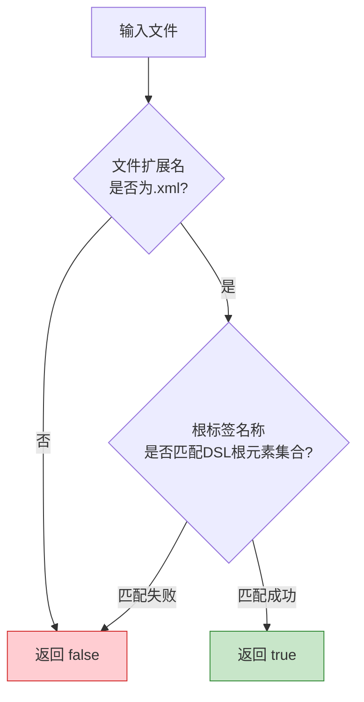

# M1 文件识别模块 - 架构设计

## 1. 模块职责

识别DSL文件并过滤非DSL XML文件，确保后续模块仅在DSL文件上触发规则检查。

**单一职责**：文件身份判定，不涉及文件内容分析。

## 2. 三层划分

| 层级 | 功能 | 说明 |
|---|---|---|
| **Core** | 双重识别机制（扩展名 + 根元素声明） | MVP必交 |
| **Extension** | FileType注册与自定义图标 | 增强IDEA集成体验 |
| **Optional** | 识别策略可配置化（允许用户自定义根元素标识） | 后续迭代 |

## 3. 核心组件

### 3.1 DslFileMatcher（接口）

```java
public interface DslFileMatcher {
    boolean isDslFile(VirtualFile file);
    boolean isDslFile(PsiFile psiFile);
}
```

- 提供给M6 UI交互模块，决定是否启用DSL检查
- 提供给M7批量检查模块，决定扫描范围过滤

### 3.2 DslFileIdentifier（实现）

双重识别策略：



**根元素集合来源**：从M2规则库中获取，规则库定义了合法的DSL根元素名称列表。

### 3.3 DslFileType（Extension层）

注册自定义FileType，使DSL文件在IDEA中获得：

- 项目树自定义图标
- 关联DSL专属的ParserDefinition（M3提供）
- 关联DSL专属的Language对象

### 3.4 DslRecognitionConfig（Optional层）

允许用户在IDEA Settings中配置：

- 自定义根元素标识符
- 自定义文件扩展名
- 开启/关闭DSL识别（全局开关）

## 4. 模块依赖

| 上游依赖 | 用途 |
|---|---|
| M2 规则库 | 获取合法DSL根元素名称集合 |

| 下游消费 | 提供接口 |
|---|---|
| M6 UI交互 | `DslFileMatcher.isDslFile()` |
| M7 批量检查 | `DslFileMatcher.isDslFile()` |
| M3 语法分析 | `DslFileType`（FileType注册触发Parser关联） |

## 5. 设计要点

- **轻量判断**：文件识别仅做根元素名称匹配，不做完整内容解析，保证响应速度
- **缓存机制**：识别结果随VirtualFile缓存，文件内容变更时清除缓存重新判断
- **无侵入性**：非DSL XML文件完全不受影响，识别失败的文件不触发任何后续模块
