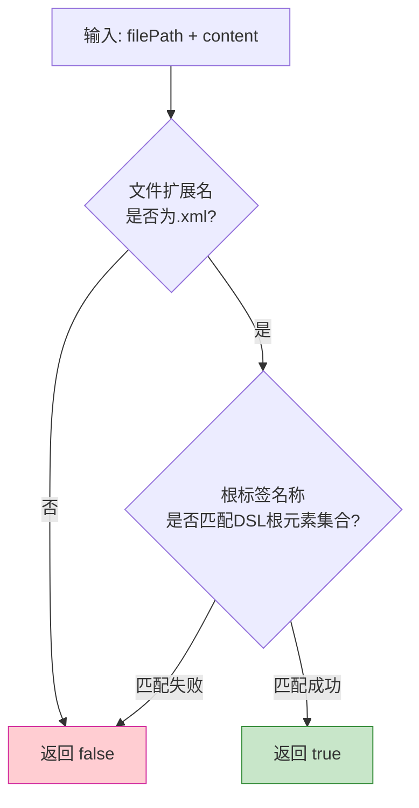

# M1 文件识别模块 - 架构设计

## 1. 模块职责

识别DSL文件并过滤非DSL XML文件，确保后续模块仅在DSL文件上触发规则检查。

**单一职责**：文件身份判定，不涉及文件内容分析。

**接口重构**：去除PSI依赖，使用纯字符串参数。Plugin层提供PsiDslFileMatcherAdapter将VirtualFile/PsiFile适配为String参数。

## 2. 三层划分

| 层级 | 功能 | 说明 |
|---|---|---|
| **Core** | 双重识别机制（扩展名 + 根元素标签） | MVP必交 |
| **Extension** | FileType注册与自定义图标 | 增强IDEA集成体验（Plugin层实现） |
| **Optional** | 识别策略可配置化（允许用户自定义根元素标识） | 后续迭代 |

## 3. 核心组件

### 3.1 DslFileMatcher（接口）

```java
public interface DslFileMatcher {
    boolean isDslFile(String filePath, String content);
}
```

**参数说明**：
- `filePath`：文件路径字符串（Core层不依赖VirtualFile/PsiFile）
- `content`：文件内容字符串（用于根元素标签提取）

**Plugin层适配**：

```java
public class PsiDslFileMatcherAdapter implements DslFileMatcher {
    // 将VirtualFile/PsiFile适配为String filePath + String content
    // 供M6/M7在IDEA环境中使用
}
```

### 3.2 DslFileIdentifier（Core层实现）

双重识别策略：



**识别步骤**：

1. 检查filePath扩展名是否为`.xml`
2. 解析content前N行，提取根元素标签名
3. 从M2 RuleRepository.getRootElementNames()匹配

**根元素集合来源**：M2 RuleRepository定义了4个合法DSL根元素：`Lockscreen`、`Wallpaper`、`Widget`、`ChargingSkin`。

**轻量判断**：仅做根元素名称匹配，不做完整内容解析，保证响应速度。

### 3.3 DslFileType（Extension层，Plugin层实现）

注册自定义FileType，使DSL文件在IDEA中获得：

- 项目树自定义图标
- 关联DSL专属的ParserDefinition
- 关联DSL专属的Language对象

此组件依赖IDEA SDK，仅存在于Plugin层。

### 3.4 DslRecognitionConfig（Optional层）

允许用户在IDEA Settings中配置：

- 自定义根元素标识符
- 自定义文件扩展名
- 开启/关闭DSL识别（全局开关）

## 4. 模块依赖

| 上游依赖 | 说明 |
|---|---|
| M2 规则库 | 获取合法DSL根元素名称集合（`RuleRepository.getRootElementNames()`） |

| 下游消费 | 提供接口 | 说明 |
|---|---|---|
| M7 批量检查 | `DslFileMatcher.isDslFile()` | 决定扫描范围过滤 |
| CLI入口 | `DslFileMatcher.isDslFile()` | CLI管线入口文件过滤 |
| M6 UI交互 | `PsiDslFileMatcherAdapter.isDslFile()` | Plugin层适配后使用 |

## 5. CLI相关

### 5.1 CLI命令调用

M1是CLI管线的第一步，负责过滤输入文件：

```
java -jar dsl-analyzer.jar [options] <file-or-directory>
```

M1在CLI管线中的位置：

```
CLI入口(path) → M1.isDslFile(filePath, content) → 是DSL文件 → M3语法分析
                                          → 非DSL文件 → 跳过
```

**单文件模式**：`java -jar dsl-analyzer.jar theme.xml` — 直接调用M1判断是否DSL文件
**目录模式**：`java -jar dsl-analyzer.jar ./themes/` — 遍历目录所有.xml文件，M1逐个过滤

### 5.2 CLI参数与M1的关系

| 参数 | 影响范围 | M1相关说明 |
|---|---|---|
| `<path>` | 输入文件/目录路径 | M1对每个.xml文件做双重识别 |
| `--rule-dir <path>` | M2规则库加载目录 | 影响M2 RuleRepository.getRootElementNames()返回值，间接影响M1识别结果 |
| `--config <path>` | 检查配置 | 配置中可指定允许的根元素列表，覆盖M2默认值 |

### 5.3 CLI输出中M1的贡献

| CLI输出字段 | 来源 | M1贡献 |
|---|---|---|
| `summary.totalFiles` | M7批量检查 | M1过滤后的DSL文件总数 |
| `summary.skippedFiles` | M7批量检查 | M1识别为非DSL的文件数（仅在verbose模式下显示） |
| 退出码=2的场景 | CLI入口 | 输入路径不存在或无法读取文件内容 |

### 5.4 CLI异常场景

| 异常场景 | 退出码 | 说明 |
|---|---|---|
| 输入路径不存在 | 2 | filePath或directoryPath指向的路径不存在 |
| 输入路径不是文件也不是目录 | 2 | 路径类型无法识别 |
| 单个文件读取失败 | 1（跳过继续） | 文件内容无法读取时跳过该文件，终端输出warning |
| 无DSL文件被识别 | 0 | 目录扫描后所有.xml文件都不是DSL文件，输出空结果，退出码0 |

### 5.5 CLI识别流程示例

**单文件**：

```
$ java -jar dsl-analyzer.jar theme.xml

# M1识别为DSL文件（根元素=Lockscreen）
theme.xml:15:3: error: 引用未定义变量 #steps_value [SEM-REF-001]
1 error, 0 warnings, 0 info
```

**目录扫描**：

```
$ java -jar dsl-analyzer.jar ./themes/

# M1过滤：3个DSL文件（2个非DSL XML跳过）
./themes/theme.xml: ...
./themes/layout.xml: ...
./themes/config.xml: ...
3 files checked, 2 skipped (non-DSL XML)
```

## 6. 设计要点

- **轻量判断**：文件识别仅做根元素名称匹配，不做完整内容解析，保证响应速度
- **纯字符串接口**：DslFileMatcher使用(filePath, content)纯字符串参数，Core层无IDEA SDK依赖
- **Plugin层适配**：PsiDslFileMatcherAdapter将VirtualFile/PsiFile适配为String参数，在IDEA环境中使用
- **无侵入性**：非DSL XML文件完全不受影响，识别失败的文件不触发任何后续模块
- **根元素集合来源**：从M2 RuleRepository获取，规则库更新时根元素集合自动更新
