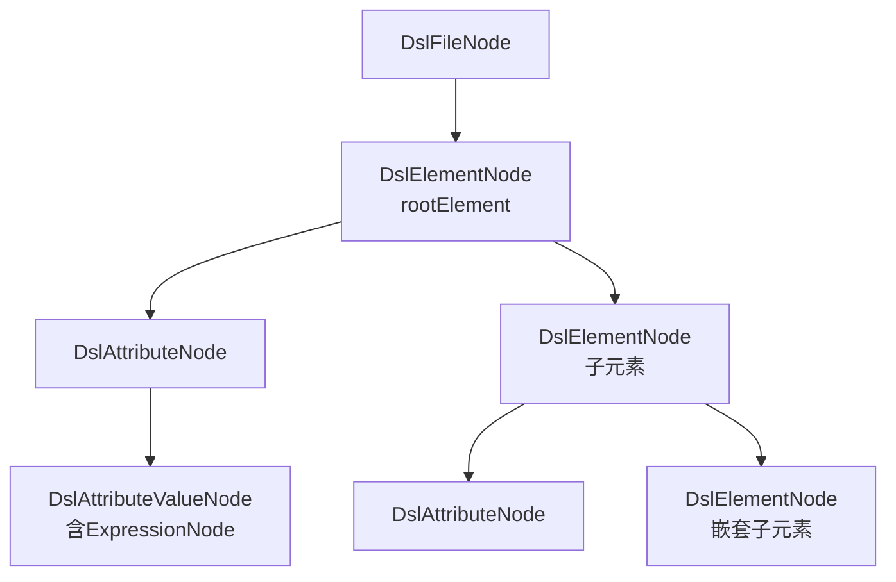

# M3 语法分析模块 - 架构设计

## 1. 模块职责

将DSL XML文件解析为独立AST，并检测语法错误。产出DslFileNode供后续模块消费，产出语法诊断供M4/M5/M7使用。

**单一职责**：XML结构解析（JDK StAX，基于 XMLStreamReader） + DSL AST构建 + 表达式嵌入（ANTLR4） + 语法错误检测。

**完全重构**：自有独立AST替代PSI依赖。Core层无IDEA PSI API依赖。

## 2. 三层划分

| 层级 | 功能 | 说明 |
|---|---|---|
| **Core** | StAX解析→DslAstNode + 语法错误检测 + ANTLR4表达式嵌入 | MVP必交 |
| **Extension** | 精细化Token类型 + 表达式解析缓存 | 增强语法分析精度与性能 |
| **Optional** | 自定义格式语法诊断输出 | 后续迭代 |

## 3. 核心组件

### 3.1 DslAst节点体系

完全独立的AST，不依赖IDEA PSI：

```java
public abstract class DslAstNode {
    String text;
    int line;
    int column;
}
```

> 设计决策(LSP原则): 基类只包含所有子类共有的字段(text/line/column); children语义不适用于所有子类(如DslAttributeValueNode无子节点), 因此各子类定义语义专属字段.

```java
public class DslFileNode extends DslAstNode {
    String xmlDeclaration;
    DslElementNode rootElement;
}

public class DslElementNode extends DslAstNode {
    String tagName;
    List<DslAttributeNode> attributes;
    List<DslElementNode> childElements;
    boolean selfClosing;
    boolean hasError;
    String errorMessage;
    DslAstNode parent;
}
```

> 字段名childElements表明子节点均为元素节点, 类型精度优于泛型List<DslAstNode>.
>
> **parent 指针**：仅 `DslElementNode` 持有 `parent`（类型 `DslAstNode` 以便 root 元素指向 `DslFileNode`）。嵌套子元素的 parent 指向外层 `DslElementNode`，root 元素的 parent 指向 `DslFileNode`。供 M4 嵌套检查（SYN-002）、作用域分析、M8 导航向上遍历。`parent` 排除在 `@EqualsAndHashCode`/`@ToString` 之外以防 `childElements`↔parent 循环引用导致栈溢出。

```java
public class DslAttributeNode extends DslAstNode {
    String name;
    DslAttributeValueNode value;
}

public class DslAttributeValueNode extends DslAstNode {
    String rawValue;
    Optional<ExpressionAstNode> expression;
    boolean isLiteral;
}
```

> DIP修正: expression引用shared/ast/ExpressionAstNode抽象接口而非M0具体类ExpressionNode; Optional处理可空值(纯文本属性无表达式).

#### ExpressionAstNode接口与ExpressionKind枚举（shared/ast/）

M3表达式嵌入使用`shared/ast/`中定义的抽象接口，M0的ExpressionNode实现此接口：

```java
public interface ExpressionAstNode {
    String getText();
    int getLine();
    int getColumn();
    ExpressionKind getKind();
}

public enum ExpressionKind {
    LITERAL, VARIABLE_REF, FUNCTION_CALL, BINARY_EXPR,
    UNARY_EXPR, CONDITIONAL, ARRAY_ACCESS, UNKNOWN
}
```

> ExpressionAstNode为M0/M3/M4共用的表达式抽象接口, ExpressionKind统一表达式类型分类, M0 ExpressionNode实现此接口.

**AST节点树结构**：



### 3.2 AstBuilder — AST构建器

使用JDK StAX（XMLStreamReader）解析XML结构，构建DslAstNode树。

> **设计决策（dom4j→StAX）**：原设计拟用 dom4j，但 dom4j 的 `Node` 不提供 per-node 行列号 API，而下游诊断（SYN-003 未知元素等）需要节点级定位。JDK 内置 `XMLStreamReader`（StAX）通过 `Location` 可在每个 `START_ELEMENT` 事件捕获行列号，故改用 StAX 的 pull 事件直接构建 AST。

**构造器**：
- `AstBuilder()` — 无 RuleRepository，所有属性值按字面量处理（降级模式，供无规则场景/单元测试）
- `AstBuilder(RuleRepository)` — 注入规则库，启用表达式嵌入

**构建流程**：

1. JDK StAX（XMLStreamReader）解析XML → XMLStreamReader事件流（携带Location）
2. START_ELEMENT/END_ELEMENT事件中直接构建DslElementNode/DslAttributeNode/DslAttributeValueNode，从Location取行列号
3. 对每个属性值，按"表达式嵌入判断"决定是否调用M0 DslExpressionParser
4. XML格式错误（XMLStreamException）写入 rootElement.hasError/errorMessage/line/column（转 Diagnostic 由 #15 负责）

**表达式嵌入判断**（启发式，非"supportsExpression=true 即解析"）：

从M2 `RuleRepository.getAttrTypeSpec(elementName, attrName)` 取 `supportsExpression` 与 `expressionKind`。当 `supportsExpression=true` **且**值含表达式语法指示符时才解析；否则按字面量处理（`isLiteral=true`）。故 `x="0"`、`color="#FFFFFF"` 即使 supportsExpression=true 也保持字面量。

**表达式语法指示符**（`hasExpressionSyntax(value, attrName)`）：

| 指示符 | 说明 |
|---|---|
| `@` `'` `(` `{` `+` `-` `*` `/` `%` | 字符串引用/字面量/函数调用/分组/二元与一元运算符，出现即解析 |
| `#` | 数值变量引用，总为指示符——**除** `color`/`shadowColor` 属性的纯 hex 颜色（`#[0-9A-Fa-f]{6}` 或 `{8}`）视为颜色字面量 |

> **hex 颜色范围调整**：原设计按 expressionKind=string 区分 hex 颜色，现改为**仅 `color`/`shadowColor` 属性**把 `#FFFFFF` 当颜色；其他属性（含 string 上下文如 `textExp`）的 `#` 一律当数值变量引用。

**按 expressionKind 选择解析入口**（grammar 区分 string/numeric）：

| expressionKind | 解析入口 | `+` 语义 | `* / %` | `@var` | `#var` |
|---|---|---|---|---|---|
| `string` | `parser.stringExpression()` | 拼接（concat） | 仅数值子式内（须 `{}` 包裹） | 允许（字符串变量） | 允许（内嵌数值，强转） |
| `number` | `parser.numericExpression()` | 加法 | 算术 | **语法错误** | 允许（数值变量） |
| `auto`/null | `parser.expression()`（通用 unified） | 算术 | 算术 | 允许 | 允许 |

**string 上下文内嵌数值表达式**：string 表达式中 `+` 恒为拼接；数值子式若含 `+ - * / %` 须用**大括号 `{}`** 包裹（如 `'val: '+{10*#num}`、`'x'+{#a+#b}`）。裸写 `'val: '+10*#num` 为语法错误。纯数值整值（如 `10*#num`）无需包裹，按数值式解析后强转为字符串。字符串不能进行 `* / %` 运算。

> **`#` 只引用数值变量、`@` 只引用字符串变量**：grammar 在 numeric 上下文不接受 `@var`（语法错误）；string 上下文 `#var` 为内嵌数值。变量类型的最终校验（`#var` 实际是否数值变量）归 M4 VarRefAnalyzer。

**解析失败处理**：`parseExpression` 用 `BailErrorStrategy`（遇错即抛，不做错误恢复）+ 入口规则 `EOF`（string/numeric）/ 残留 token 检查（auto），确保部分匹配（如 `'val: '+10*#num` 残留 `*#num`）判为失败。失败时 `isLiteral=false, expression=Optional.empty()`，保留"曾尝试解析"信号供 #22 报 SYN-EXPR-ANTLR。

**`-#var` 语法检测（SYN-EXPR-001）**：解析后用 `containsInvalidUnaryMinusVar` 递归检查 AST——任何 `UNARY_EXPR("-")` 其直接子节点为 `#` 前缀的 `VARIABLE_REF`/`ARRAY_ACCESS`（即 `-#w`、`-#arr[0]`）即判失败。`-#w` 须改写为 `-1*#w` 或 `0-#w`。`-5`（负数值）、`-sin(#x)`（负号函数）合法。命中时同样 `isLiteral=false, expression=empty`，#22 据原始值报 SYN-EXPR-001。

**调用链**：AstBuilder → XMLStreamReader（pull 事件流）构建DslAstNode →（supportsExpression=true 且含指示符的属性）按 expressionKind 选 M0 DslExpressionParser 入口 → DslFileNode

### 3.3 DslAstProvider（接口）

替代原PsiTreeProvider：

```java
public interface DslAstProvider {
    DslFileNode getDslAst(String filePath, String content);
}
```

> 设计决策: 遍历/查询方法不属于语法分析职责, 延后到实现阶段; 调用方可直接遍历DslFileNode树.

**纯字符串参数**：Core层接口使用(filePath, content)，不依赖VirtualFile/PsiFile。

### 3.4 语法错误检测分层

M3产出的语法诊断分三层：

| 错误层级 | 检测机制 | 规则ID | 说明 |
|---|---|---|---|
| XML结构语法 | StAX XMLStreamException直接报出 | — | 标签未闭合、属性引号缺失、缺少XML声明等XML格式错误，不做额外包装映射 |
| DSL结构语法 | M3 SyntaxChecker（AST + M2规则库比对） | SYN-001, SYN-003, SYN-004 | 根元素、未知元素/属性检测；嵌套/必填/类型/枚举已迁移至 M4（见下方说明） |
| DSL表达式语法 | ANTLR4 DslExpressionParser | SYN-EXPR-001~006, SYN-EXPR-ANTLR | `-#var`模式、单引号缺失、花括号嵌套等 |

**XML格式错误处理**：StAX解析XML遇格式错误直接抛出XMLStreamException，AstBuilder捕获后写入 `rootElement.hasError/errorMessage/line/column`（保留XMLStreamException的行列号和错误消息），不包装映射为自定义SYN-xxx规则ID。SyntaxChecker 遇 `rootElement==null || hasError` 时返回空诊断列表（XML 格式错误转换留给上层 DiagnosticProvider 包装）。M3 SyntaxChecker 实际产出 SYN-001 / SYN-003 / SYN-004；嵌套/必填/类型/枚举检测归 M4 以 SEM-* 规则产出。

**DSL结构语法检测详情**：

| 规则ID | 检测内容 | 检测机制 | 严重级别 |
|---|---|---|---|
| SYN-001 | 根元素标签错误 | M1文件识别 + M3 SyntaxChecker根节点检测 | error |
| SYN-003 | 未知元素标签 | M3 AST tagName + M2 DslElementRule名称集合比对 | error |
| SYN-004 | 未知属性名 | M3属性名 + M2 optionalAttrs+requiredAttrs比对 | warning |

> **规则归属说明（P0 调整后）**：M3 `SyntaxChecker` 实际只产出 SYN-001 / SYN-003 / SYN-004。原 SYN-002（嵌套）、SYN-005（必填）、SYN-006（字面量类型）、SYN-007（枚举）的检测已迁移至 M4 analyzer，分别以 SEM-NEST-001、SEM-REQ-001、SEM-TYPE-003、SEM-ENUM-001 产出，详见 M4 文档 §3.4.3。

**SyntaxChecker 实现**（`syntaxanalysis/SyntaxChecker`）：注入 `RuleRepository`，`check(filePath, DslFileNode) → List<Diagnostic>`。遇 `rootElement==null || hasError` 返回空（XML 错误另作）。否则 SYN-001 检 root，递归遍历所有元素做 SYN-003（未知元素）/ SYN-004（未知属性）；SYN-002/005/006/007 已迁移至 M4（见上说明）。

防噪声跳过：SYN-004 在元素未知时跳过（SYN-003 已覆盖未知元素）；root 不查 SYN-003（SYN-001 已覆盖）。Diagnostic 的 line/column 取自对应 AST 节点，`ruleDocUrl` 从 `getRuleSource(ruleId)` 查填。

**DSL表达式语法检测详情**：

| 规则ID | 检测内容 | 检测机制 | 严重级别 |
|---|---|---|---|
| SYN-EXPR-001 | 数值表达式使用`-#var`语法 | ANTLR4解析：负号直接前缀变量引用检测 | error |
| SYN-EXPR-002 | 数值表达式值超过7位精度限制 | ANTLR4解析：数值常量位数检查 | warning |
| SYN-EXPR-003 | 字符串表达式中数值计算以#开头 | ANTLR4解析：变量名边界检测 | error |
| SYN-EXPR-004 | 字符串表达式未使用单引号 | ANTLR4解析：字符串常量引号类型检查 | error |
| SYN-EXPR-005 | 字符串表达式嵌入数值表达式缺少花括号 | ANTLR4解析：嵌套语法检查 | error |
| SYN-EXPR-006 | preciseeval后使用运算符或+连接符 | ANTLR4解析：函数后缀约束检查 | error |
| SYN-EXPR-ANTLR | ANTLR4词法/语法错误 | ANTLR4自动报错：不可识别token、表达式结构不合法 | error |

**ExpressionSyntaxChecker 实现**（`syntaxanalysis/ExpressionSyntaxChecker`）：注入 `RuleRepository`，`check(filePath, DslFileNode) → List<Diagnostic>`。遍历元素/属性，对 `supportsExpression=true && hasExpressionSyntax` 的属性调 `AstBuilder.doParse`（共用解析逻辑，返回 node + antlrError + leftoverTokens）。

检测：001 跑 `containsInvalidUnaryMinusVar(node)`；002 遍历 node 的 NUMBER LITERAL，数字位数(不含`.`)>7；003 string 上下文 rawValue 以 `#` 开头且含 `* / % -`；006 rawValue 匹配 `preciseeval(...)` 后跟 `+ - * / %`；004/005 仅在 string 上下文解析失败时——004 检 `+`拼接项含裸词(`^[a-zA-Z_]\w*$`)、005 检去 `{...}` 后含 `+` 且含 `* / %`；其余解析失败归 SYN-EXPR-ANTLR。004/005 优先于 ANTLR（更具体）。

### 3.5 自定义Lexer（Extension层）

精细化Token划分，为语义分析提供更精确的Token信息：

- 区分DSL关键字Token与普通字符串Token
- 区分属性名Token与属性值Token
- 表达式解析结果缓存（同一属性值不重复调用ANTLR4）

### 3.6 语法诊断格式化（Optional层）

为语法错误提供自定义格式的诊断信息：

- 精确到行列号的位置信息
- 与规则库RuleSource关联的规则ID和文档链接
- 自定义格式输出（如HTML格式诊断报告）

## 4. 模块依赖

| 上游依赖 | 说明 |
|---|---|
| M0 解析器基础设施 | DslExpressionParser + DslExpressionVisitorAdapter（表达式属性值解析） |
| M2 规则库 | DslElementRule名称集合 + AttrTypeSpec.supportsExpression（语法比对+表达式判断） |

| 下游消费 | 提供接口 | 说明 |
|---|---|---|
| M4 语义分析 | `DslAstProvider.getDslAst()` | AST供语义分析+类型推断+符号表+约束检查 |
| M5 修复逻辑 | `DslAstProvider.getDslAst()` | AST供FixAction定位TextRange |
| M7 批量检查 | `DslAstProvider.getDslAst()` | AST供批量扫描管线 |
| PSI Adapter | `DslAstProvider.getDslAst()` | AST供offset↔PSI映射 |
| CLI入口 | `DslAstProvider.getDslAst()` | CLI管线AST构建 |

## 5. CLI相关

### 5.1 CLI命令调用

M3是CLI管线核心步骤，将文件内容解析为AST：

```
java -jar dsl-analyzer.jar [options] <file-or-directory>
```

M3在CLI管线中的位置：

```
文件输入 → M1识别 → M3语法分析(StAX→AST+ANTLR4表达式) → M4语义分析 → 输出
```

### 5.2 CLI参数与M3的关系

| 参数 | 影响范围 | M3相关说明 |
|---|---|---|
| `--syntax-only` | 只做语法检查 | 只跑 SyntaxChecker + ExpressionSyntaxChecker（M3），不跑 M4 analyzer；CLI直接输出语法诊断 |
| `--rule-dir <path>` | M2规则库目录 | 影响M2提供的元素名称集合和AttrTypeSpec，间接影响M3语法比对和表达式嵌入判断 |
| `--verbose` | 详细输出 | 开启时CLI输出包含AST构建过程信息（如：解析耗时、AST节点数量、表达式属性列表） |

### 5.3 CLI输出中M3的贡献

| CLI输出字段 | 来源路径 | M3贡献 |
|---|---|---|
| XML格式错误诊断 | M3 → StAX XMLStreamException | 标签未闭合、属性引号缺失等XML格式错误 |
| `ruleId: SYN-001/003/004` | M3 SyntaxChecker → M2规则库 | DSL结构语法错误（SYN-002/005/006/007 见 M4 SEM-* 规则） |
| `ruleId: SYN-EXPR-001~006/ANTLR` | M3表达式解析 → M0 ANTLR4 | DSL表达式语法错误 |
| `summary.skippedFiles`（非DSL XML） | M1 → M3跳过 | M1识别为非DSL，M3不处理 |

### 5.4 CLI异常场景

| 异常场景 | 退出码 | 说明 |
|---|---|---|
| XML格式严重错误（StAX无法解析） | 1 | XMLStreamReader抛出XMLStreamException，M3产出XML格式错误诊断 |
| 文件编码非UTF-8 | 1 | StAX解析时编码问题，产出编码相关诊断 |
| ANTLR4表达式解析失败 | 1 | 产出SYN-EXPR-ANTLR诊断，AST中对应属性值expression=null |

### 5.5 CLI输出示例

**`--syntax-only`模式**：

```
$ java -jar dsl-analyzer.jar --syntax-only theme.xml

theme.xml:3:5: error: 未知元素标签 'UnknownTag' [SYN-003]
theme.xml:5:10: warning: 未知属性 'unknownAttr' [SYN-004]

1 error, 1 warning, 0 info
```

**全量检查模式**（M3诊断+M4诊断合并输出）：

```
$ java -jar dsl-analyzer.jar theme.xml

theme.xml:3:5: error: 未知元素标签 'UnknownTag' [SYN-003]     ← M3产出
theme.xml:15:3: error: 引用未定义变量 #steps_value [SEM-REF-001]  ← M4产出
theme.xml:20:8: error: 类型不匹配，期望number实际string [SEM-TYPE-001] ← M4产出

3 errors, 0 warnings, 0 info
```

## 6. 设计要点

- **独立AST替代PSI**：自有DslAstNode体系替代IDEA PSI依赖，Core层无com.intellij import
- **JDK StAX解析XML结构**：不使用ANTLR4解析XML；StAX XMLStreamException直接报出XML格式错误，不包装映射为自定义SYN-xxx规则ID
- **ANTLR4仅用于表达式**：仅expression/reference类型属性值调用M0 DslExpressionParser；纯字面量属性直接验证不走解析器
- **表达式嵌入判断**：从M2 AttrTypeSpec.supportsExpression字段决定是否调用解析器
- **DslAstProvider纯字符串接口**：使用(filePath, content)参数，不依赖IDEA类型
- **语法错误三层分层**：XML结构语法（JDK StAX） → DSL结构语法（AST+规则库比对） → DSL表达式语法（ANTLR4），各层独立检测
