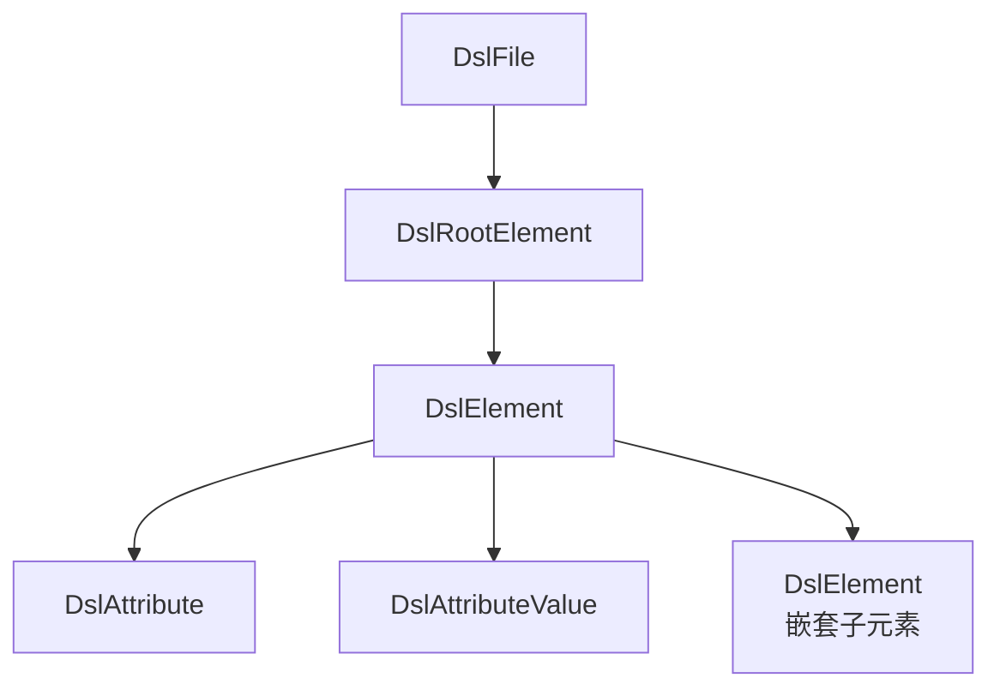

# M3 语法分析模块 - 架构设计

## 1. 模块职责

将DSL文本解析为PSI Tree，并检测基础语法错误（标签未闭合、嵌套错误、属性引号缺失）。产出PSI Tree供后续模块消费，产出语法诊断供M6展示。

**单一职责**：词法分析 + 语法分析 + PSI Tree构建。

## 2. 三层划分

| 层级 | 功能 | 说明 |
|---|---|---|
| **Core** | PSI Tree定义 + Parser + 语法错误标记 | MVP必交 |
| **Extension** | 自定义Lexer + Token类型精细化 | 增强语法分析精度 |
| **Optional** | 语法错误诊断的自定义格式化输出 | 后续迭代 |

## 3. 核心组件

### 3.1 DslLanguage与ParserDefinition

注册DSL Language对象与ParserDefinition，使IDEA将DSL文件关联到自定义PSI体系：

```java
public class DslLanguage extends Language {
    public static final DslLanguage INSTANCE = new DslLanguage();
}

public class DslParserDefinition implements ParserDefinition {
    // 定义Lexer、Parser、PSI元素类型
}
```

### 3.2 PSI Tree结构

基于IDEA XML PSI体系扩展，定义DSL特有的NodeType：



**关键设计决策**：基础XML语法分析利用IDEA内置XML PSI API完成，DSL Parser在此基础上叠加DSL特有的语法约束验证。

### 3.3 语法错误标记

PSI构建过程中，通过ErrorElement标记语法错误：

| 错误类型 | PSI标记方式 | 规则ID |
|---|---|---|
| XML标签未闭合 | ErrorElement + "Tag not closed" | SYN-001 |
| 标签嵌套错误 | ErrorElement + "Invalid nesting" | SYN-002 |
| 属性引号缺失 | ErrorElement + "Missing attribute quotes" | SYN-003 |

### 3.4 PsiTreeProvider（接口）

```java
public interface PsiTreeProvider {
    DslFile getDslPsiTree(VirtualFile file);
    List<PsiElement> findElementsByName(PsiFile file, String elementName);
}
```

供M4语义分析和M6 UI交互模块消费。

### 3.5 自定义Lexer（Extension层）

精细化Token划分，为语义分析提供更精确的Token信息：

- 区分DSL关键字Token与普通字符串Token
- 区分属性名Token与属性值Token
- 支持DSL特有的语法结构（如继承声明）

### 3.6 语法诊断格式化（Optional层）

为语法错误提供自定义格式的诊断信息，包含：

- 精确到行列号的位置信息
- 与规则库RuleSource关联的规则ID和文档链接

## 4. 模块依赖

| 上游依赖 | 用途 |
|---|---|
| M1 文件识别 | DslFileType注册触发Parser关联 |
| M2 规则库 | 获取DSL合法元素名称集合（用于Parser验证） |

| 下游消费 | 提供接口 |
|---|---|
| M4 语义分析 | `PsiTreeProvider.getDslPsiTree()` + PSI Tree访问 |
| M6 UI交互 | PSI Tree驱动编辑器标注 + 语法诊断展示 |

## 5. 设计要点

- **复用XML PSI**：不从零构建XML语法分析，复用IDEA内置XML PSI能力，仅叠加DSL特有约束
- **ErrorElement标记**：语法错误通过PSI Tree中的ErrorElement自然标记，M6可直接消费
- **增量解析**：基于IDEA PSI增量解析机制，仅重分析变更部分，保证实时性能≤50ms
- **Parser与规则库解耦**：Parser的核心语法规则硬编码（XML标准语法），DSL元素合法性验证由M4语义分析模块负责
