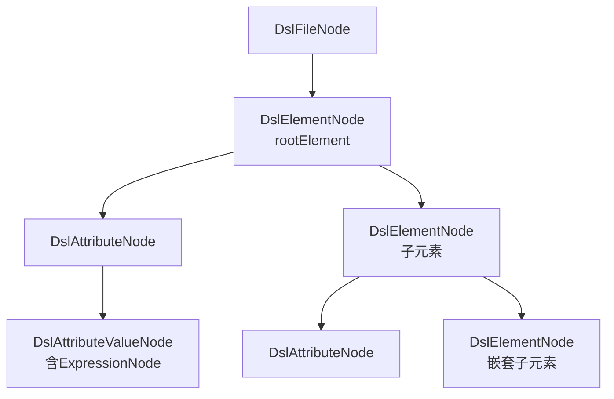

# M3 语法分析模块 - 架构设计

## 1. 模块职责

将DSL XML文件解析为独立AST，并检测语法错误。产出DslFileNode供后续模块消费，产出语法诊断供M4/M5/M7使用。

**单一职责**：XML结构解析（JDK SAX） + DSL AST构建 + 表达式嵌入（ANTLR4） + 语法错误检测。

**完全重构**：自有独立AST替代PSI依赖。Core层无IDEA PSI API依赖。

## 2. 三层划分

| 层级 | 功能 | 说明 |
|---|---|---|
| **Core** | SAX解析→DslAstNode + 语法错误检测 + ANTLR4表达式嵌入 | MVP必交 |
| **Extension** | 精细化Token类型 + 表达式解析缓存 | 增强语法分析精度与性能 |
| **Optional** | 自定义格式语法诊断输出 | 后续迭代 |

## 3. 核心组件

### 3.1 DslAst节点体系

完全独立的AST，不依赖IDEA PSI：

```java
public abstract class DslAstNode {
    String text;
    int line;
    int column;
}
```

> 设计决策(LSP原则): 基类只包含所有子类共有的字段(text/line/column); children语义不适用于所有子类(如DslAttributeValueNode无子节点), 因此各子类定义语义专属字段.

```java
public class DslFileNode extends DslAstNode {
    String xmlDeclaration;
    DslElementNode rootElement;
}

public class DslElementNode extends DslAstNode {
    String tagName;
    List<DslAttributeNode> attributes;
    List<DslElementNode> childElements;
    boolean selfClosing;
    boolean hasError;
    String errorMessage;
}
```

> 字段名childElements表明子节点均为元素节点, 类型精度优于泛型List<DslAstNode>.

```java
public class DslAttributeNode extends DslAstNode {
    String name;
    DslAttributeValueNode value;
}

public class DslAttributeValueNode extends DslAstNode {
    String rawValue;
    Optional<ExpressionAstNode> expression;
    boolean isLiteral;
}
```

> DIP修正: expression引用shared/ast/ExpressionAstNode抽象接口而非M0具体类ExpressionNode; Optional处理可空值(纯文本属性无表达式).

#### ExpressionAstNode接口与ExpressionKind枚举（shared/ast/）

M3表达式嵌入使用`shared/ast/`中定义的抽象接口，M0的ExpressionNode实现此接口：

```java
public interface ExpressionAstNode {
    String getText();
    int getLine();
    int getColumn();
    ExpressionKind getKind();
}

public enum ExpressionKind {
    LITERAL, VARIABLE_REF, FUNCTION_CALL, BINARY_EXPR,
    UNARY_EXPR, CONDITIONAL, ARRAY_ACCESS, UNKNOWN
}
```

> ExpressionAstNode为M0/M3/M4共用的表达式抽象接口, ExpressionKind统一表达式类型分类, M0 ExpressionNode实现此接口.

**AST节点树结构**：



### 3.2 AstBuilder — AST构建器

使用JDK SAXParser解析XML结构，构建DslAstNode树：

> **设计决策（dom4j→SAX）**：原设计拟用 dom4j，但 dom4j 的 `Node` 不提供 per-node 行列号 API，而下游诊断（SYN-003 未知元素等）需要节点级定位。JDK 内置 `SAXParser` 通过 `Locator` 可在每个 `startElement` 事件捕获行列号，故改用 SAX 直接在事件回调中构建 AST。

**构建流程**：

1. JDK SAXParser解析XML → ContentHandler事件流（携带Locator）
2. startElement/endElement事件中直接构建DslElementNode/DslAttributeNode/DslAttributeValueNode，从Locator取行列号
3. 对expression/reference类型属性值，调用M0 DslExpressionParser → ExpressionNode子树
4. 纯字面量属性值直接设置isLiteral=true，不调用解析器

**表达式嵌入判断**：从M2 RuleRepository.getAttrTypeSpec(elementName, attrName)获取supportsExpression字段，true时调用M0表达式解析器。

**调用链**：AstBuilder → SAXParser.parse(content, ContentHandler) → 事件流直接构建DslAstNode → M0 DslExpressionParser（仅expression/reference类型） → DslFileNode

### 3.3 DslAstProvider（接口）

替代原PsiTreeProvider：

```java
public interface DslAstProvider {
    DslFileNode getDslAst(String filePath, String content);
}
```

> 设计决策: 遍历/查询方法不属于语法分析职责, 延后到实现阶段; 调用方可直接遍历DslFileNode树.

**纯字符串参数**：Core层接口使用(filePath, content)，不依赖VirtualFile/PsiFile。

### 3.4 语法错误检测分层

M3产出的语法诊断分三层：

| 错误层级 | 检测机制 | 规则ID | 说明 |
|---|---|---|---|
| XML结构语法 | SAX SAXParseException直接报出 | — | 标签未闭合、属性引号缺失、缺少XML声明等XML格式错误，不做额外包装映射 |
| DSL结构语法 | M3 AST构建 + M2规则库比对 | SYN-001, SYN-002, SYN-003, SYN-004, SYN-005, SYN-006, SYN-007 | 嵌套约束、未知元素/属性、必填缺失、根元素错误 |
| DSL表达式语法 | ANTLR4 DslExpressionParser | SEM-EXPR-001~006, SEM-EXPR-ANTLR | `-#var`模式、单引号缺失、花括号嵌套等 |

**XML格式错误处理**：SAX解析XML遇格式错误直接抛出SAXParseException，M3捕获后转换为Diagnostic产出（保留SAXParseException的行列号和错误消息），不包装映射为自定义SYN-xxx规则ID。原SYN-001(标签未闭合)、SYN-003(属性引号缺失)、SYN-009(缺少XML声明头)不再作为自定义规则ID使用，编号已重新排列为连续序号SYN-001~007。

**DSL结构语法检测详情**：

| 规则ID | 检测内容 | 检测机制 | 严重级别 |
|---|---|---|---|
| SYN-001 | 根元素标签错误 | M1文件识别+M3 AST根节点检测 | error |
| SYN-002 | 标签嵌套违反父子约束 | M3 AST遍历 + M2 allowedParents/allowedChildren比对 | error |
| SYN-003 | 未知元素标签 | M3 AST tagName + M2 DslElementRule名称集合比对 | error |
| SYN-004 | 未知属性名 | M3属性名 + M2 optionalAttrs+requiredAttrs比对 | warning |
| SYN-005 | 缺失必填属性 | M3属性存在性 + M2 requiredAttrs比对 | error |
| SYN-006 | 属性值类型错误（纯字面量） | 直接类型比对 | error |
| SYN-007 | 枚举值错误 | M2 enumValues比对 | error |

**DSL表达式语法检测详情**：

| 规则ID | 检测内容 | 检测机制 | 严重级别 |
|---|---|---|---|
| SEM-EXPR-001 | 数值表达式使用`-#var`语法 | ANTLR4解析：负号直接前缀变量引用检测 | error |
| SEM-EXPR-002 | 数值表达式值超过7位精度限制 | ANTLR4解析：数值常量位数检查 | warning |
| SEM-EXPR-003 | 字符串表达式中数值计算以#开头 | ANTLR4解析：变量名边界检测 | error |
| SEM-EXPR-004 | 字符串表达式未使用单引号 | ANTLR4解析：字符串常量引号类型检查 | error |
| SEM-EXPR-005 | 字符串表达式嵌入数值表达式缺少花括号 | ANTLR4解析：嵌套语法检查 | error |
| SEM-EXPR-006 | preciseeval后使用运算符或+连接符 | ANTLR4解析：函数后缀约束检查 | error |
| SEM-EXPR-ANTLR | ANTLR4词法/语法错误 | ANTLR4自动报错：不可识别token、表达式结构不合法 | error |

### 3.5 自定义Lexer（Extension层）

精细化Token划分，为语义分析提供更精确的Token信息：

- 区分DSL关键字Token与普通字符串Token
- 区分属性名Token与属性值Token
- 表达式解析结果缓存（同一属性值不重复调用ANTLR4）

### 3.6 语法诊断格式化（Optional层）

为语法错误提供自定义格式的诊断信息：

- 精确到行列号的位置信息
- 与规则库RuleSource关联的规则ID和文档链接
- 自定义格式输出（如HTML格式诊断报告）

## 4. 模块依赖

| 上游依赖 | 说明 |
|---|---|
| M0 解析器基础设施 | DslExpressionParser + DslExpressionVisitorAdapter（表达式属性值解析） |
| M2 规则库 | DslElementRule名称集合 + AttrTypeSpec.supportsExpression（语法比对+表达式判断） |

| 下游消费 | 提供接口 | 说明 |
|---|---|---|
| M4 语义分析 | `DslAstProvider.getDslAst()` | AST供语义分析+类型推断+符号表+约束检查 |
| M5 修复逻辑 | `DslAstProvider.getDslAst()` | AST供FixAction定位TextRange |
| M7 批量检查 | `DslAstProvider.getDslAst()` | AST供批量扫描管线 |
| PSI Adapter | `DslAstProvider.getDslAst()` | AST供offset↔PSI映射 |
| CLI入口 | `DslAstProvider.getDslAst()` | CLI管线AST构建 |

## 5. CLI相关

### 5.1 CLI命令调用

M3是CLI管线核心步骤，将文件内容解析为AST：

```
java -jar dsl-analyzer.jar [options] <file-or-directory>
```

M3在CLI管线中的位置：

```
文件输入 → M1识别 → M3语法分析(SAX→AST+ANTLR4表达式) → M4语义分析 → 输出
```

### 5.2 CLI参数与M3的关系

| 参数 | 影响范围 | M3相关说明 |
|---|---|---|
| `--syntax-only` | 只做语法检查 | 仅执行M3语法分析，不进入M4语义分析阶段；CLI直接输出语法诊断 |
| `--rule-dir <path>` | M2规则库目录 | 影响M2提供的元素名称集合和AttrTypeSpec，间接影响M3语法比对和表达式嵌入判断 |
| `--verbose` | 详细输出 | 开启时CLI输出包含AST构建过程信息（如：解析耗时、AST节点数量、表达式属性列表） |

### 5.3 CLI输出中M3的贡献

| CLI输出字段 | 来源路径 | M3贡献 |
|---|---|---|
| XML格式错误诊断 | M3 → SAX SAXParseException | 标签未闭合、属性引号缺失等XML格式错误 |
| `ruleId: SYN-001/002/003/004/005/006/007` | M3语法比对 → M2规则库 | DSL结构语法错误 |
| `ruleId: SEM-EXPR-001~006/ANTLR` | M3表达式解析 → M0 ANTLR4 | DSL表达式语法错误 |
| `summary.skippedFiles`（非DSL XML） | M1 → M3跳过 | M1识别为非DSL，M3不处理 |

### 5.4 CLI异常场景

| 异常场景 | 退出码 | 说明 |
|---|---|---|
| XML格式严重错误（SAX无法解析） | 1 | SAXParser抛出SAXParseException，M3产出XML格式错误诊断 |
| 文件编码非UTF-8 | 1 | SAX解析时编码问题，产出编码相关诊断 |
| ANTLR4表达式解析失败 | 1 | 产出SEM-EXPR-ANTLR诊断，AST中对应属性值expression=null |

### 5.5 CLI输出示例

**`--syntax-only`模式**：

```
$ java -jar dsl-analyzer.jar --syntax-only theme.xml

theme.xml:3:5: error: 未知元素标签 'UnknownTag' [SYN-003]
theme.xml:5:10: warning: 未知属性 'unknownAttr' [SYN-004]
theme.xml:8:1: error: 标签嵌套违反父子约束 [SYN-002]

2 errors, 1 warning, 0 info
```

**全量检查模式**（M3诊断+M4诊断合并输出）：

```
$ java -jar dsl-analyzer.jar theme.xml

theme.xml:3:5: error: 未知元素标签 'UnknownTag' [SYN-003]     ← M3产出
theme.xml:15:3: error: 引用未定义变量 #steps_value [SEM-REF-001]  ← M4产出
theme.xml:20:8: error: 类型不匹配，期望number实际string [SEM-TYPE-001] ← M4产出

3 errors, 0 warnings, 0 info
```

## 6. 设计要点

- **独立AST替代PSI**：自有DslAstNode体系替代IDEA PSI依赖，Core层无com.intellij import
- **JDK SAX解析XML结构**：不使用ANTLR4解析XML；SAX SAXParseException直接报出XML格式错误，不包装映射为自定义SYN-xxx规则ID
- **ANTLR4仅用于表达式**：仅expression/reference类型属性值调用M0 DslExpressionParser；纯字面量属性直接验证不走解析器
- **表达式嵌入判断**：从M2 AttrTypeSpec.supportsExpression字段决定是否调用解析器
- **DslAstProvider纯字符串接口**：使用(filePath, content)参数，不依赖IDEA类型
- **语法错误三层分层**：XML结构语法（JDK SAX） → DSL结构语法（AST+规则库比对） → DSL表达式语法（ANTLR4），各层独立检测
