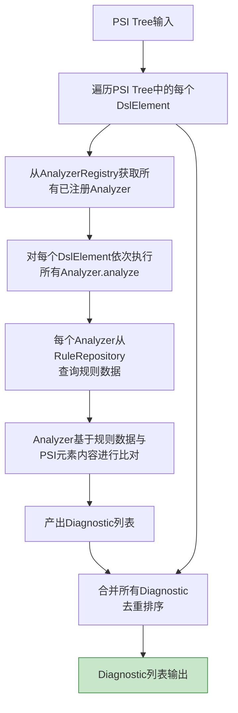

# M4 语义分析模块 - 架构设计

## 1. 模块职责

基于PSI Tree和规则库，对DSL文件进行语义和规则层面的约束检查，产出诊断结果（Diagnostic）供M5/M6/M7消费。同时提供语义相似度匹配，为未知元素/属性推荐最接近的合法候选。

**单一职责**：语义约束检查 + 诊断结果产出。

## 2. 三层划分

| 层级 | 功能 | 说明 |
|---|---|---|
| **Core** | 基础语义Analyzer + Diagnostic模型 + Analyzer注册机制 | MVP必交 |
| **Extension** | 语义相似度匹配 + 上下文约束分析（属性在不同父级下的差异） | 正式版本 |
| **Optional** | 继承链分析 + 引用完整性校验 | 后续迭代 |

## 3. 核心组件

### 3.1 Diagnostic数据模型

```java
@Data
@Builder
public class Diagnostic {
    DiagnosticSeverity severity;     // ERROR | WARNING | INFO
    String ruleId;                   // 规则ID，如 SEM-001
    String message;                  // 诊断描述
    PsiElement targetElement;        // 诊断目标PSI元素
    List<String> suggestedFixes;     // 建议修复描述列表
    String ruleDocUrl;               // 规则文档URL
}
```

### 3.2 DiagnosticProvider（接口）

```java
public interface DiagnosticProvider {
    List<Diagnostic> analyzeFile(PsiFile file);
    List<Diagnostic> analyzeElement(PsiElement element);
}
```

### 3.3 Analyzer注册机制

每种语义检测类型对应一个Analyzer实现，通过注册机制管理：

```java
public interface DslAnalyzer {
    List<Diagnostic> analyze(PsiElement element, RuleRepository ruleRepo);
}

public class AnalyzerRegistry {
    private AnalyzerRegistry() {}    // 工具类：私有构造函数

    public static void register(DslAnalyzer analyzer);
    public static List<DslAnalyzer> getAnalyzers();
}
```

**Core层Analyzer列表**：

| Analyzer | 检测内容 | 规则ID |
|---|---|---|
| UnknownElementAnalyzer | 未知组件 | SYN-004 |
| RequiredAttrAnalyzer | 必填属性缺失 | SYN-006 |
| UnknownAttrAnalyzer | 未知属性 | SYN-005 |
| AttrTypeAnalyzer | 属性类型不匹配 | SYN-007 |
| EnumValueAnalyzer | 枚举值不合法 | SYN-008 |
| ParentChildAnalyzer | 父子结构不合法 | SYN-002 |
| ScopeAnalyzer | 元素不支持当前应用位置 | SEM-SCOPE-001 |

### 3.4 语义分析流程



### 3.5 语义相似度匹配（Extension层）

当检测到未知元素或未知属性时，基于相似度算法推荐最接近的合法候选：

```java
public interface SimilarityMatcher {
    List<String> matchElement(String unknownName, List<String> candidates);
    List<String> matchAttribute(String unknownName, String elementName, List<String> candidates);
}
```

**匹配策略优先级**：完全匹配 > 编辑距离匹配 > 语义匹配

**候选排序**：按相似度分数降序，候选数量上限5条。

**实现方案**：
- 编辑距离：Levenshtein Distance算法
- 语义匹配：基于规则库中元素的分类/功能描述进行关键词匹配

### 3.6 上下文约束分析（Extension层）

同一元素在不同父级下拥有不同的合法属性集：

```java
public interface ContextConstraintAnalyzer {
    List<Diagnostic> analyzeInContext(PsiElement element, PsiElement parent, RuleRepository ruleRepo);
}
```

场景：某属性在父元素A下合法但在父元素B下非法，需要根据上下文判定。

### 3.7 继承链分析 + 引用完整性（Optional层）

| Optional Analyzer | 检测内容 | 规则ID |
|---|---|---|
| InheritanceAnalyzer | 继承链断裂 | SEM-013 |
| DuplicateIdAnalyzer | 重复定义 | SEM-011 |
| ReferenceAnalyzer | 引用不存在 | SEM-014 |

## 4. 模块依赖

| 上游依赖 | 用途 |
|---|---|
| M2 规则库 | `RuleRepository` 查询元素规则、属性规范 |
| M3 语法分析 | `PsiTreeProvider` 获取PSI Tree |

| 下游消费 | 提供接口 |
|---|---|
| M5 Quick Fix | `DiagnosticProvider` + `SimilarityMatcher` 获取诊断与修复候选 |
| M6 UI交互 | `DiagnosticProvider` 获取诊断结果用于标注展示 |
| M7 批量检查 | `DiagnosticProvider.analyzeFile()` 批量扫描 |

## 5. 设计要点

- **Analyzer注册机制**：新增检测类型只需实现DslAnalyzer并注册，不修改引擎核心代码；AnalyzerRegistry遵循工具类模式（私有构造函数、静态方法）
- **数据驱动**：Analyzer从RuleRepository查询规则数据进行比对，规则变更不影响Analyzer逻辑
- **诊断与修复分离**：M4仅产出Diagnostic（问题描述+建议描述），不包含修复执行逻辑（修复逻辑归M5）
- **相似度匹配独立**：SimilarityMatcher作为独立子组件，可被M5 Quick Fix模块直接引用获取候选列表
- **POJO规范**：Diagnostic使用@Data/@Builder注解简化数据模型
