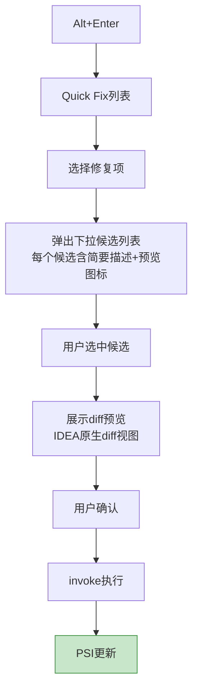

# M5 Quick Fix模块 - 架构设计

## 1. 模块职责

对每种诊断类型提供自动修复动作，包含修复逻辑实现和Quick Fix交互UI。无需确认类修复直接执行，需确认类修复通过下拉候选列表+diff预览供用户选择后执行。

**单一职责**：修复逻辑执行 + Quick Fix交互UI。

## 2. 三层划分

| 层级 | 功能 | 说明 |
|---|---|---|
| **Core** | 无需确认类Quick Fix + IntentionAction注册 | MVP必交 |
| **Extension** | 需确认类Quick Fix（下拉候选+diff预览） | 正式版本 |
| **Optional** | 批量Quick Fix（批量检查后一键修复同类型问题） | 后续迭代 |

## 3. 核心组件

### 3.1 QuickFixAction基础模型

```java
public abstract class DslQuickFixAction implements IntentionAction {
    Diagnostic diagnostic;           // 对应的诊断问题
    String fixDescription;           // 修复描述（展示在Quick Fix列表中）

    @Override
    abstract void invoke(@NotNull Project project, Editor editor, PsiFile file);
}
```

### 3.2 QuickFixProvider（接口）

```java
public interface QuickFixProvider {
    List<IntentionAction> getQuickFixes(Diagnostic diagnostic);
    void registerFix(DslQuickFixAction fixAction, String ruleId);
}
```

供M6 UI交互模块在Annotator中注册和查找Quick Fix。

### 3.3 无需确认类Quick Fix（Core层）

| Quick Fix | 对应诊断 | 修复策略 | 规则ID |
|---|---|---|---|
| CloseTagFix | 标签未闭合 | 补闭合标签 | SYN-001 |
| RemoveExtraEndTagFix | 多余结束标签 | 删除多余结束标签 | SYN-001 |
| AddAttrQuotesFix | 属性引号缺失 | 补属性引号 | SYN-003 |
| InsertRequiredAttrFix | 必填属性缺失 | 插入必填属性占位值/默认值 | SYN-006 |
| NormalizeFormatFix | 属性值类型错误 | 类型归一化（数字/布尔/表达式格式修正） | SYN-007 |

**交互流程**：


### 3.4 需确认类Quick Fix（Extension层）

| Quick Fix | 对应诊断 | 修复策略 | 规则ID |
|---|---|---|---|
| ReplaceElementFix | 未知元素 | 替换为最接近合法组件名（下拉候选） | SYN-004 |
| ReplaceAttrFix | 未知属性 | 替换为别名/删除/转为通用属性（下拉候选） | SYN-005 |
| ReplaceEnumFix | 枚举值不合法 | 替换为最接近合法枚举值（下拉候选） | SYN-008 |

**交互流程**：



### 3.5 下拉候选列表交互UI

```java
public class CandidateSelectionDialog {
    private List<CandidateItem> candidates;  // 候选列表
    private PsiElement targetElement;        // 目标元素
    private Diagnostic diagnostic;           // 对应诊断

    Optional<CandidateItem> showAndSelect(); // 展示对话框并返回用户选择（用户取消时返回Optional.empty）
}

@Data
@Builder
public class CandidateItem {
    String description;              // 简要描述，如 "替换为 <Theme>"
    String previewText;              // 预览文本（修复后的代码片段）
    double similarityScore;          // 相似度分数（排序用）
}
```

**候选来源**：从M4语义分析的`SimilarityMatcher`获取候选列表。

### 3.6 Diff预览机制

用户选中候选后，通过IDEA原生diff视图展示修复前后对比：

```java
public class FixPreviewUtil {
    static void showDiffPreview(Project project, PsiElement original, String fixedText);
}
```

- 左侧：当前代码（原始内容）
- 右侧：修复后代码（替换内容）
- 用户确认后执行修复

### 3.7 批量Quick Fix（Optional层）

批量检查完成后，提供一键修复同类型问题的能力：

```java
public interface BatchQuickFixProvider {
    void applyFixForAll(Project project, String ruleId);
    void applyFixForDirectory(Project project, String ruleId, VirtualFile directory);
}
```

交互：在DSL诊断面板中，对某个问题分组提供"Fix All"按钮，一键修复该类型的所有问题。

## 4. 模块依赖

| 上游依赖 | 用途 |
|---|---|
| M2 规则库 | 获取修复建议数据（默认值、枚举候选等） |
| M4 语义分析 | `Diagnostic` 诊断数据 + `SimilarityMatcher` 候选列表 |

| 下游消费 | 提供接口 |
|---|---|
| M6 UI交互 | `QuickFixProvider` 注册Quick Fix到Annotator |

## 5. 设计要点

- **修复与诊断分离**：M4只描述问题，M5只执行修复，职责边界清晰
- **IntentionAction注册机制**：每种Quick Fix通过IntentionAction注册到IDEA，与IDEA原生Quick Fix交互一致
- **最小修改原则**：Quick Fix仅做最小必要修改，不触发代码格式化或无关变更
- **候选来源解耦**：下拉候选列表的候选数据来自M4 SimilarityMatcher，M5只负责候选的UI展示和执行
- **交互UI内聚**：Quick Fix的交互UI（下拉列表、diff预览）归属M5模块，不散落到M6
- **事件驱动通知**：修复完成后通过Dispatcher.send通知M6刷新标注，模块间无直接调用
