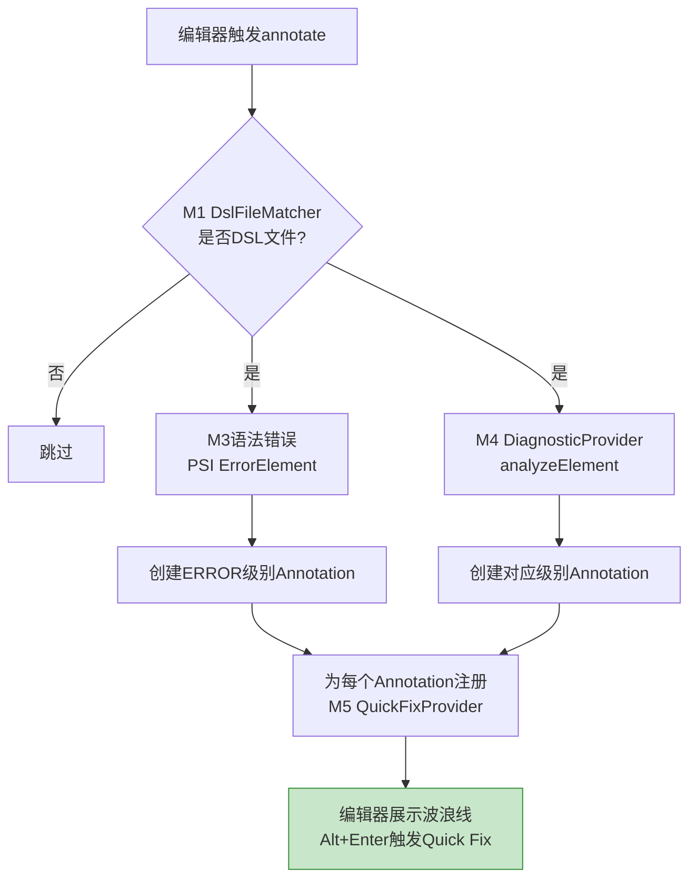

# M6 UI交互模块 - 架构设计

## 1. 模块职责

负责所有IDEA侧的用户交互层，包括编辑器内标注、悬浮提示、DSL诊断面板、右键菜单注册。不包含Quick Fix交互UI（归属M5）。

**单一职责**：IDEA界面集成与用户交互展示。

## 2. 三层划分

| 层级 | 功能 | 说明 |
|---|---|---|
| **Core** | Annotator标注 + 悬浮提示 | MVP必交 |
| **Extension** | DSL诊断面板（ToolWindow） + 右键菜单注册 | 正式版本 |
| **Optional** | 诊断面板筛选/排序高级功能 | 后续迭代 |

## 3. 核心组件

### 3.1 DslAnnotator（Core层）

基于IDEA Annotator API，实现实时编辑器标注：

```java
public class DslAnnotator implements Annotator {
    @Override
    void annotate(@NotNull PsiElement element, @NotNull AnnotationHolder holder) {
        // 1. 通过M1 DslFileMatcher判断是否为DSL文件
        // 2. 非DSL文件跳过
        // 3. DSL文件：从M3获取PSI语法错误，从M4获取语义诊断
        // 4. 为每个Diagnostic创建Annotation
        // 5. 为每个Annotation注册对应的M5 Quick Fix
    }
}
```

**标注流程**：



**配色方案**：沿用IDEA原生配色（Error红色、Warning黄色、Info蓝色）。

### 3.2 精简版悬浮提示（Core层）

鼠标悬停在波浪线标注处时展示精简Tooltip：

```java
public class DslDocumentationProvider extends DocumentationProvider {
    @Override
    String generateDoc(PsiElement element, PsiElement originalElement) {
        // 从M4获取该元素的Diagnostic
        // 组装精简版Tooltip文本：
        //   错误摘要 + 建议修复 + 规则ID + 规则文档链接
    }
}
```

**Tooltip内容规范**：
- 错误摘要：一行描述
- 建议修复：一行描述
- 规则来源：规则ID + 可点击文档链接

**不展示**：组件完整说明、规则置信度、详细枚举列表。

### 3.3 DSL诊断面板（Extension层）

基于IDEA ToolWindow API，在底部创建DSL Analysis面板：

```java
public class DslAnalysisToolWindowFactory implements ToolWindowFactory {
    @Override
    void createToolWindowContent(@NotNull Project project, @NotNull ToolWindow toolWindow) {
        // 创建面板内容：JTree展示诊断列表
        // 底部工具栏：Run Analysis按钮 + Export下拉按钮
    }
}
```

**面板结构**：

```
┌──────────────────────────────────────────────┐
│  DSL Analysis                          [⚙][×]│
├──────────────────────────────────────────────┤
│  ▼ Errors (3)                                │
│    ── 问题条目1                               │
│    ── 问题条目2                               │
│  ▼ Warnings (2)                              │
│    ── 问题条目3                               │
│  ▼ Info (1)                                  │
│    ── 问题条目4                               │
├──────────────────────────────────────────────┤
│  [▶ Run Analysis]       [📥 Export▾] | 6     │
└──────────────────────────────────────────────┘
```

**面板数据来源**：从M4 DiagnosticProvider获取当前文件级诊断结果；项目级诊断结果通过Dispatcher监听M7事件获取。

**面板事件注册**：
```java
Dispatcher.instance().register(EventId.BATCH_INSPECTION_COMPLETED, (event) -> {
    BatchInspectionResult result = event.getData();
    dslAnalysisPanel.refresh(result);
});
```

**面板交互**：
- 点击问题条目 → 编辑器跳转定位
- 右键问题条目 → Quick Fix / 查看规则文档 / 复制

### 3.4 右键菜单注册（Extension层）

在项目树节点注册"Check DSL Rules"菜单项：

```java
public class DslCheckActionGroup extends DefaultActionGroup {
    // 注册到ProjectViewPopupMenu
    // 子菜单：
    //   - CheckDSLFileAction (文件级)
    //   - CheckDSLDirectoryAction (目录级)
    //   - CheckDSLProjectAction (项目级)
}
```

右键菜单触发后调用M7 BatchInspectionRunner执行批量检查。

### 3.5 面板筛选/排序（Optional层）

诊断面板高级功能：

- 按文件/规则类别分组切换
- 搜索过滤（按文件名/规则ID搜索）
- 排序（按严重级别/文件路径/时间排序）

## 4. 模块依赖

| 上游依赖 | 用途 |
|---|---|
| M1 文件识别 | `DslFileMatcher.isDslFile()` 过滤DSL文件 |
| M3 语法分析 | PSI Tree + ErrorElement获取语法错误 |
| M4 语义分析 | `DiagnosticProvider` 获取语义诊断结果 |
| M5 Quick Fix | `QuickFixProvider.getQuickFixes()` 注册到Annotation |
| M7 批量检查 | `BatchInspectionRunner` 右键菜单触发执行 |

| 下游消费 | 说明 |
|---|---|
| 无 | UI交互模块是最终展示层，不向其他模块提供接口 |

## 5. 设计要点

- **Annotator + LocalInspectionTool双通道**：Annotator负责实时标注（编辑即触发），LocalInspectionTool供批量检查调用（M7使用）
- **纯展示层**：M6不包含任何分析逻辑或修复逻辑，仅负责将其他模块的结果展示到IDEA界面
- **事件驱动通信**：M6通过Dispatcher.register监听M7批量检查完成事件，接收BatchInspectionResult刷新面板，模块间无直接方法调用
- **Quick Fix UI归属明确**：编辑器内Alt+Enter弹出的Quick Fix列表由M6 Annotator注册，但Quick Fix的具体交互UI（下拉候选、diff预览）归属M5
- **面板数据实时同步**：编辑器中代码变更时，Annotator实时更新标注，面板监听PSI变更事件同步刷新
- **原生交互一致性**：所有交互复用IDEA原生API（Annotator、ToolWindow、ActionGroup），与IDEA原生功能体验一致
