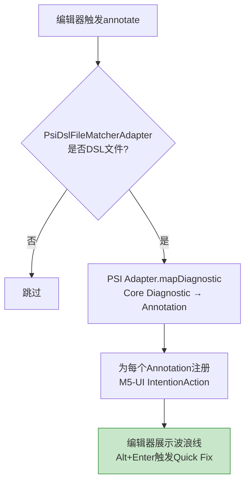

# M6 UI交互模块 - 架构设计

## 1. 模块职责

负责所有IDEA侧的用户交互层，包括编辑器标注、悬浮提示（含变量信息）、DSL诊断面板、右键菜单、Quick Fix交互UI（M5-UI桥接）。

**单一职责**：IDEA界面集成与用户交互展示。

**M5-UI纳入说明**：M5的Plugin层交互UI（IntentionAction桥接+候选对话框+diff预览）归属于M6的Quick Fix交互部分，不单独成模块。原因：Quick Fix UI是IDEA交互能力，与M6其他UI共享Annotator注册通道，且FixAction→IntentionAction桥接逻辑量小。

## 2. 三层划分

| 层级 | 功能 | 说明 |
|---|---|---|
| **Core** | Annotator标注 + 错误悬浮提示 + Quick Fix交互UI基础 | MVP必交 |
| **Extension** | 变量信息悬浮 + 元素规则悬浮 + Var声明悬浮 + 诊断面板 + 右键菜单 + 需确认类Quick Fix交互 | 正式版本 |
| **Optional** | 面板筛选/排序/搜索 | 后续迭代 |

## 3. 核心组件

### 3.1 DslAnnotator（Core层）

基于IDEA Annotator API，实现实时编辑器标注：

```java
public class DslAnnotator implements Annotator {
    @Override
    void annotate(@NotNull PsiElement element, @NotNull AnnotationHolder holder) {
        // 1. PsiDslFileMatcherAdapter判断是否为DSL文件
        // 2. 非DSL文件跳过
        // 3. DSL文件：PSI Adapter.mapDiagnostic()将Core Diagnostic映射为Annotation
        // 4. 为每个Annotation注册M5-UI的IntentionAction
    }
}
```

**标注流程**：



**配色方案**：沿用IDEA原生配色（Error红色、Warning黄色、Info蓝色）。

### 3.2 DslDocumentationProvider（Core+Extension层）

鼠标悬停时展示Tooltip。扩展为非错误场景也响应：

```java
public class DslDocumentationProvider extends DocumentationProvider {
    @Override
    String generateDoc(PsiElement element, PsiElement originalElement) {
        // 1. 有Diagnostic → 显示错误信息（原有逻辑）
        // 2. 无Diagnostic → 查询Core符号表
        //    → 变量引用(#/@var) → 显示变量类型+声明位置
        //    → 元素标签 → 显示元素规则摘要
        // 3. Var声明 → 显示变量类型+isConstAttr标记
    }
}
```

**Tooltip内容规范**：

| 场景 | Tooltip内容 | 数据来源 |
|---|---|---|
| 有Diagnostic | 错误摘要 + 建议修复 + 规则ID + 文档链接 | PSI Adapter → Core Diagnostic |
| 变量引用(#/@var) | 变量类型 + 声明位置(name:xxx, type:number) | PSI Adapter → Core SymbolTable |
| 元素标签 | 元素规则摘要(requiredAttrs/optionalAttrs概要) | Core M2 RuleRepository |
| Var声明 | 变量类型 + isConstAttr标记 | PSI Adapter → Core SymbolTable |

### 3.3 M5-UI Quick Fix交互（Core+Extension层）

将Core FixAction桥接为IDEA IntentionAction：

**无需确认类**：直接将FixAction的TextRange映射为PSI范围，执行WriteCommandAction文本替换。

```java
public class DirectFixIntentionAction implements IntentionAction {
    FixAction fixAction;
    FixActionAdapter adapter;

    @Override
    void invoke(@NotNull Project project, Editor editor, PsiFile file) {
        // FixActionAdapter将TextRange映射为PSI offset范围
        // WriteCommandAction执行文本替换
    }
}
```

**需确认类**：弹出CandidateSelectionDialog，选中后执行FixAction。

```java
public class ConfirmFixIntentionAction implements IntentionAction {
    FixAction fixAction;
    FixActionAdapter adapter;

    @Override
    void invoke(@NotNull Project project, Editor editor, PsiFile file) {
        // 弹出CandidateSelectionDialog
        // 用户选中候选 → FixActionAdapter映射并执行
    }
}
```

**修复完成后通知**：

```java
Dispatcher.instance().send(EventId.QUICK_FIX_EXECUTED, fixAction);
```

M6 Annotator监听此事件刷新标注。

### 3.4 CandidateSelectionDialog（Extension层）

需确认类修复的候选选择对话框：

```java
public class CandidateSelectionDialog {
    List<CandidateItem> candidates;
    PsiElement targetElement;
    Diagnostic diagnostic;

    Optional<CandidateItem> showAndSelect();
}
```

- 每个候选含简要描述+预览图标
- 用户选中后展示diff预览（IDEA原生diff视图）
- 用户确认后执行FixAction

### 3.5 DSL诊断面板（Extension层）

基于IDEA ToolWindow API，在底部创建DSL Analysis面板：

```java
public class DslAnalysisToolWindowFactory implements ToolWindowFactory {
    @Override
    void createToolWindowContent(@NotNull Project project, @NotNull ToolWindow toolWindow) {
        // JTree展示诊断列表
        // 底部工具栏：Run Analysis按钮 + Export下拉按钮
    }
}
```

**面板结构**：

```
┌──────────────────────────────────────────────┐
│  DSL Analysis                          [⚙][×]│
├──────────────────────────────────────────────┤
│  ▼ Errors (3)                                │
│    ── 问题条目1                               │
│  ▼ Warnings (2)                              │
│    ── 问题条目3                               │
├──────────────────────────────────────────────┤
│  [▶ Run Analysis]       [📥 Export▾] | 6     │
└──────────────────────────────────────────────┘
```

**面板数据来源**：
- 当前文件诊断：PSI Adapter → Core DiagnosticProvider
- 项目级诊断：Dispatcher监听M7 BATCH_INSPECTION_COMPLETED事件

**面板交互**：
- 点击问题条目 → 编辑器跳转定位
- 右键问题条目 → Quick Fix / 查看规则文档 / 复制

### 3.6 右键菜单注册（Extension层）

在项目树节点注册"Check DSL Rules"菜单项：

```java
public class DslCheckActionGroup extends DefaultActionGroup {
    // CheckDSLFileAction (文件级)
    // CheckDSLDirectoryAction (目录级)
}
```

右键菜单触发后调用M7 BatchInspectionRunner（Plugin Adapter适配后）执行批量检查。

### 3.7 面板筛选/排序/搜索（Optional层）

- 按文件/规则类别分组切换
- 搜索过滤（按文件名/规则ID搜索）
- 排序（按严重级别/文件路径/时间排序）

## 4. 模块依赖

| 上游依赖 | 说明 |
|---|---|
| PSI Adapter | DslPsiBridge（Diagnostic→Annotation映射） + FixActionAdapter（FixAction→IntentionAction） + SymbolTableAdapter（符号表→Reference） |
| Core M4 语义分析 | DiagnosticProvider（诊断结果，经PSI Adapter桥接） |
| Core M5 修复逻辑 | QuickFixProvider（FixAction列表，经FixActionAdapter桥接） |
| Core M7 批量检查 | BatchInspectionRunner（Plugin Adapter适配后，右键菜单触发） |
| Core M2 规则库 | RuleRepository（元素规则摘要，悬浮提示用） |

| 下游消费 | 说明 |
|---|---|
| 无 | UI交互模块是Plugin层终端交互层，不向其他模块提供接口 |

## 5. CLI相关

### 5.1 CLI与M6的关系

**M6不存在于CLI模式**。CLI jar不打包plugin/**中的UI交互代码。M6的所有功能（Annotator、DocumentationProvider、ToolWindow、IntentionAction等）仅在IDEA环境中生效。

**CLI替代方案**：M6的交互功能在CLI模式中由以下机制替代：

| M6功能 | CLI替代 |
|---|---|
| 编辑器标注（波浪线） | Terminal彩色输出（error红色、warning黄色） |
| 悬浮提示（变量信息） | `--verbose`模式输出符号表内容摘要 |
| Quick Fix交互UI | CLI输出suggestedFixes和FixAction文本 |
| 诊断面板 | JSON/Markdown报告文件（`--output`参数） |
| 右键菜单批量检查 | CLI命令行直接指定文件/目录路径 |

### 5.2 CLI参数不受M6影响

M6的所有参数和配置仅在IDEA环境中生效，不影响CLI参数和输出。

## 6. 设计要点

- **M5-UI纳入M6**：Quick Fix交互UI归M6模块，不单独成模块。FixAction→IntentionAction桥接逻辑量小，共享Annotator注册通道
- **PSI Adapter桥接所有Core数据**：M6不直接依赖Core内部实现，所有数据通过PSI Adapter桥接
- **Annotator + LocalInspectionTool双通道**：Annotator实时标注（编辑触发），LocalInspectionTool供批量检查调用
- **悬浮提示扩展**：非错误场景也响应（变量信息、元素规则、Var声明），增强IDEA交互体验
- **事件驱动通信**：M6通过Dispatcher监听M7批量检查完成事件和M5-UI修复执行事件，刷新标注和面板
- **CLI替代**：所有M6交互功能在CLI模式中有对应替代机制
