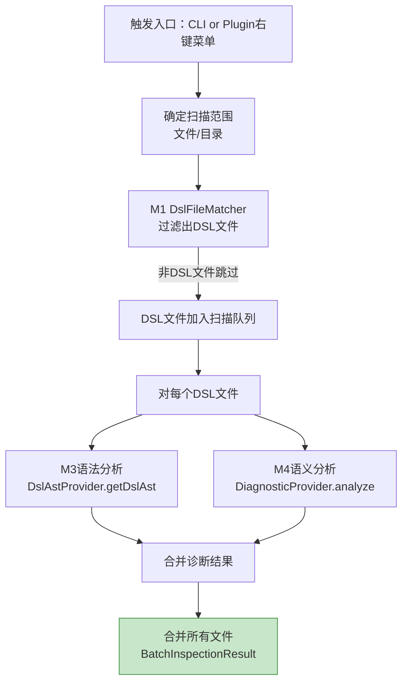

# M7 批量检查与报告模块 - 架构设计

## 1. 模块职责

对指定范围（文件/目录）进行批量DSL规则检查，产出汇总诊断报告。Core层提供CLI入口批量扫描能力，Plugin层提供IDEA右键菜单触发+进度条+事件通知。

**单一职责**：批量检查执行 + 报告生成与导出。

**接口重构**：使用core抽象（String filePath/directoryPath）而非PSI/VirtualFile/Project。

## 2. 三层划分

| 层级 | 功能 | 说明 |
|---|---|---|
| **Core** | 批量扫描执行器 + Markdown报告导出 | MVP必交 |
| **Extension** | JSON报告 + Terminal彩色输出 + IDEA进度条集成 | 正式版本 |
| **Optional** | 自定义报告模板 + 定时自动检查 | 后续迭代 |

## 3. 核心组件

### 3.1 BatchInspectionRunner（接口）

```java
public interface BatchInspectionRunner {
    BatchInspectionResult runOnFile(String filePath);
    BatchInspectionResult runOnDirectory(String directoryPath);
}
```

**纯字符串参数**：Core层接口使用filePath/directoryPath，不依赖VirtualFile/Project。

**CLI调用**：CLI入口直接调用Core层接口。
**Plugin调用**：Plugin层提供Adapter将VirtualFile/Project适配为String参数，供M6右键菜单触发。

### 3.2 批量扫描执行器（Core层）



**CLI模式**：单线程顺序执行，每步返回结果传递给下一步。
**Plugin模式**：提交至DumbService后台线程异步执行，完成后通过Dispatcher通知M6。

### 3.3 BatchInspectionResult数据模型

```java
@Data
@Builder
public class BatchInspectionResult {
    int totalFiles;
    int skippedFiles;
    int errorCount;
    int warningCount;
    int infoCount;
    List<FileDiagnosticResult> fileResults;
}

@Data
@Builder
public class FileDiagnosticResult {
    String filePath;
    List<Diagnostic> diagnostics;
}
```

**新增字段**：`skippedFiles`记录M1过滤掉的非DSL文件数（仅verbose模式显示）。

### 3.4 ReportExporter（接口）

```java
public interface ReportExporter {
    String exportMarkdown(BatchInspectionResult result);
    String exportJson(BatchInspectionResult result);
    String exportTerminal(BatchInspectionResult result);
    void exportToFile(BatchInspectionResult result, String format, String outputPath);
}
```

**三种输出格式**：

| 格式 | CLI参数 | 用途 | 说明 |
|---|---|---|---|
| JSON | `--format json` | CI/CD流水线 | 结构化诊断数据，stdout或报告文件 |
| Terminal | `--format terminal` | 人工阅读 | gcc/clang格式，终端彩色输出 |
| Markdown | `--format markdown` | 报告文件 | 按严重级别分组，含修复建议 |

**报告内容字段**：severity/file/line/col/ruleId/message/suggestedFixes/ruleDocUrl，多文件扫描时按文件聚合+汇总统计。

### 3.5 Terminal彩色输出（Core层）

```
theme.xml:15:3: error: 引用未定义变量 #steps_value [SEM-REF-001]
  建议修复: 声明Var name="steps_value"

1 error, 0 warnings, 0 info
```

**彩色规则**：error=红色、warning=黄色、info=蓝色。`--no-color`参数禁用。

### 3.6 JSON输出（Core层）

单文件：

```json
{
  "file": "theme.xml",
  "diagnostics": [
    {"severity":"error","line":15,"col":3,"ruleId":"SEM-REF-001","message":"引用未定义变量 #steps_value","suggestedFixes":["声明Var name=\"steps_value\""],"ruleDocUrl":"https://dsl-docs.example.com/rules/SEM-REF-001"}
  ],
  "summary": {"errors":1,"warnings":0,"info":0}
}
```

多文件：

```json
{
  "files": [
    {"file":"theme.xml","diagnostics":[...],"summary":{"errors":1,"warnings":0,"info":0}},
    {"file":"layout.xml","diagnostics":[...],"summary":{"errors":0,"warnings":2,"info":1}}
  ],
  "summary": {"totalFiles":2,"errors":1,"warnings":2,"info":1}
}
```

### 3.7 Markdown报告导出（Core层）

- 按error/warning/info分组
- 每条包含：文件路径、行列号、ruleId、诊断消息、修复建议、规则来源链接
- 文件级汇总统计+全局汇总统计

### 3.8 IDEA进度条集成（Extension层，Plugin层实现）

批量检查执行时，通过IDEA ProgressManager展示原生进度条：

```java
public class BatchInspectionTask extends CompletableFuture<Integer, TaskArgs<BatchInspectionResult>> {
    private static final LogUtil LOGGER = LogUtil.getInstance(BatchInspectionTask.class);

    @Override
    protected CompletableFuture<Integer> run(TaskArgs<BatchInspectionResult> taskArgs) {
        ProgressManager.getInstance().run(new Task.Backgroundable(project, "Checking DSL rules") {
            @Override
            void run(@NotNull ProgressIndicator indicator) {
                indicator.setIndeterminate(false);
                indicator.setFraction(progress);
                indicator.setText("Checking: " + currentFile);
            }
        });
        return CompletableFuture.completedFuture(result);
    }
}
```

### 3.9 Dispatcher事件通知（Extension层，Plugin层实现）

批量检查完成后，通过Dispatcher通知M6刷新面板：

```java
Dispatcher.instance().send(EventId.BATCH_INSPECTION_COMPLETED, batchInspectionResult);
```

M6注册事件处理器：

```java
Dispatcher.instance().register(EventId.BATCH_INSPECTION_COMPLETED, (event) -> {
    BatchInspectionResult result = event.getData();
    dslAnalysisPanel.refresh(result);
});
```

**事件不跨层**：Core层CLI模式无Dispatcher事件，单线程顺序执行直接输出。

### 3.10 自定义报告模板 + 定时检查（Optional层）

**自定义模板**：允许用户在Settings中配置报告模板。
**定时自动检查**：支持配置定时检查频率，自动执行全项目扫描，结果写入DSL诊断面板。

## 4. 模块依赖

| 上游依赖 | 说明 |
|---|---|
| M1 文件识别 | `DslFileMatcher.isDslFile()` 过滤扫描范围 |
| M2 规则库 | `RuleRepository` 全量规则用于批量分析 |
| M3 语法分析 | `DslAstProvider.getDslAst()` AST构建 |
| M4 语义分析 | `DiagnosticProvider.analyze()` 语义诊断 |

| 下游消费 | 提供接口 | 说明 |
|---|---|---|
| M6 UI交互 | `BatchInspectionRunner`（Plugin Adapter适配后） | 右键菜单触发+面板展示 |
| CLI入口 | `BatchInspectionRunner.runOnFile/runOnDirectory` | CLI管线组合入口 |
| CLI入口 | `ReportExporter` | CLI报告导出 |

## 5. CLI相关

### 5.1 CLI命令

M7是CLI的主入口，组合全管线执行并输出报告：

```
java -jar dsl-analyzer.jar [options] <file-or-directory>
```

**CLI管线完整流程**：

```
CLI入口 → 参数解析 → 加载规则库(M2) → 加载函数签名库(M0)
→ M1识别(filePath, content)
→ M3语法分析(filePath, content → DslFileNode)
→ M4语义分析(filePath, content → List<Diagnostic>)
→ M5修复生成(Diagnostic → List<FixAction>)
→ M7组合结果(BatchInspectionResult)
→ ReportExporter输出(JSON/Terminal/Markdown)
→ 退出码(0/1/2)
```

### 5.2 CLI参数与M7的关系

| 参数 | 影响范围 | M7相关说明 |
|---|---|---|
| `<file-or-directory>` | 输入目标 | M7扫描范围的入口参数 |
| `--syntax-only` | 只做语法检查 | DiagnosticProvider 以 SYNTAX_ONLY 模式派发，只跑 M3（SyntaxChecker + ExpressionSyntaxChecker），跳过 M4/M5 |
| `--semantic-only` | 只做语义检查 | DiagnosticProvider 以 SEMANTIC_ONLY 模式派发，只跑 M4 analyzer（不含 TypeAnalyzer + SyntaxErrorAnalyzer） |
| `--no-type-check` | 关闭类型推断 | config.typeCheck=false 时 M4 过滤 TypeAnalyzer |
| `--rule-dir <path>` | M2规则库目录 | M7加载自定义规则库替代内置规则 |
| `--format <format>` | 输出格式 | M7调用ReportExporter的对应格式导出 |
| `--output <path>` | 报告文件输出路径 | M7导出报告到指定文件（仅md/json格式） |
| `--no-color` | 禁止终端彩色 | Terminal输出时不使用ANSI颜色 |
| `--quiet` | 只输出error级别 | 过滤 WARNING/INFO 级别诊断，仅保留 ERROR |
| `--config <path>` | 检查配置文件 | 配置中可指定规则子集、severity覆盖、启用/禁用特定ruleId |
| `--verbose` | 详细输出 | 输出 5 类信息（AST统计/符号表/耗时/analyzer计数/类型推断链） |

### 5.3 退出码语义

| 退出码 | 含义 | 触发场景 |
|---|---|---|
| 0 | 无error级诊断 | 所有诊断均为warning/info级别 |
| 1 | 有error级诊断 | 至少一条error级诊断 |
| 2 | 执行异常 | 文件不存在、规则库加载失败、函数签名库JSON错误、参数互斥冲突 |

> **内部异常诊断（P0 调整后）**：文件级内部异常（AST 构建失败、DiagnosticProvider 整体抛出）产出 `INTERNAL-AST-ERROR` / `INTERNAL-ANALYZER-ERROR`（ERROR 级），并标记 `hasInternalErrors=true`，`ExitCodeCalculator` 据此返回退出码 2；分析过程中单 analyzer/符号表构建失败产出 `INTERNAL-ANALYZER-ERROR` / `INTERNAL-SYMBOLTABLE-ERROR`（WARNING 级），不改变退出码。

### 5.4 CLI输出示例

**单文件 + Terminal格式**：

```
$ java -jar dsl-analyzer.jar theme.xml

theme.xml:3:5: error: 未知元素标签 'UnknownTag' [SYN-003]
theme.xml:15:3: error: 引用未定义变量 #steps_value [SEM-REF-001]
  建议修复: 声明Var name="steps_value"
theme.xml:20:8: error: 类型不匹配，期望number实际string [SEM-TYPE-001]

3 errors, 0 warnings, 0 info
```

**目录扫描 + JSON格式**：

```
$ java -jar dsl-analyzer.jar --format json ./themes/
```

```json
{
  "files": [
    {"file":"theme.xml","diagnostics":[...],"summary":{"errors":3,"warnings":0,"info":0}},
    {"file":"layout.xml","diagnostics":[],"summary":{"errors":0,"warnings":2,"info":1}}
  ],
  "summary": {"totalFiles":2,"skippedFiles":1,"errors":3,"warnings":2,"info":1}
}
```

**Markdown报告导出**：

```
$ java -jar dsl-analyzer.jar --format markdown --output report.md ./themes/
```

终端输出：`Report exported to: report.md`

**异常场景**：

```
$ java -jar dsl-analyzer.jar /nonexistent/path
Error: Path not found: /nonexistent/path
```

退出码=2

## 6. 设计要点

- **Core/Plugin双模式**：Core层CLI单线程顺序执行；Plugin层异步执行+Dispatcher事件通知
- **纯字符串接口**：BatchInspectionRunner使用filePath/directoryPath参数，Core层无IDEA依赖
- **事件不跨层**：CLI模式无Dispatcher事件，直接输出；Plugin层Dispatcher仅用于M7→M6通知
- **性能目标**：≤5s/100文件（CLI模式）
- **扫描策略**：先M1过滤DSL文件，减少不必要分析开销
- **三种输出格式**：JSON(CI/CD)、Terminal(人工阅读)、Markdown(报告文件)，CLI入口统一调度
- **退出码语义**：0=无error、1=有error、2=异常，与eslint/clang-tidy一致
