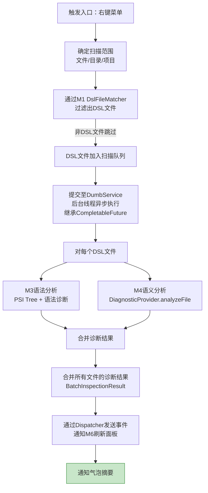

# M7 批量检查模块 - 架构设计

## 1. 模块职责

对指定范围（文件/目录/项目）进行批量DSL规则检查，产出汇总诊断报告，支持Markdown/JSON格式导出。

**单一职责**：批量检查执行 + 报告生成与导出。

## 2. 三层划分

| 层级 | 功能 | 说明 |
|---|---|---|
| **Core** | 批量扫描执行器 + Markdown报告导出 | MVP必交 |
| **Extension** | JSON报告导出 + IDEA原生进度条集成 | 正式版本 |
| **Optional** | 报告自定义模板 + 定时自动检查 | 后续迭代 |

## 3. 核心组件

### 3.1 BatchInspectionRunner（接口）

```java
public interface BatchInspectionRunner {
    BatchInspectionResult runOnFile(VirtualFile file);
    BatchInspectionResult runOnDirectory(VirtualFile directory);
    BatchInspectionResult runOnProject(Project project);
}
```

供M6右键菜单调用。

### 3.2 批量扫描执行器（Core层）



### 3.3 BatchInspectionResult数据模型

```java
@Data
@Builder
public class BatchInspectionResult {
    int totalFiles;                  // 扫描文件总数
    int errorCount;
    int warningCount;
    int infoCount;
    List<FileDiagnosticResult> fileResults;  // 各文件的诊断结果
}

@Data
@Builder
public class FileDiagnosticResult {
    String filePath;                 // 文件路径
    List<Diagnostic> diagnostics;    // 该文件的诊断列表
}
```

### 3.4 Markdown报告导出（Core层）

```java
public interface ReportExporter {
    String exportMarkdown(BatchInspectionResult result);
    String exportJson(BatchInspectionResult result);
    void exportToFile(BatchInspectionResult result, String format, String outputPath);
}
```

Markdown报告格式：
- 按error/warning/info分组
- 每条包含：文件路径、行列号、诊断code、修复建议、规则来源链接

### 3.5 JSON报告导出（Extension层）

JSON报告格式：
- summary统计信息
- issues数组，每条包含完整诊断信息

导出文件保存到项目根目录，通过IDEA通知气泡提示文件位置。

### 3.6 IDEA原生进度条集成（Extension层）

批量检查执行时，通过IDEA ProgressManager展示原生进度条：

```java
public class BatchInspectionTask extends CompletableFuture<Integer, TaskArgs<BatchInspectionResult>> {
    private static final LogUtil LOGGER = LogUtil.getInstance(BatchInspectionTask.class);

    @Override
    protected CompletableFuture<Integer> run(TaskArgs<BatchInspectionResult> taskArgs) {
        ProgressManager.getInstance().run(new Task.Backgroundable(project, "Checking DSL rules") {
            @Override
            void run(@NotNull ProgressIndicator indicator) {
                indicator.setIndeterminate(false);
                indicator.setFraction(progress);
                indicator.setText("Checking: " + currentFile);
            }
        });
        return CompletableFuture.completedFuture(result);
    }
}
```

- 底部状态栏显示进度条 + 百分比
- 与IDEA原生Inspect Code进度体验一致

### 3.7 事件驱动通信（Extension层）

批量检查完成后，通过Dispatcher通知M6刷新面板：

```java
Dispatcher.instance().send(EventId.BATCH_INSPECTION_COMPLETED, batchInspectionResult);
```

M6 UI交互模块注册对应事件处理器接收结果并刷新面板：

```java
Dispatcher.instance().register(EventId.BATCH_INSPECTION_COMPLETED, (event) -> {
    BatchInspectionResult result = event.getData();
    dslAnalysisPanel.refresh(result);
});
```

### 3.7 报告自定义模板 + 定时检查（Optional层）

**自定义模板**：允许用户在Settings中配置报告模板（自定义Markdown/JSON格式）。

**定时自动检查**：
- 支持配置定时检查频率（每日/每周）
- 定时触发后自动执行全项目扫描
- 结果写入DSL诊断面板，通过通知气泡提醒

## 4. 模块依赖

| 上游依赖 | 用途 |
|---|---|
| M1 文件识别 | `DslFileMatcher.isDslFile()` 过滤扫描范围 |
| M2 规则库 | `RuleRepository` 全量规则用于批量分析 |
| M3 语法分析 | PSI Tree构建 + 语法诊断 |
| M4 语义分析 | `DiagnosticProvider.analyzeFile()` 语义诊断 |

| 下游消费 | 提供接口 |
|---|---|
| M6 UI交互 | `BatchInspectionRunner` 右键菜单触发 + 面板展示结果 |

## 5. 设计要点

- **异步执行**：批量检查继承CompletableFuture<T, U>，提交至DumbService后台线程，不阻塞IDEA主线程
- **事件驱动通信**：检查完成后通过Dispatcher发送事件通知M6，模块间无直接依赖调用
- **性能目标**：≤5s/100文件，通过增量分析和规则库缓存保障
- **报告与展示分离**：M7负责报告生成与文件导出，M6负责面板展示（两者通过Dispatcher事件共享BatchInspectionResult数据）
- **扫描策略**：先通过M1过滤DSL文件，减少不必要的分析开销
- **结果一次性产出**：BatchInspectionResult包含所有文件的完整诊断，通过Dispatcher事件传递，M6可直接消费
