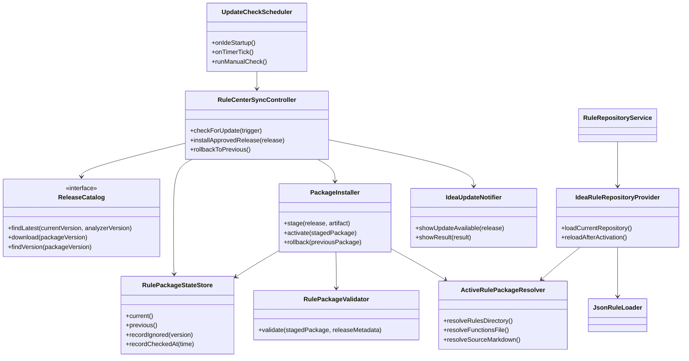
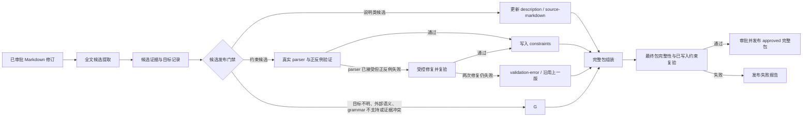
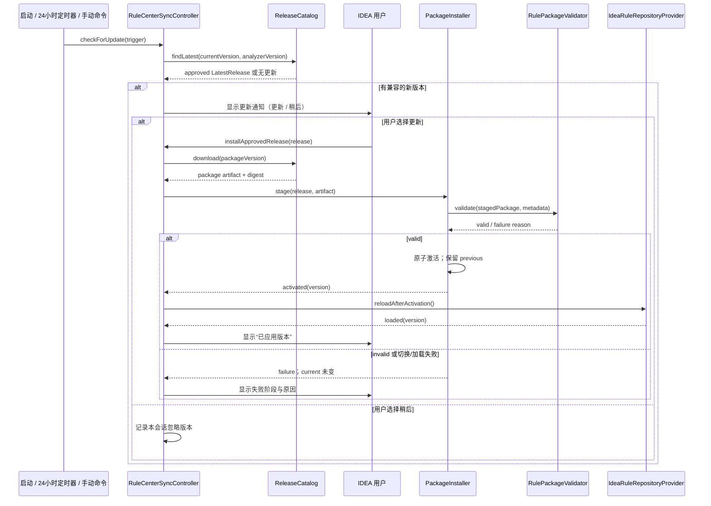

# FEAT001 规则中心仓同步 — PHASE 3 设计

## 1. 设计范围

本设计只覆盖 IntelliJ IDEA 原生插件的中心仓规则包同步，以及中心仓将获批 Markdown 转为发布制品的质量门禁。CLI、LSP、VS Code 是后续接入目标：它们复用已发布包格式与校验规则，但不在首版实现和验收范围。

现有 `RuleRepositoryService` 从插件内置 `/rules` 加载 `RuleRepository`；`JsonRuleLoader` 已能从指定目录加载 `rules/elements/**`、`global_vars.json` 与 `rule_sources.json`。本设计在这两个既有边界之外增加“当前规则包定位”和“已安装包校验”，不改变静态检查只能依赖 DSL XML/JSON 文本的边界。

## 2. 模块与职责



| 模块 | 职责 | 不负责 |
|---|---|---|
| `ReleaseCatalog` | 从公司中心仓查询 approved 发布、下载指定完整包、查询可回滚历史版本。 | 决定 Markdown 是否能成为规则、绕过审批。 |
| `RuleCenterSyncController` | 协调启动/定时/手动检查、用户确认、安装、回滚与通知。 | 解析规则 JSON 或实现网络细节。 |
| `PackageInstaller` | staging、调用验证、原子激活、失败恢复旧版本。 | 判断约束语义、展示 IDEA UI。 |
| `RulePackageValidator` | 校验摘要、清单、目录完整性、JSON/函数库可加载性、发布报告与分析器版本兼容性。 | 读取项目 DSL 或外部资源。 |
| `RulePackageStateStore` | 保存当前/上一个包、忽略版本及最近检查时间。 | 保存完整规则内容。 |
| `ActiveRulePackageResolver` | 给 IDEA 静态检查和文档提供唯一的当前包路径。没有远端包时返回内置资源。 | 下载、安装或合并规则。 |
| `IdeaRuleRepositoryProvider` | 用当前包路径创建并重载 `RuleRepository`，使诊断与文档使用同版规则。 | 检查远端更新。 |
| `IdeaUpdateNotifier` | 展示“有更新”、安装结果、失败原因及手动检查入口。 | 自动安装。 |

`RuleRepositoryService` 保留为 IDEA 现有调用点；它改为委托 `IdeaRuleRepositoryProvider`，而不是自行固定读取插件内置资源。`JsonRuleLoader` 仍是规则 JSON 的唯一解析器，以避免客户端重新实现一份 JSON 语义。

## 3. 中心转换与发布流水线

中心仓与 IDEA 插件通过已审批的规则包交互。中心转换流水线是发布前系统，不在插件进程中运行。



| 中心模块 | 输入 | 输出 | 协作约束 |
|---|---|---|---|
| `DocumentRevisionIngestor` | 已审批 Markdown 修订 | 不可变源文档版本 | 不因章节缺失而拒绝扫描。 |
| `VerifiedConstraintExampleCatalog` | 已发布且验证通过的约束、正反例和 grammar 特性 | 目标相关的受控示例/模板 | 只作为提取参考；不绕过独立验证。 |
| `CandidateExtractionService` | 整篇 Markdown、受控示例 | `RuleCandidate` 集合 | LLM 可作为实现之一；每条候选必须附原文证据，不能直接发布。 |
| `CandidatePublicationGate` | 候选、当前规则包、受控示例 | description 改动、已验证约束、`skipped` 原因或 `validation-error` | 实施 SP-05 四道硬门；三类明确不可转换内容直接跳过。 |
| `ConstraintVerificationRunner` | 候选约束、正例、反例、真实分析器 | `ConstraintVerification` 或验证错误 | 必须运行真实条件 parser 和 analyzer；parser 已接受后的正反例错误进入受控修复循环。 |
| `RulePackageAssembler` | 所有通过项与原始 MD | 完整规则包、manifest、release report | 目录必须遵守 SP-01；不得只产出增量 JSON。 |
| `DocumentFeedbackPublisher` | `DocumentConversionFeedback` | 上传人可见的处理反馈 | 复用中心仓页面或消息渠道；不影响 IDEA 客户端。 |
| `ApprovedReleasePublisher` | 通过验证的完整包与审批结果 | `approved` 发布记录 | 未审批或报告失败不得对 IDEA 可见。 |

### 3.1 候选失败隔离与直接跳过

“无法验证或有冲突”是指**这条候选**无法安全成为诊断，不是整个 Markdown 或整个规则包失效。下列三类内容直接 `skipped`：不尝试转换、不自动修复、不进入人工审核队列。

| 场景 | 例子 | 跳过原因 | 上传人反馈 |
|---|---|---|---|
| 目标不明确 | 原文只说“需正确配置”，没有标签或属性名。 | `UNRESOLVED_TARGET` | 可选建议：在原句中明确写出 DSL 标签和属性。 |
| 超出静态范围 | “视频不得超过 30 秒”“资源不能超过 25 MB”。 | `OUT_OF_STATIC_SCOPE` | 说明该内容保留在 MD 中，但不会成为静态诊断；不要求返工。 |
| 条件语言不支持 | `children.where(...).count()` 不被当前 parser 完整支持。 | `UNSUPPORTED_CONDITION_GRAMMAR` | 可选建议：改写为示例库中已支持的、仅依赖 XML/JSON 结构的表达。 |

证据冲突或与既有规则冲突时同样直接 `skipped` 并给出对应原因码；若它试图修改旧的已验证约束，则下一包继续携带旧约束。

但“condition 已被 parser 接受，正例没有命中 ruleId、反例错误命中 ruleId、或 fixture 不能运行”不是能力边界，而是转换错误。它进入 `validation-error`：在不改变原文证据和目标的前提下，结合 `VerifiedConstraintExampleCatalog` 修正 condition/fixture 并复验，最多两次。两次仍失败则保持 `validation-error`，向上传人发出 `REWORK_REQUIRED`，不写入规则包；它不被伪装成 `skipped`。

因此，一个包含“路径说明、可验证的属性互斥、无法判断的性能建议”三种内容的 MD，会发布属性互斥和安全说明，跳过性能建议并向上传人反馈，而不会导致整包失败。

### 3.2 用已验证规则降低生成失败

`VerifiedConstraintExampleCatalog` 只收录已发布且具有真实正反例验证记录的约束。提取器先按目标类型、元素、属性关系和已登记的 condition 能力检索少量相近示例，再生成候选。例如需要表达“两个属性不能共存”时，示例库可提供已经验证的 `attrA != null AND attrB != null` 模式及其 fixture；需要判断属性值是否像表达式时，可提供 evaluator 内置的 `containsExpression(element.attrs['attr'])` 示例，而不是让模型凭空发明 `.count()` 或任意函数调用。

示例库降低失败率，但不复制业务语义：`Image` 的 `src/srcExp` 互斥示例只能说明“互斥属性如何表达”，不能让模型据此为其他 `src` 属性推导文件格式、大小或时长约束。`dsl_functions.json` 中的 `sin`、`max`、`int`、`strContains` 等是待检查 DSL 表达式的函数签名，不自动构成 condition 函数；所有新候选仍经过真实 condition 能力验证与正反例验证。

候选提取与发布分离：即使 LLM 广撒网产生误报，误报最多成为 `skipped` 或 `validation-error` 记录和上传人反馈，不能进入用户 IDE 的诊断。现有 `DefaultRuleDslEvaluator` 对不可解析条件返回 `false` 的行为，正是 `ConstraintVerificationRunner` 必须在发布前阻断的风险点。

### 3.3 上传人反馈

`DocumentFeedbackPublisher` 在每个源文档修订处理结束后，向上传页面和公司既有消息渠道发布 `DocumentConversionFeedback`。反馈分成三层：文档是否接收、哪些内容已发布到哪个规则包版本、哪些原文片段被跳过及原因/可选重写建议。

上传人不需要猜测“文档是否生效”：`PUBLISHED` 表示本修订的可转换内容已进入指定版本；`PUBLISHED_WITH_SKIPS` 表示规则包已发布但有明确跳过项；`PUBLISHED_WITH_ERRORS` 表示规则包已发布，但部分已解析候选的正反例验证耗尽两次修复，上传人需要按反馈返工；`NO_APPLICABLE_CHANGE` 表示文档已接收但没有可转换的静态规则；`RELEASE_FAILED` 只表示制品级故障，需由中心仓维护者处理。上传人提交新修订即可触发新的完整流水线。

## 4. IDEA 更新与应用时序



### 4.1 触发与 UI 归属

| 触发 | 发起者 | 用户可见行为 |
|---|---|---|
| IDEA 启动完成 | `RuleCenterSyncController` | 静默查询；发现兼容新版本才显示通知。 |
| 运行满 24 小时 | `RuleCenterSyncController` | 同上；网络失败只显示非打扰式失败状态。 |
| “检查 DSL 规则更新”命令 | 用户 | 立即查询并明确显示“已是最新”或可更新版本。 |
| 通知中的“更新” | 用户 | 下载、校验、切换；仅成功后标记已应用。 |
| 通知中的“稍后” | 用户 | 本会话不再提示同版本；手动检查仍可重新显示。 |
| “回滚至上一规则版本”命令 | 用户 | 经可加载性验证后原子切换；显示回滚后的版本。 |

设置页负责显示当前版本、上一版本、最近检查时间、手动检查与回滚命令；弹窗只承担发现更新时的短操作。更新通知不是“已更新”通知，直到 `IdeaRuleRepositoryProvider` 成功重载才可显示“已应用”。

## 5. 规则包安装边界

```text
<IDEA 插件应用数据目录>/
  rule-packages/
    <packageVersion>/              # 已校验的完整包，只读
    staging/<packageVersion>/      # 未激活的下载/解包目标
  rule-package-state.json          # current、previous、ignored、lastCheckedAt
```

`PackageInstaller` 只允许在 `staging/` 完成解包和校验。验证成功后以目录级原子指针/状态切换选择 `<packageVersion>` 为 current；旧 current 成为 previous。任何中断、摘要不一致、JSON 无法加载或规则库重载失败都必须保留旧 current，且不得把 staging 包写入状态文件。

当前包只提供三个只读定位：`rules/` 给 `JsonRuleLoader`，`functions/dsl_functions.json` 给函数签名库，`source-markdown/` 给 IDEA 文档显示。它们来自同一 `<packageVersion>`，因此不可能单独切换文档或诊断。

## 6. 可测试性设计

| 依赖 | 注入接口 | 可替换测试对象 | 关键可证伪信号 |
|---|---|---|---|
| 中心仓 | `ReleaseCatalog` | 内存/fixture catalog | 只有 `approved`、兼容元数据可被发现。 |
| 已验证示例 | `VerifiedConstraintExampleCatalog` | 含通过验证记录和无记录的约束集 | 只能检索带真实正反例记录的同类示例；示例本身不使新候选免检。 |
| 上传人反馈 | `DocumentFeedbackPublisher` | 记录型 feedback publisher | 每个跳过项带原文位置、原因码与作者动作；不会产生 IDE 诊断。 |
| 时间 | `Clock` 与定时触发器接口 | 固定时间、手动触发 | 未满 24 小时不查询；手动命令总会查询。 |
| 下载制品 | 制品字节流提供者 | 正确包、篡改包、截断包 | 摘要不一致时 current 不变。 |
| 文件安装 | `PackageInstaller` 的存储边界 | 临时目录 | 加载或切换失败后 previous/current 不变。 |
| IDEA 通知 | `IdeaUpdateNotifier` | 记录型 notifier | 用户未确认时不下载；失败显示阶段。 |
| 规则加载 | `IdeaRuleRepositoryProvider` / `JsonRuleLoader` | 当前内置包、有效远端包、坏 JSON 包 | 成功后文档与诊断读取同一版本；坏包拒绝。 |
| 条件验证 | 真实 parser 与 analyzer | 正例、反例 DSL fixture | parser 拒绝则 skipped；parser 已接受但正反例失败必须进入修复循环，耗尽后为 validation-error；最终写入包的约束复验失败，发布报告为 `failed`。 |

所有改变诊断行为的实现任务还必须执行仓库规定的真实 DSL canary：先声明预期诊断 delta，再运行 `bash scripts/canary-real-run.sh`，以实际输出验证行为变化；该命令及其预期信号将在 PHASE 4 逐任务写明。

### 6.1 无需等待 24 小时的开发验证

生产策略固定为“启动检查 + 每 24 小时检查 + 手动检查”，但时间不是直接读取系统时间并 `sleep` 24 小时。`UpdateCheckScheduler` 依赖可注入的 `Clock`、定时触发器和检查间隔策略；生产装配提供 24 小时策略，测试装配提供可控时间。

| 验证层级 | 运行方式 | 实际信号 |
|---|---|---|
| 单元测试 | 使用 `MutableClock` 与手动触发器，将时间从上次检查推进 23:59、再推进 1 分钟。 | 前者 `ReleaseCatalog` 调用次数为 0，后者恰为 1；证明 24 小时门禁存在。 |
| 插件集成测试 | 使用临时目录规则包与 `TestReleaseCatalog`，通过“检查 DSL 规则更新”命令触发。 | 不等待计时器即可看到更新通知；确认后新包成为 current，取消后不下载。 |
| 定时器集成测试 | 仅测试装配把间隔设为 30 秒，并使用本地 approved 测试制品库。 | 一个真实 IDEA 测试实例在 30 秒后触发一次查询；生产包仍是 24 小时。 |
| 端到端人工验收 | 使用隔离的测试中心仓和 approved 测试包，点击手动检查、更新、回滚。 | IDEA 设置页版本、文档说明和静态诊断均来自同一测试包；篡改摘要时旧版本保持不变。 |

30 秒间隔只能存在于测试装配、测试中心仓或测试构建参数中，不能暴露为生产用户设置，也不能由远端包下发。日常开发优先使用手动检查，既能马上验证完整下载/校验/切换链路，也不会把生产轮询频率改得过高。

## 7. 后续接入边界

LSP、CLI 与 VS Code 不属于首版模块。后续接入只允许复用 `manifest.json`、完整包结构、`RulePackageValidator` 的校验结果和“当前规则包”的概念；不得重新定义包结构或放宽 SP-05/SP-06 的发布门禁。它们将以独立需求进入新的 SDD 流程。
