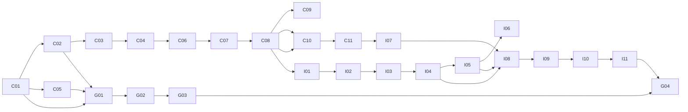

# FEAT001 规则中心仓同步 — PHASE 4 任务拆分

## 1. 执行规则

每个任务限定为一次 15–30 分钟的 RED → GREEN → REFACTOR 循环，完成即单独 commit。每项先写测试并确认红灯，再写最小实现，最后重构并重跑测试。所有 Gradle 命令使用 `--no-daemon`；单元测试命令由对应模块的 `gradle-build-test` skill 确认后执行。

中心仓首版使用真实 GitHub Models、GitHub Actions 与 GitHub Release。共享契约和本地 fixture 仍用于快速 TDD，但不得代替隔离私有仓库中的真实 PR、远端模型推理、Actions run、Release assets 与 IDEA 下载安装 E2E。公司网关尚未部署时，以实现同一 `ReleaseCatalog` HTTP 契约的测试网关连接真实 GitHub Release；IDEA 仍不得感知 GitHub owner、repo、URL 或 token。

### 通用测试与 canary 约定

| 标识 | 命令 / 方法 | 可证伪信号 |
|---|---|---|
| UT | `./gradlew --no-daemon :feature:analysis:test --tests "<测试类>"` | 新测试在 RED 阶段失败，GREEN/REFACTOR 后通过。 |
| 全量 | `./gradlew --no-daemon :feature:analysis:test` | 全部分析模块测试通过。 |
| 真实 DSL canary | `bash scripts/canary-real-run.sh` | 先记录预期诊断 delta；默认路径/重构任务为零 delta，实际远端包激活任务以专用 fixture 产生声明的非零 delta。 |
| 测试 canary | 暂时把被测条件、摘要或版本判定改回错误值，重跑目标测试 | 原本用于防该错误的测试必须由绿变红；否则补测或删除虚假断言。 |

## 2. 中心流水线共享能力

| ID | 任务（15–30 分钟） | 对应规格 | RED 测试场景 | GREEN / REFACTOR 目标 | 依赖与 canary |
|---|---|---|---|---|---|
| C01 | 定义 `RuleCandidate`、`ConstraintVerification`、`DocumentConversionFeedback` 的 JSON codec 与 fixture。 | SP-04、SP-05b、SP-06 | 反序列化已发布、skipped、validation-error 三类 fixture；缺失证据/状态非法失败。 | 共享模型只表达契约字段；不加载规则、不调用 LLM。 | 无；UT + 将 `skipReason` 改为非法值，测试须红。 |
| C02 | 实现 condition 能力登记表：基础 grammar、`containsExpression`、固定 `children.where/filter(...).size()` 预处理形态。 | SP-05、SP-05a | 已登记内置形态被接受；`endsWith`、`number()`、`c => ...count()` 被拒绝。 | 单一 capability registry，供提取与验证共同读取。 | C01；UT + 删除 `containsExpression` 登记，相关测试须红。 |
| C03 | 实现严格 condition 接受器，消除 evaluator 静默返回 `false` 与“解析成功”的混淆。 | SP-05、SP-06 | grammar 拒绝得到 `UNSUPPORTED_CONDITION_GRAMMAR`；已接受 condition 返回结构化成功。 | 调用真实 grammar/evaluator 能力，不以字符串规则判断。 | C02；UT + 允许 `endsWith` 时测试须红。 |
| C04 | 为正例、反例执行建立 `ConstraintVerificationRunner`。 | SP-06 | 正例含目标 ruleId、反例不含目标 ruleId；正例漏报和反例误报分别产出错误码。 | 只验证 XML/JSON 文本；不访问资源路径。 | C01、C03；UT + 反转正例断言，测试须红。 |
| C05 | 建立 `VerifiedConstraintExampleCatalog`，仅索引有通过验证记录的同类约束。 | SP-05a | 有验证记录的互斥规则可检索；无记录规则和不相干资源语义不可作为示例。 | 按目标/属性关系/能力筛选少量示例。 | C01；UT + 为无记录规则伪造可检索结果，测试须红。 |
| C06 | 实现候选分流：外部语义、目标不明、未登记 grammar 直接 `skipped`；已解析但 fixture 失败进入 `validation-error`。 | SP-04、SP-05、SP-06 | 三类直接跳过；正例漏报不被标为 skipped。 | 分流只产生状态与理由，不生成诊断。 | C02–C04；UT + 把 validation-error 改为 skipped，测试须红。 |
| C07 | 实现最多两次的 validation-error 修复循环与不可变证据/目标保护。 | SP-06 | 第一次修复成功则 published；两次失败为 `validation-error` + `REWORK_REQUIRED`；修复若改证据/目标则拒绝。 | 循环只调整 condition/fixture，并在每轮运行真实验证。 | C04、C05、C06；UT + 允许第三次修复，测试须红。 |
| C08 | 组装完整规则包和 `release-report.json`，支持 `passed`、`passed-with-exclusions`、`failed`。 | SP-01、SP-02、SP-07 | 包保留现有 rules/functions 目录；skipped/error 进入报告；最终写入的坏条件使报告 failed。 | 只组装完整快照，绝不输出增量 merge 包。 | C01、C04、C06、C07；UT + 删除 `rule_sources.json`，测试须红。 |
| C09 | 发布上传人反馈：已发布、跳过、validation-error、沿用旧规则均有行号、原因和作者动作。 | SP-05b、AC-08 | `PUBLISHED_WITH_SKIPS` 和 `PUBLISHED_WITH_ERRORS` 反馈准确；外部资源项作者动作为 `NONE`。 | 对接抽象 `DocumentFeedbackPublisher`，不绑定具体消息系统。 | C01、C06、C07、C08；UT + 移除行号，测试须红。 |
| C10 | 实现 GitHub Release 后端契约：将 approved GitHub Release 的 tag、资产和摘要映射为完整规则包发布。 | SP-02、SP-07、SP-08 | draft、pre-release、报告 failed、缺少 zip/manifest/report 或不兼容 Release 均不可发布。 | GitHub 只作为首版后端；发布资产固定为完整包 zip、manifest、release report。 | C08；UT + 返回 unapproved Release，测试须红。 |
| C11 | 实现稳定的规则中心网关 / `ReleaseCatalog` 契约适配，隔离 GitHub API。 | SP-08、SP-09 | GitHub 后端与 fixture 后端返回相同 `LatestRelease`/下载语义；插件不感知 release URL、token 或仓库名。 | IDEA 只依赖网关/`ReleaseCatalog`；后续 CodeHub 仅替换后端适配器。 | C10；UT + 让插件读取 GitHub 特有字段，测试须红。 |

## 3. GitHub 生产适配与真实发布

| ID | 任务（15–30 分钟） | 对应规格 | RED 测试场景 | GREEN / REFACTOR 目标 | 依赖与 canary |
|---|---|---|---|---|---|
| G01 | 实现 `CandidateExtractionService` 的 GitHub Models 生产适配器，使用 JSON Schema 结构化响应并记录模型、prompt/文档摘要。 | SP-04、SP-05、SP-05a | 缺原文证据、越界行号、模型新增未表达语义或直接输出 published 时拒绝；合法候选只进入 extracted。 | `temperature=0`、固定 seed（模型支持时）、版本化 prompt；模型输出永远不能绕过发布门禁。 | C01、C02、C05；UT + 让模型候选直接成为 published，测试须红；真实 inference smoke 返回 schema 合法 JSON。 |
| G02 | 实现 `validate-document.yml`：PR 全文提取、分流、真实验证、最多两次修复、反馈与 Check。 | SP-04–SP-07、AC-01–AC-04、AC-08 | workflow 使用不可移植 wrapper、无 `models: read`、验证失败仍成功或反馈无行号时门禁失败。 | GitHub-hosted runner 可重复执行；产出 feedback/report 并把摘要反馈到 PR。 | G01、C03–C09；workflow canary 提交已知坏 condition，run 必须失败或明确排除且不能发布。 |
| G03 | 实现 `publish-rule-package.yml`：在 main 合并提交上重跑并发布三个固定 Release assets。 | SP-01–SP-03、SP-07、SP-08 | draft 输入、failed report、缺资产或摘要不一致时不得创建 approved Release。 | 只为 `passed`/`passed-with-exclusions` 创建 `rules-v<version>`；Release 资产保持不可变。 | G02、C08、C10；发布门禁 canary 以 failed report 触发非零退出且无 Release。 |
| G04 | 用 `gh` 在隔离私有仓完成 MD PR → Models → Actions → Release → 测试网关 → IDEA 应用/篡改拒绝/回滚。 | AC-01–AC-08、SP-08–SP-10 | v1 不含目标 ruleId；v2 应命中且文档更新；篡改保持旧 current；回滚后目标 ruleId 消失。 | 保存真实 PR/run/Release URL、三资产摘要及自动化 IDEA 结果，不要求用户操作网页或 IDE。 | G03、C11、I11；fixture/mock 结果不能满足本任务。 |

## 4. IDEA 插件规则包同步

| ID | 任务（15–30 分钟） | 对应规格 | RED 测试场景 | GREEN / REFACTOR 目标 | 依赖与 canary |
|---|---|---|---|---|---|
| I01 | 定义 `RulePackageManifest` 与 IDEA 侧包布局校验。 | SP-01、SP-02、SP-03 | 完整包通过；缺 `rules/global_vars.json`、`rule_sources.json` 或 `functions/dsl_functions.json` 失败。 | 复用 `JsonRuleLoader` 作 JSON 可加载性依据。 | C08 fixture；UT + 删除必需项，测试须红。 |
| I02 | 实现 staging 摘要核验与只读安装目录。 | SP-02、SP-09 | 摘要不一致/解包失败时 current 不变；正确制品只进入 staging。 | 安装器不触及内置资源。 | I01；UT + 篡改一字节，测试须红。 |
| I03 | 实现 `RulePackageStateStore`：current、previous、ignored、lastCheckedAt。 | SP-09 | 首次、切换、忽略、回滚状态可恢复；未验证版本不能写 current。 | 状态读写与文件安装解耦。 | I02；UT + 强行写未验证版本，测试须红。 |
| I04 | 实现原子激活与回滚。 | SP-09、AC-06 | 激活失败或随后加载失败时 current 仍指向旧包；回滚后 previous/current 互换正确。 | `PackageInstaller` 只在通过验证后改状态。 | I02、I03；UT + 让切换中断，测试须红。 |
| I05 | 实现 `ActiveRulePackageResolver` 与 `IdeaRuleRepositoryProvider`，无远端包回退内置规则。 | SP-10 | 默认使用内置规则；激活测试包后 repository、函数库和 source-markdown 来自同一版本。 | `RuleRepositoryService` 仅委托 provider，保留现有调用点。 | I04；UT + 故意混用两个版本路径，测试须红；真实 DSL canary 预期默认零 delta。 |
| I06 | 让 IDEA 诊断、元素/属性文档、表达式补全统一读取 provider。 | SP-10、AC-06 | 测试包新增 description/规则后，文档与诊断同时可见；两者不得分别读取旧包。 | 不接入 LSP/CLI。 | I05；专用远端包 fixture 预期非零诊断/文档 delta，默认 canary 零 delta。 |
| I07 | 定义 `ReleaseCatalog`、`UpdateCheckScheduler`、`Clock` 与间隔策略。 | SP-08、SP-09 | 启动和手动检查查询；23:59 不查、24:00 恰查一次；只看到 approved 兼容版本。 | 生产 24 小时策略，测试可注入时钟。 | C10、I03；UT + 把 24h 比较改为 23h，测试须红。 |
| I08 | 实现同步控制器的“查询 → 用户确认 → 下载 → 验证 → 激活 → 重载”流程。 | SP-08、SP-09 | 用户拒绝不下载；确认后成功应用；下载/验证/重载失败均保持旧包。 | 注入 catalog、installer、provider、notifier。 | I04、I05、I07；UT + 自动下载被拒绝版本，测试须红。 |
| I09 | 增加 IDEA 通知、手动“检查 DSL 规则更新”动作、版本状态与回滚入口。 | SP-09、AC-05、AC-07 | 有新版显示更新/稍后；手动检查重新展示忽略版本；回滚显示生效版本。 | 通知不宣称“已更新”，直到重载成功。 | I08；IDEA 测试 + 用记录 notifier 验证未确认不下载。 |
| I10 | 建立测试装配的 30 秒 scheduler 与隔离 `TestReleaseCatalog`。 | SP-09、PHASE 3 §6.1 | 测试构建 30 秒触发一次；生产装配始终 24 小时且用户设置不可改。 | 测试配置不由远端包和生产 UI 控制。 | I07–I09；UT + 生产策略被设为 30 秒时测试须红。 |
| I11 | IDEA 端到端安装、篡改、忽略、手动更新与回滚验证。 | AC-05、AC-06、AC-07 | approved 包可应用；篡改包被拒；拒绝后手动可再次检查；回滚恢复旧诊断与文档。 | 使用临时目录和 fixture catalog，不等 24 小时。 | I01–I10；真实 DSL canary：激活 fixture 后声明的 ruleId 出现，回滚后消失。 |

## 5. 集成顺序与交付门禁

1. C01–C11 与 G01–G03 完成后，中心仓可用 GitHub Models/Actions/Release 作为首版真实后端；fixture 只证明契约，不证明线上链路。
2. I01–I06 完成后，IDEA 已具备“加载一个已验证完整包”的能力，但尚不联网。
3. I07–I11 完成后，首版更新发现、用户确认、同步、回滚和测试装配闭环完成。
4. G04 只有在真实私有测试仓和 IDEA 测试运行时均产生预期信号后完成；公司生产网关缺席不能用 mock 冒充，由测试网关实现同一 HTTP 契约并连接真实 GitHub Release。
5. PHASE 5 已由 Goal 明确确认。每个任务完成前必须运行其 RED/GREEN/REFACTOR 证明；涉及 IDEA 静态诊断行为的任务还必须运行声明了预期信号的真实 DSL canary。

## 6. 交付文档任务

| ID | 交付物 | 最低可证伪门禁 |
|---|---|---|
| D01 | `phase6-validation.md` 与 SP/AC 100% 证据矩阵 | 每项链接到真实测试命令、结果或 GitHub URL；无证据项不得写通过。 |
| D02 | IDEA 插件用户指南 | 文档中的检查更新、拒绝、重新检查、回滚和失败处理路径由自动化测试逐项覆盖。 |
| D03 | DSL 源文档作者指南 | 至少包含可发布约束、description-only 资源说明、skipped/validation-error 三类真实样例及反馈码。 |
| D04 | 中心仓维护者与 GitHub E2E 运维指南 | 从文档复制执行的 `gh` 命令链能定位真实 PR、run、Release、资产与失败日志；不含凭据。 |
| D05 | 整体验收报告、API/CodeHub 迁移说明和必要 lessons learned | 报告列出环境、commit、测试/覆盖率、canary、三轮 review、真实 URL、摘要和已知限制。 |

全部文档遵守 `doc-management` frontmatter；运行 `check-frontmatter.sh`、`check-doc-dir-size.sh`、`git diff --check` 和占位符/敏感信息扫描。Review C 同时审代码和文档。D01–D05 任一缺失或命令未经真实执行，Goal 不得完成。

## 7. 非首版工作

LSP、CLI、VS Code 的远端规则包同步不进入本任务清单。它们只能在 IDEA 首版稳定并完成 PHASE 6 后，以独立 SDD 需求复用本规则包契约。
