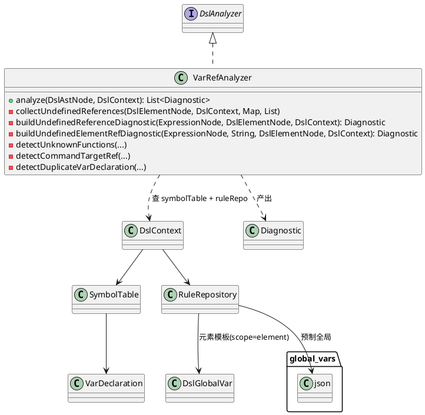
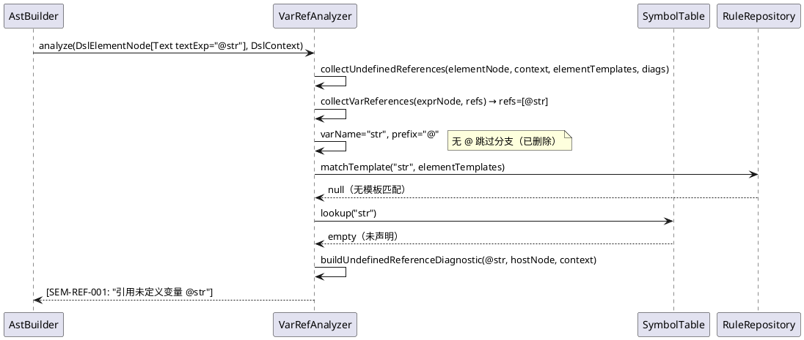

# FIX002 — PHASE 3 设计

> 阶段：PHASE 3（设计）
> 状态：已确认（review 通过 + 修正 4 issue）
> 原则：只设计到接口和协作关系，不设计算法和实现细节（留给 TDD 探索）。

## 1. 设计概述

本次修复**不新增类/接口**。所有变更在既有 `VarRefAnalyzer` 内部 + golden fixture XML + 测试类。

| 变更对象 | 类型 | 对应契约 |
|---|---|---|
| `VarRefAnalyzer.collectUndefinedReferences` | 删除 `@` 跳过分支 | C1 |
| `VarRefAnalyzer.buildUndefinedElementRefDiagnostic` | 拆双文本变量 + 改 docUrl rule | C3 |
| `VarRefAnalyzer.buildUndefinedReferenceDiagnostic` | **无代码变更**（已通过 `ref.getPrefix()` 前缀无关） | C2 |
| 8 个 fixture XML | 声明 string Var | C4 |
| `VarRefAnalyzerTest` | 修正 1 断言 + 新增 1 负测试 | C1/C2 |
| `AnalysisServiceTest`（LSP） | 新增 1 回归测试 | C5 |

## 2. 类图（VarRefAnalyzer 协作关系，无变更）



**协作不变**：VarRefAnalyzer 通过 DslContext 获取 SymbolTable（含预制全局 + 用户声明 Var + elementNames）和 RuleRepository（含元素模板）。修复仅改变 VarRefAnalyzer 内部分支逻辑，不影响任何协作接口。

## 3. 方法级修改点

### 3.1 `collectUndefinedReferences` — C1

**修改**：删除 `@` 前缀跳过分支（当前 line 83-85）。

**修改前后数据流对比**：

```
修改前（@str 未声明）:
  collectVarReferences → [@str]
  → prefix=="@" → continue ◀── 跳过，永不检查
  → (无诊断)

修改后（@str 未声明）:
  collectVarReferences → [@str]
  → matchTemplate("str", templates) → null
  → symbolTable.lookup("str") → empty
  → buildUndefinedReferenceDiagnostic(@str) → SEM-REF-001
```

**4 个 `@` 场景的修复后流**：

| 场景 | matchTemplate | lookup | 结果 |
|---|---|---|---|
| `@str`（未声明） | null | empty | SEM-REF-001（变量引用） |
| `@ishour12`（预制全局） | null | **found** | 无诊断 |
| `@myVideo.currentTime`（元素存在） | **match→myVideo** | — | 无诊断（elementNames 含 myVideo） |
| `@missingElem.currentTime`（元素不存在） | **match→missingElem** | — | SEM-REF-001（元素属性引用） |

### 3.2 `buildUndefinedElementRefDiagnostic` — C3

**3 处缺陷的修改设计**（不写实现代码，只描述设计决策）：

| 缺陷 | 设计决策 | 理由 |
|---|---|---|
| D1 重复 `refText` | 拆为两个局部变量：一个承载高亮宽度文本（prefix+varName 全长），一个承载消息文本（prefix+elementName）。变量命名留给 TDD。 | 同一值不能既用于宽度（需完整引用文本 `#unlocker.move_x`）又用于消息（需元素名 `#unlocker`） |
| D2 docUrl 查错 rule | docUrl 解析常量从 `RULE_REF_002` 改为 `RULE_REF_001`，与 ruleId 一致 | e4d713d 改 ruleId 时漏改 docUrl；测试 `elementPropertyRefDocUrlFromRuleSource` 反证 |

**不变项**：方法签名、ruleId（SEM-REF-001）、severity（ERROR）、suggestedFix 格式、位置回退逻辑（ref 位置 or host 回退）。

### 3.3 `buildUndefinedReferenceDiagnostic` — C2

**无代码变更**。该方法已通过 `ref.getPrefix()` 构造 refText（line 307），天然前缀无关。移除 `@` 跳过后，`@str` 自然流入此方法，产出 `引用未定义变量 @str`。

## 4. 时序图（`@str` 未声明引用，修复后）



## 5. golden fixture 修改设计

7 个 fixture（8 处 Var 声明，constraint_edge_cases 占 2 处）在根元素首部插入 `<Var name="xxx" type="string"/>`。Var 声明置于已有 Var 声明同列位置（若 fixture 已有 Var 则紧随其后；若无则在根元素首个子元素前）。

**修正**：`expected.json` counts/diagnostics 不变，但 `constraint_edge_cases`(+2) 和 `deep_nesting_violations`(+1) 需更新 approxLine（Var 插入致行号位移，PHASE 5 证伪"全部不改"）。`@ishour12`（deep_nesting_violations:39）不动。

## 6. 测试结构设计

| 测试类 | 测试方法 | 操作 | 对应 spec |
|---|---|---|---|
| `VarRefAnalyzerTest` | `undefinedStringRefProducesSEM_REF_001` | **改断言**：`isEmpty()` → 期望 SEM-REF-001 + endColumn 非零宽断言（C1-T1/C2-T1/C2-T2） | C1, C2 |
| `VarRefAnalyzerTest` | `undefinedStringElementPropertyRef`（新增） | `@missingElem.currentTime` → SEM-REF-001 元素属性引用（C1-T6/C3-T4） | C1, C3 |
| `VarRefAnalyzerTest` | `videoCurrentTimeStringRefWithExistingElementNoViolation` | **不变**（回归保护，验证合法 `@` 元素属性不误报） | C1-T5 |
| `VarRefAnalyzerTest` | `undefinedNumericRefProducesSEM_REF_001` | **不变**（`#` 回归保护） | C1-T2 |
| `VarRefAnalyzerTest` | `elementPropertyRefWithUndefinedElementProducesSEM_REF_001` | **TDD 补 endColumn 断言**：当前仅验 ruleId/message/suggestedFix（C3-T1）；需补 endColumn 非零宽（C3-T2）。C3-T3 docUrl 由 `elementPropertyRefDocUrlFromRuleSource` 覆盖 | C3-T1, C3-T2 |
| `AnalysisServiceTest`（LSP） | `undefinedStringRefNonZeroWidthRange`（新增） | `@undefinedStr` → SEM-REF-001 + LSP range 非零宽（C5-T1） | C5 |
| `GoldenDiagnosticMatchTest` | 7 fixture | **不变**（fixture 改 Var 后 counts 不变，golden 自动匹配） | C4 |

**测试基础设施复用**：VarRefAnalyzerTest 已有 `StubRuleRepository` + `SymbolTableBuilder` + `element()`/`exprAttr()` helpers，新增测试直接复用。`repoWithTemplates()` 已含 `{videoName}.currentTime` 模板，C1-T6 可直接用。

## 7. 可测试性考虑

- **依赖注入**：VarRefAnalyzer 通过 DslContext 接收 SymbolTable + RuleRepository，测试可注入 stub（已验证，现有测试全用此模式）。
- **无静态方法依赖**：`matchTemplate`/`compileElementTemplates` 均为实例/静态纯函数，无隐藏全局状态。
- **隔离性**：VarRefAnalyzer 单元测试不需启动真实 AST 构建或规则加载——直接构造 DslElementNode + ExpressionNode（现有 helpers 已支持）。
- **golden 测试**：fixture 改 Var 后，GoldenDiagnosticMatchTest 自动验证（counts 不变即匹配），无需新增 golden 断言逻辑。

## 8. 依赖关系

```
FIX-A (编译) ──阻塞──> 一切（模块不编译则无法 TDD）
FIX-B (@跳过) ──独立──> FIX-C (测试断言)
FIX-D (fixture) ──后果──> FIX-B（移除 @ 跳过后 golden 因新增 SEM-REF-001 而红，必须与 FIX-B 同提交以保持门禁绿）
FIX-E (负测试+LSP) ──依赖──> FIX-B（实现改完才能跑负测试）
```

**建议 TDD 顺序**：FIX-A（编译先行）→ FIX-B + FIX-C（RED→GREEN）→ FIX-D（fixture）→ FIX-E（负测试+LSP）。

---

> **阶段切换**：PHASE 3 完成。请用户确认以上设计（无新类、3 方法修改点、时序图、测试结构、TDD 顺序），确认后进入 PHASE 4（任务拆分）。
