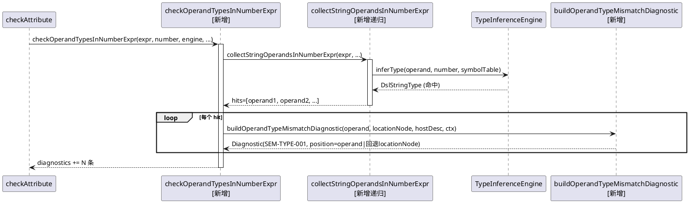

# FIX005 二元/一元表达式操作数类型一致性校验 — PHASE 3 设计

> 阶段：PHASE 3（设计）
> 状态：待用户确认
> 依据：phase2-spec.md（SPEC-1~SPEC-6）

本文档设计到**方法签名与协作关系**层面，不设计算法/控制流细节（递归实现留给 PHASE 5 TDD 探索）。本设计为**纯增量**：新增 3 个私有方法 + 2 处调用接线 + 1 个诊断构造，无新类、无接口变更、无重构。

## 1. 模块职责

变更全部限定在 `com.huawei.theme.analysis.core.semanticanalysis.analyzers.TypeAnalyzer`（M4 语义分析层）。不新增类、不动 `DslAnalyzer` 接口、不改 `TypeInferenceEngine`（保留上下文决定论的推断返回值）。`VarRefAnalyzer` 不受影响。

## 2. 方法设计

### M1：主入口 `checkOperandTypesInNumberExpr`

```java
private void checkOperandTypesInNumberExpr(
    ExpressionNode expr,              // 表达式根
    DslType expectedType,             // DslNumberType（前置条件）
    TypeInferenceEngine engine,       // 复用 checkAttribute/checkVarExpressionBody 的 engine 实例
    SymbolTable symbolTable,          // 可 null
    DslContext context,
    DslAstNode locationNode,          // 宿主（attr/element），位置回退源
    String hostDesc,                  // 消息用：属性名 或 "Var expression"
    List<Diagnostic> diagnostics)
```

- 职责：SPEC-1 契约；仅 number 上下文调用；递归收集命中操作数并对每个产 SEM-TYPE-001
- 异常策略：不抛出；null 子节点/空 children 安全返回

### M2：递归遍历 `collectStringOperandsInNumberExpr`

```java
private void collectStringOperandsInNumberExpr(
    ExpressionNode node,
    DslType expectedType,
    TypeInferenceEngine engine,
    SymbolTable symbolTable,
    Set<ExpressionNode> reported,     // 防御性去重集（IdentityHashMap-backed）
    List<ExpressionNode> hits)         // 命中操作数输出
```

- 职责：SPEC-2 命中判据 + SPEC-3 递归边界
- 命中：`inferred = engine.inferType(node, expectedType, symbolTable)`；`inferred != null && inferred instanceof DslStringType` → 加入 hits
- 跳过：`inferred == null || inferred instanceof DslMixedType`（D2）
- 边界：`LITERAL` 不作为候选（D3）；`FUNCTION_CALL` 自身作为候选但不递归进 children（参数归 SEM-TYPE-002）；`CONDITIONAL`(ifelse) 不递归（归 `checkIfelseBranchTypes`）
- 去重：DSL 表达式 AST 为树（无 DAG），天然无重复访问；`reported` 为防御性 IdentityHashSet，应对未来共享子树

### M3：诊断构造 `buildOperandTypeMismatchDiagnostic`

```java
private Diagnostic buildOperandTypeMismatchDiagnostic(
    ExpressionNode operand,            // 命中的 string 操作数
    DslAstNode locationNode,           // 位置回退源
    String hostDesc,
    DslContext context)
```

- 职责：SPEC-6 诊断字段构造
- 位置策略：**复用 `VarRefAnalyzer.buildUndefinedFunctionDiagnostic`（:221-245）现成模式**——取 `operand` 的 line/column/endLine/endColumn；当 `line==0 && column==0` 回退到 `locationNode`
- 类型约束说明：`ExpressionNode implements ExpressionAstNode`，但 `ExpressionAstNode` 不继承 `DslAstNode`，故**不能**用 `.astNode(operand)`；采用 `.line(x).column(x).endLine(x).endEndColumn(x)` 显式设置（与 VarRefAnalyzer 一致，不设 astNode 字段）

## 3. 调用点接线

| 调用点 | 现有代码位置 | 插入语句（number 分支内，与现有检查并列） |
|---|---|---|
| `checkAttribute` | `if (expectedType instanceof DslNumberType)` 块（:115-123） | `checkOperandTypesInNumberExpr(exprNode, expectedType, engine, symbolTable, context, attr, "属性 " + attr.getName(), diagnostics);` |
| `checkVarExpressionBody` | `if (varType instanceof DslNumberType)` 块（:293-296） | `checkOperandTypesInNumberExpr(exprNode, varType, engine, symbolTable, context, exprAttr, "Var expression", diagnostics);` |

> 接线点上下文确认：`checkAttribute` 的 `symbolTable`(:98)、`engine`(参数)、`attr`(参数)、`exprNode`(:90) 均在作用域；`checkVarExpressionBody` 的 `symbolTable`(:268)、`engine`(参数)、`exprAttr`(:258)、`exprNode`(:264)、`varType`(:248) 均在作用域。

## 4. 协作关系

```
TypeAnalyzer.analyze
  └─ checkAttribute (number 上下文)
       ├─ engine.inferType            [既有]
       ├─ checkFunctionCalls          [既有]
       ├─ checkRefVarExpressionErrors [既有]
       ├─ checkStringLiteralInNumExpr [既有，查 LITERAL→SEM-TYPE-003]
       ├─ checkIfelseBranchTypes      [既有]
       └─ checkOperandTypesInNumberExpr [新增]      ← 接线点1
            ├─ collectStringOperandsInNumberExpr [新增递归]
            │    └─ engine.inferType(operand, number, symbolTable)  [复用]
            └─ buildOperandTypeMismatchDiagnostic [新增]
  └─ checkVarExpressionBody (number/auto→number 上下文)
       ├─ checkVarConstRefs           [既有]
       ├─ inferExpressionType         [既有]
       ├─ checkFunctionCalls          [既有]
       ├─ checkStringLiteralInNumExpr [既有]
       └─ checkOperandTypesInNumberExpr [新增]      ← 接线点2
```

## 5. 去重边界（与现有检查正交，SPEC-5）

| 现有检查 | 节点范围 | 上下文 | 与新校验关系 |
|---|---|---|---|
| `checkStringLiteralInNumExpr` | `LITERAL` | number | 新校验跳过 LITERAL → 不双产 |
| `checkRefVarExpressionErrors` | `#`前缀 VARIABLE_REF/ARRAY_ACCESS | string 上下文（`typeEquals` 条件）或无期望 | 新校验仅 number 上下文 → 不双产 |
| `checkIfelseBranchTypes` | `CONDITIONAL` 分支 | number | 新校验不递归 ifelse → 不双产 |
| `checkFunctionCalls` | `FUNCTION_CALL` 参数 | 任意 | 新校验不递归函数参数 → 不双产 |

## 6. 诊断消息模板

| 场景 | 消息 |
|---|---|
| 元素属性 | `类型不匹配，表达式含 string 类型操作数 {operand.text}，不能参与 number 算术运算（属性 {attrName}）` |
| Var.expression | `类型不匹配，表达式含 string 类型操作数 {operand.text}，不能参与 number 算术运算（Var expression）` |

> 复用 `RULE_TYPE_001`/`DiagnosticSeverity.ERROR`/`resolveDocUrl(context, RULE_TYPE_001)`，与现有 SEM-TYPE-001 诊断一致。

## 7. 可测试性

- 私有方法通过公共 `analyze(DslAstNode, DslContext)` 入口间接验证——与现有 `check*` 方法同级，测试风格一致（现有 TypeAnalyzerTest 全部通过 analyze 入口构造）
- 复用 `checkAttribute`/`checkVarExpressionBody` 已构造的 `engine` 实例（依赖注入友好，不 new、无静态调用）
- 无新全局状态、无静态方法
- 测试用 `ExpressionNode.binaryExpr/unaryExpr/variableRef/arrayAccess/functionCall` 工厂构造 AST（与 TypeAnalyzerTest 现有 helper 一致）

## 8. 时序图（checkAttribute number 上下文）



## 9. 不涉及

- 不改 `TypeInferenceEngine.inferBinaryExpr`/`inferUnaryExpr` 返回值（保留上下文决定论）
- 不改 `Diagnostic`/`DslAstNode`/`ExpressionAstNode` 类型体系
- 不改 `DslAnalyzer` 接口、`AnalyzerRegistry`、模式过滤
- 不动 `VarRefAnalyzer`、golden schema 规则（fixture 的 `.expected.json` 更新归 PHASE 5/6，遵循策略变更同步 golden）
- 不引入新依赖

---

> **阶段切换**：PHASE 3 完成。设计为纯增量（3 私有方法 + 2 接线 + 1 诊断构造），复用 `VarRefAnalyzer` 位置模式与 `RULE_TYPE_001` 规则常量。请用户确认后进入 PHASE 4（任务拆分）。
