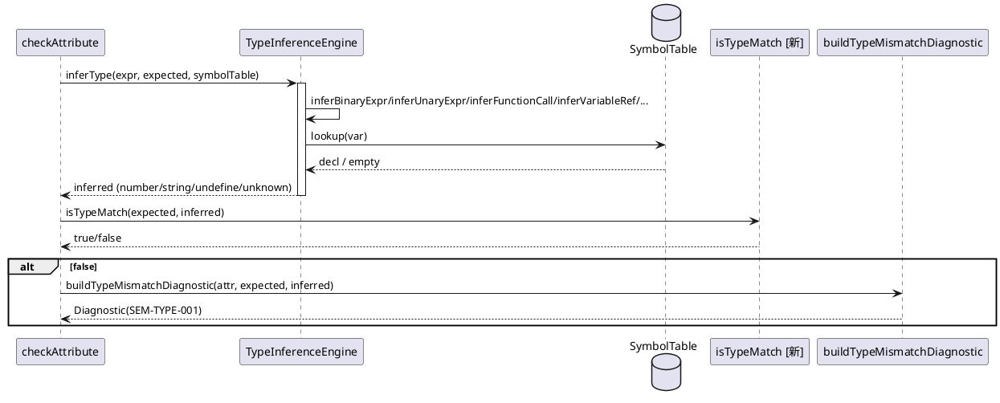

# FIX006 表达式类型推断系统重设计 — PHASE 3 设计

> 阶段：PHASE 3（设计）
> 状态：待用户确认
> 依据：phase2-spec.md（SPEC-1~13）

设计到**方法签名与协作关系**层面，不设计算法/控制流（留 PHASE 5 TDD）。

## 1. 模块职责

| 模块 | 职责 | 变更 |
|---|---|---|
| `shared.type.DslUndefinedType` | 新增类型 | 新建 |
| `shared.type.DslUnknownType` | 新增类型 | 新建 |
| `expression.TypeInferenceEngine` | 表达式类型推断（操作数推导论） | 重写 5 方法 + 移入 inferIfelseType |
| `semanticanalysis.analyzers.TypeAnalyzer` | 期望检查 + 诊断产出 | 改造期望检查 + 删除 FIX005/SEM-TYPE-003/双引擎 |
| `VarRefAnalyzer` | 不变 | `#`前缀语义检查保留（与类型推断正交） |

## 2. 新增类

### C1：`DslUndefinedType`
```java
package com.huawei.theme.analysis.core.shared.type;
public class DslUndefinedType extends DslType {
    @Override public String getName() { return "undefine"; }
}
```

### C2：`DslUnknownType`
```java
package com.huawei.theme.analysis.core.shared.type;
public class DslUnknownType extends DslType {
    @Override public String getName() { return "unknown"; }
}
```

> 仿 `DslNumberType`/`DslStringType` 风格（@Data/@Builder 可选，现有类型类无 Lombok，保持一致用裸类）

## 3. TypeInferenceEngine 重写

### M1：`inferType`（加 CONDITIONAL case）

```java
public DslType inferType(ExpressionNode node, DslType expectedContext, SymbolTable symbolTable)
```
switch(kind)：
- `LITERAL` → `inferLiteral`（不变）
- `VARIABLE_REF` → `inferVariableRef`（调整：#未声明→unknown）
- `ARRAY_ACCESS` → `inferArrayAccess`（调整：#未声明→unknown）
- `FUNCTION_CALL` → `inferFunctionCall`（改：ifelse→inferIfelseType；其他查所有签名）
- `BINARY_EXPR` → `inferBinaryExpr`（重写：操作数推导）
- `UNARY_EXPR` → `inferUnaryExpr`（重写：操作数推导）
- **`CONDITIONAL` → `inferIfelseType`（新增 case，原 engine 无）**
- `UNKNOWN`/default → `unknown`

### M2：`inferBinaryExpr`（重写，SPEC-5）

```java
private DslType inferBinaryExpr(ExpressionNode node, DslType expectedContext, SymbolTable symbolTable)
```
- 递归 `inferType(left, ...)`、`inferType(right, ...)`（expectedContext 透传但不依赖）
- 按优先级返回：undefine > unknown > operator 规则（`+`拼接/`-*/%`算术 string→undefine）
- **不再返回 expectedContext**

### M3：`inferUnaryExpr`（重写，SPEC-6）

```java
private DslType inferUnaryExpr(ExpressionNode node, DslType expectedContext, SymbolTable symbolTable)
```
- 递归 `inferType(operand, ...)`；operator `-`：number→number、string→undefine、unknown→unknown、undefine→undefine

### M4：`inferFunctionCall`（改，SPEC-7）

```java
private DslType inferFunctionCall(ExpressionNode node, DslType expectedContext, SymbolTable symbolTable)
```
- if `node.getFunctionName()=="ifelse"` → `inferIfelseType(node, expectedContext, symbolTable)`
- 否则收集 `getSignature(name,"number")` 与 `getSignature(name,"string")` 的 returnType 去重：唯一→该类型，冲突/无→`unknown`
- 不依赖 expectedContext

### M5：`inferVariableRef`/`inferArrayAccess`（调整，SPEC-8）

- `@`前缀 → `DslStringType`
- `#`前缀：lookup 成功→`decl.getType()`（数组取 baseType）；**lookup 失败→`DslUnknownType`（非 null）**

### M6：`inferIfelseType`（从 TypeAnalyzer 移入 engine）

```java
private DslType inferIfelseType(ExpressionNode node, DslType expectedContext, SymbolTable symbolTable)
```
- 递归 `inferType` 各分支；全一致→该类型；任一 `undefine`→`unknown`（Q1）；类型不一致→`unknown`
- 从 `TypeAnalyzer.inferIfelseType` 迁移，递归改用 `engine.inferType`（自身）

### M7：`typeEquals`（保留，按 name 比对）

```java
public static boolean typeEquals(DslType a, DslType b)  // 现有，自动支持新类型
```

## 4. TypeAnalyzer 期望检查改造

### M8：`isTypeMatch`（新增辅助，期望检查 4 类型规则）

```java
private static boolean isTypeMatch(DslType expected, DslType inferred)
```
- expected number：inferred 为 `DslNumberType`/`DslUnknownType` → true；其余 false
- expected string：inferred 为 `DslStringType`/`DslUnknownType` → true；其余 false
- 其余 expected（array 等）：inferred 同类或 unknown → true

### M9：`checkAttribute` 期望检查改造

```java
DslType inferred = engine.inferType(exprNode, expectedType, symbolTable);
if (inferred != null && !isTypeMatch(expectedType, inferred)) {
    diagnostics.add(buildTypeMismatchDiagnostic(attr, expectedType, inferred, context));
}
```
- 删除原 SEM-TYPE-003 调用（`checkStringLiteralInNumExpr` 的 003 产出）
- 删除 FIX005 接线（`checkOperandTypesInNumberExpr` 调用）
- 保留 `checkFunctionCalls`/`checkRefVarExpressionErrors`/`checkIfelseBranchTypes`？→ **`checkIfelseBranchTypes` 删除**（ifelse 类型由 engine.inferIfelseType 统一，不再单独检查分支）

### M10：`checkVarExpressionBody` 改造（D9 统一引擎）

```java
DslType exprType = engine.inferType(exprNode, varType, symbolTable);  // 原 inferExpressionType
if (exprType != null && !isTypeMatch(varType, exprType)) {
    diagnostics.add(buildVarTypeMismatchDiagnostic(...));  // 统一 SEM-TYPE-001
}
```
- 删除 `inferExpressionType` 调用 → 用 `engine.inferType`
- 删除 `isSimpleLiteralExpression` 分支（SEM-TYPE-003）
- 删除 `hasIfelseMixedBranches` 调用（ifelse 由 engine 推断）
- 删除 FIX005 接线 + 去重条件（新推导顶层覆盖，无需操作数校验）

## 5. 删除清单（SPEC-13）

**TypeAnalyzer 删除**：
| 方法/字段 | 来源 |
|---|---|
| `checkOperandTypesInNumberExpr`/`collectStringOperandsInNumberExpr`/`buildOperandTypeMismatchDiagnostic` + 2 接线 | FIX005 |
| `checkStringLiteralInNumExpr`（003 产出部分）/`buildStringLiteralInNumDiagnostic`/`buildSimpleLiteralTypeMismatchDiagnostic`/`isSimpleLiteralExpression`/`RULE_TYPE_003` | SEM-TYPE-003 |
| `inferExpressionType`/`inferIfelseType`/`hasIfelseMixedBranches` | 双引擎（D9，移入/统一到 engine） |
| `checkIfelseBranchTypes` | ifelse 由 engine.inferIfelseType 统一 |

> `checkStringLiteralInNumExpr` 若仅产 SEM-TYPE-003 则整体删除；若兼有其他职责则只删 003 分支（PHASE 5 确认）

**TypeInferenceEngine 删除**：无（仅重写内部实现）

## 6. 协作关系

```
TypeAnalyzer.analyze
  └─ checkAttribute
       ├─ engine.inferType(expr, expected, symbolTable)  [重写：操作数推导]
       ├─ isTypeMatch(expected, inferred)                [新增：4 类型规则]
       ├─ buildTypeMismatchDiagnostic                   [复用：SEM-TYPE-001]
       ├─ checkFunctionCalls                             [保留：SEM-TYPE-002，参数推断用新 engine]
       ├─ checkRefVarExpressionErrors                   [保留：#前缀语义/Var expression 一致性]
       └─ checkArrayBounds                               [保留：SEM-ARR-001]
  └─ checkVarExpressionBody
       ├─ engine.inferType(expr, varType, symbolTable)   [统一引擎，原 inferExpressionType 删除]
       ├─ isTypeMatch(varType, exprType)
       └─ buildVarTypeMismatchDiagnostic                [SEM-TYPE-001]

TypeInferenceEngine.inferType
  ├─ inferLiteral (不变)
  ├─ inferVariableRef/inferArrayAccess (@→string, #→声明类型/unknown)
  ├─ inferFunctionCall (ifelse→inferIfelseType; 其他查所有签名)
  ├─ inferBinaryExpr (操作数推导：undefine>unknown>+拼接/-*/%算术string→undefine)
  ├─ inferUnaryExpr (操作数推导)
  └─ inferIfelseType [移入] (分支一致→该类型，冲突→unknown)
```

## 7. 可测试性

- `TypeInferenceEngine` 可独立单测（纯函数，无副作用）——`TypeInferenceEngineTest` 直接测 inferType 各 kind
- `TypeAnalyzer` 经公共 `analyze()` 入口间接测（与现有风格一致）
- `DslUndefinedType`/`DslUnknownType` 简单值对象，单测 `getName()`
- 复用现有 `ExpressionNode` 工厂构造 AST
- 无静态/全局状态

## 8. 时序图（checkAttribute）



## 9. 不涉及

- `VarRefAnalyzer`（`#`前缀语义检查 SEM-REF-001 保留，与类型推断正交）
- `FunctionSignatureLibrary` 接口（仅 inferFunctionCall 改用 getSignature 收集 returnType）
- DSL 语法/解析
- 数组越界（SEM-ARR-001）、数组 size（SEM-VAR-004）、函数参数（SEM-TYPE-002，参数推断自动适配新 engine）

---

> **阶段切换**：PHASE 3 完成。设计为：2 新类 + engine 重写 6 方法（含移入 inferIfelseType）+ TypeAnalyzer 改造（isTypeMatch + 统一引擎）+ 删除 4 类方法。请用户确认后进入 PHASE 4（任务拆分）。
