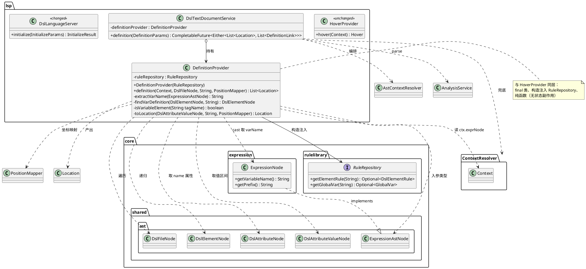
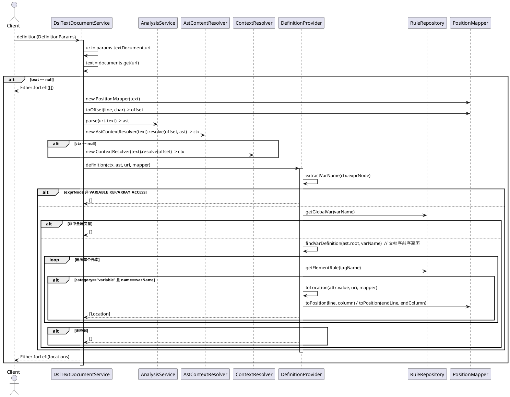

# FEAT001 LSP 变量定义跳转 — PHASE 3 设计

> 阶段：PHASE 3（设计）
> 状态：待用户确认
> 依据：`docs/development/specs/feat001-lsp-variable-definition/phase2-spec.md`

## 1. 设计目标与原则

- **只设计到接口与协作关系**，算法细节（AST 遍历序、instanceof 守卫）留待 TDD 探索
- **复用既有 provider 编排模式**：`DefinitionProvider` 与 `HoverProvider`/`CompletionProvider` 同层，由 `DslTextDocumentService` 编排
- **可测试性优先**：核心逻辑（`DefinitionProvider`）为纯函数——所有依赖经入参注入，无状态、无静态方法调用，单测无需启动 LSP server
- **最小侵入**：不改 core 层 AST 数据结构，不改 `ContextResolver.Context` 形状，不动 `resolveContext`（hover 仍用）

## 2. 模块职责（三层）

| 层 | 类 | 职责 | 变更 |
|---|---|---|---|
| **Provider 层** | `DefinitionProvider`（新建） | 纯逻辑：`ctx + ast + uri + mapper → List<Location>`。识别变量引用、遍历 AST 找 Var 声明、映射坐标 | 新建 |
| **Service 层** | `DslTextDocumentService`（改） | LSP 协议适配与编排：解析 `DefinitionParams`、取文档文本、parse AST、双层上下文解析、调 provider、包 `Either` 返回 | 加字段 + 加方法 |
| **Server 层** | `DslLanguageServer`（改） | 能力声明：`initialize` 设 `definitionProvider=true` | 加 1 行 |

## 3. 类图

## 4. 时序图

## 5. 类设计

### 5.1 DefinitionProvider（新建）

| 成员 | 可见性 | 说明 |
|---|---|---|
| `ruleRepository` | private final | 构造注入，识别 variable category 与全局变量 |
| `DefinitionProvider(RuleRepository)` | 包级 | 与 `HoverProvider` 同为包级构造 |
| `definition(Context, DslFileNode, String, PositionMapper)` | 包级 | 主入口，返回 `List<Location>` |
| `extractVarName(ExpressionAstNode)` | private | cast 到 `ExpressionNode` 取 varName；`instanceof` 守卫，非 VARIABLE_REF/ARRAY_ACCESS 返回 null |
| `findVarDefinition(DslElementNode, String)` | private | 文档序前序递归，返回首个匹配元素；无匹配返 null |
| `isVariableElement(String)` | private | `ruleRepository.getElementRule(tag).map(r -> "variable".equals(r.getCategory())).orElse(false)`，复用 `HoverProvider.isVariableTag` 同一判定 |
| `toLocation(DslAttributeValueNode, String, PositionMapper)` | private | 用 `mapper.toPosition` 构造 `Range` + `Location` |

**返回约定**：用 `List.of()` / `List.of(location)` 返回不可变列表，不返 null。

### 5.2 DslTextDocumentService（改）

| 变更 | 说明 |
|---|---|
| 字段 `volatile DefinitionProvider definitionProvider` | 与 `hoverProvider` 同模式，volatile 供 `updateRuleRepository` 重建可见 |
| `rebuildProviders` 加 `this.definitionProvider = new DefinitionProvider(ruleRepository)` | 与 `hoverProvider` 同期构造 |
| `definition(DefinitionParams)` 方法 | 实现见 SPEC-2 处理流程，**不复用 `resolveContext`**，内联 parse + 双层解析 |

### 5.3 DslLanguageServer（改）

| 变更 | 说明 |
|---|---|
| `initialize` 加 `caps.setDefinitionProvider(Either.forLeft(true))` | 与 `setHoverProvider` 同模式 |

## 6. 依赖关系

### 上游依赖（已存在，不改）

| 依赖 | 用途 |
|---|---|
| `RuleRepository` | getElementRule（category 判定）、getGlobalVar（全局变量识别） |
| `DslFileNode` / `DslElementNode` / `DslAttributeNode` / `DslAttributeValueNode` | AST 遍历与坐标 |
| `ExpressionNode` | cast 取 varName（`ExpressionAstNode` 接口无此方法） |
| `ContextResolver.Context` | 光标上下文（复用，不改其形状） |
| `AstContextResolver` / `ContextResolver` | 上下文解析（复用，不改） |
| `PositionMapper` | 坐标映射（复用，不改） |
| `AnalysisService.parse` | 取 AST（复用，不改） |
| `lsp4j` `Location`/`Range`/`Position`/`DefinitionParams`/`DefinitionLink`/`Either` | LSP 协议类型 |

### 下游消费

| 消费方 | 说明 |
|---|---|
| VS Code 客户端（`feature/clients/vscode`） | 自动生效，无需改 TS 代码——VS Code LanguageClient 默认支持 `textDocument/definition`，只要 server 声明 capability |

> **无需改 VS Code 客户端**：`extension.ts` 用的是 `LanguageClient` 通用代理，definition 由 VS Code 内核处理，server 声明即生效。

## 7. 可测试性设计

| 层 | 测试策略 | 依据 |
|---|---|---|
| `DefinitionProvider`（核心） | **纯函数单测**：`new DefinitionProvider(repo)` + 手动构造 `Context`（含 `exprNode`）+ `new AstBuilder(null).getDslAst(...)` 构造 ast + `new PositionMapper(text)`，直接断言返回 `List<Location>` | 所有依赖经入参注入，无状态、无静态方法。模式参考 `HoverProviderTest` + `AstContextResolverTest` |
| `DslTextDocumentService.definition`（编排层） | 手写 **no-op `LanguageClient` stub**（`PublishDiagnosticsParams` 入参忽略），`new DslTextDocumentService(repo)` + `setClient(stub)` + `didOpen` + 调 `definition`，断言 `Either.forLeft` 内容 | `definition` 方法本身不调 `client`，但 `didOpen` 会 `publishDiagnostics`，故需 stub。无 Mockito 依赖（build.gradle 未引入），stub 手写 |
| `DslLanguageServer.initialize` | 构造 server（`new DslLanguageServer(null, InspectionConfig.builder().build())` 或等价），调 `initialize`，断言 `capabilities.getDefinitionProvider().getLeft() == true` | 参考 `DslLanguageServer` 现有包级构造 |

### Context 手动构造（测试便利）

`ContextResolver.Context` 已暴露 6 参包级构造 `(type, tagName, word, attrName, exprNode, elementNode)`，测试可直接 `new ContextResolver.Context(ATTRIBUTE_VALUE, "Text", "foo", "x", exprNode, element)` 构造任意场景，无需解析真实文本。

## 8. 与现有架构的一致性

| 维度 | 一致性 |
|---|---|
| Provider 模式 | `DefinitionProvider` 与 `HoverProvider`/`CompletionProvider`/`SemanticTokensProvider` 同层同构（构造注入 `RuleRepository`，包级方法，final 类） |
| 编排模式 | `definition` 方法与 `hover` 方法结构对称（取 uri/text/offset → 解析 ctx → 调 provider）；唯一差异是 `definition` 内联 parse 以复用 ast |
| 坐标映射 | 复用 `PositionMapper.toPosition`，与诊断/hover 同一坐标约定（1-based line / 0-based column → LSP） |
| Capability 声明 | `setDefinitionProvider(Either.forLeft(true))` 与 `setHoverProvider`/`setCodeActionProvider` 同模式 |
| 文档序遍历 | `childElements` 由 `AstBuilder` 保证文档顺序，递归即文档序前序——与 `DslTextDocumentService.collectElementAndVarNames` 现有遍历模式一致 |

## 9. 不做的事（明确边界）

- 不引入 Mockito 或其它 mock 框架（保持 build.gradle 干净）
- 不改 `ContextResolver.Context` 形状（已满足需求）
- 不改 core 层 `ExpressionAstNode` 接口（cast 到 `ExpressionNode` 足够）
- 不改 VS Code TS 客户端（LanguageClient 通用代理自动支持）
- 不实现 references / rename / 跨文件（属后续 FEAT）

---

> **阶段切换**：PHASE 3 完成。请用户确认以上设计，确认后进入 PHASE 4（任务拆分）。
