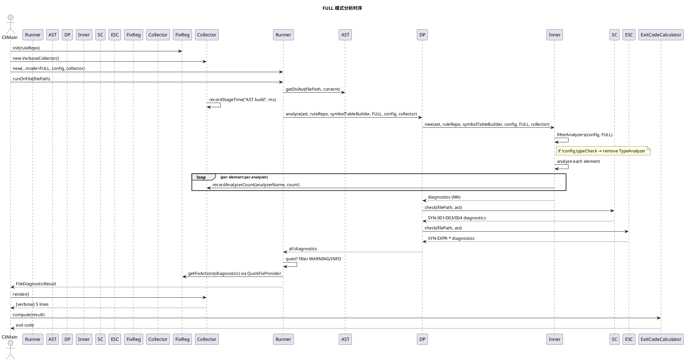
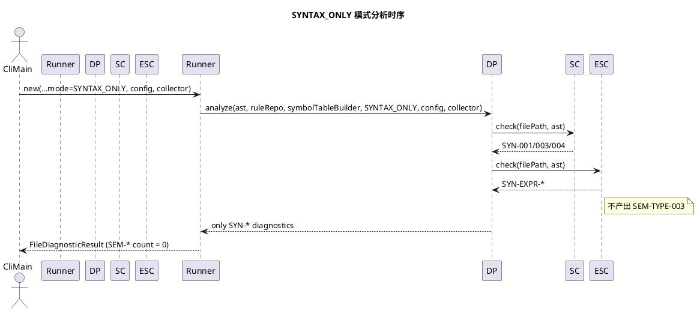
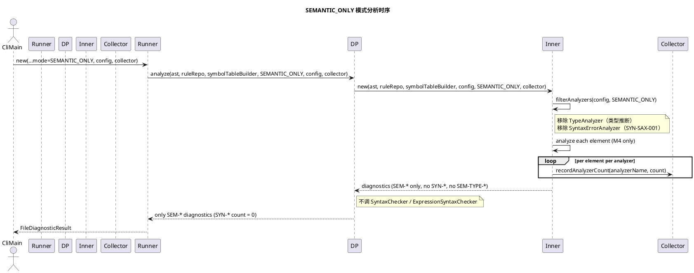
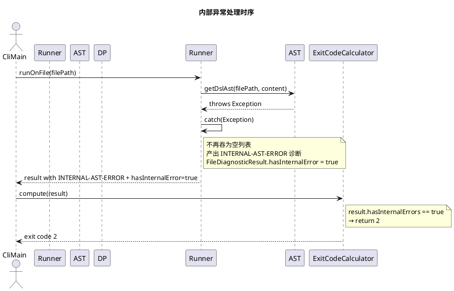

# P0 Beta 闭环修复 — PHASE 3 设计

> 阶段：PHASE 3（设计）
> 状态：待用户确认
> 依据：`docs/specs/p0-bugfix/phase2-spec.md`

## 1. 类职责与依赖

### 1.1 变更类总览

| 类 | 变更类型 | 职责 | 对应 SPEC |
|---|---|---|---|
| `DiagnosticProvider` | **接口变更** | 模式感知分析入口 | SPEC-1 |
| `DiagnosticProviderImpl` | **重构** | 按 mode 分发 M3/M4；内部过滤 TypeAnalyzer | SPEC-1, SPEC-5 |
| `DiagnosticProviderImplInner` | **重构** | 接受 config 过滤 analyzer；记录 per-analyzer 计数 | SPEC-5 |
| `ExpressionSyntaxChecker` | **修改** | 移除 SEM-TYPE-003 产出分支 | SPEC-3 |
| `BatchInspectionRunnerImpl` | **修改** | 传 mode+config+collector；quiet 过滤；异常不吞 | SPEC-1, SPEC-6, SPEC-8 |
| `FileDiagnosticResult` | **加字段** | `hasInternalError` | SPEC-8 |
| `BatchInspectionResult` | **加字段** | `hasInternalErrors` | SPEC-9 |
| `ExitCodeCalculator` | **修改** | 内部异常优先返回 2 | SPEC-9 |
| `CliMain` | **修改** | 调 FixActionRegistry.init()；verbose 输出 | SPEC-4, SPEC-7 |
| `VerboseCollector` | **新增** | 收集 5 类 verbose 信息 | SPEC-7 |
| `rule_sources.json` | **数据修正** | SYN-EXPR-* category SEM→SYN | SPEC-2 |

### 1.2 新增类

#### VerboseCollector

```
职责：在分析过程中收集 verbose 输出所需的 5 类信息
依赖：无（纯数据收集器，被 DiagnosticProviderImpl 和 TypeAnalyzer 填充）
```

```java
public class VerboseCollector {
    void recordStageTime(String stage, long ms);      // SPEC-7-A
    void recordAstStats(int elements, int attrs, int exprs);  // SPEC-7-B
    void recordSymbolStats(int globals, int userVars, int dups);  // SPEC-7-C
    void recordAnalyzerCount(String analyzerName, int count);     // SPEC-7-D
    void recordTypeInference(String attrDesc, String inferred, String expected, boolean match);  // SPEC-7-E
    String render();  // 输出 5 类信息为 [verbose] 前缀文本
}
```

**设计决策**：使用 VerboseCollector 而非返回值附加 metadata，因为：
- DI 友好（可注入 mock 做测试）
- 不改变 `List<Diagnostic>` 返回类型（减少对现有测试的冲击）
- 非 verbose 模式下传 null 或 no-op 实例，零开销

### 1.3 接口设计

#### DiagnosticProvider（接口变更）

```java
public interface DiagnosticProvider {
    List<Diagnostic> analyze(
        DslFileNode ast,
        RuleRepository ruleRepo,
        SymbolTableBuilder symbolTableBuilder,
        PipelineMode mode,          // 新增
        InspectionConfig config,    // 新增
        VerboseCollector collector  // 新增（nullable）
    );
}
```

**设计决策**：mode + config + collector 作为参数传入而非构造器注入，因为 DiagnosticProviderImpl 当前是无状态实例（CliMain 每次 run 创建新实例），参数传入避免实例字段的生命周期管理。

#### DiagnosticProviderImpl（重构）

```java
public class DiagnosticProviderImpl implements DiagnosticProvider {
    @Override
    public List<Diagnostic> analyze(DslFileNode ast, RuleRepository ruleRepo,
                                    SymbolTableBuilder symbolTableBuilder,
                                    PipelineMode mode, InspectionConfig config,
                                    VerboseCollector collector) {
        // 分发逻辑（详见时序图）
    }
}
```

**协作关系**：
- `mode == SYNTAX_ONLY` → 只调 `SyntaxChecker.check()` + `ExpressionSyntaxChecker.check()`
- `mode == SEMANTIC_ONLY` → 只调 `DiagnosticProviderImplInner`（过滤 TypeAnalyzer + SyntaxErrorAnalyzer）
- `mode == FULL` → 调 `DiagnosticProviderImplInner`（过滤 TypeAnalyzer if !config.typeCheck）+ `SyntaxChecker` + `ExpressionSyntaxChecker`

## 2. 类图

```plantuml
@startuml
title P0 修复后核心分析管线类图

interface DiagnosticProvider {
    +analyze(ast: DslFileNode, ruleRepo: RuleRepository, symbolTableBuilder: SymbolTableBuilder, mode: PipelineMode, config: InspectionConfig, collector: VerboseCollector): List<Diagnostic>
}

class DiagnosticProviderImpl {
    -analyzeSyntax(ast, ruleRepo): List<Diagnostic>
    -analyzeSemantic(ast, ruleRepo, symbolTableBuilder, config, collector): List<Diagnostic>
}
DiagnosticProviderImpl ..|> DiagnosticProvider

class DiagnosticProviderImplInner {
    -List<DslAnalyzer> filteredAnalyzers
    +getDiagnostics(): List<Diagnostic>
    -filterAnalyzers(config, mode): List<DslAnalyzer>
}
DiagnosticProviderImplInner --> VerboseCollector : records per-analyzer counts

class SyntaxChecker {
    +check(filePath: String, fileNode: DslFileNode): List<Diagnostic>
}

class ExpressionSyntaxChecker {
    +check(filePath: String, fileNode: DslFileNode): List<Diagnostic>
}
note right of ExpressionSyntaxChecker: 移除 SEM-TYPE-003 产出分支

class VerboseCollector {
    -stageTimes: Map<String, Long>
    -astStats: int[3]
    -symbolStats: int[3]
    -analyzerCounts: Map<String, Integer>
    -typeTraces: List<String>
    +recordStageTime(stage, ms): void
    +recordAstStats(elements, attrs, exprs): void
    +recordSymbolStats(globals, userVars, dups): void
    +recordAnalyzerCount(name, count): void
    +recordTypeInference(attrDesc, inferred, expected, match): void
    +render(): String
}

class BatchInspectionRunnerImpl {
    -analyzeFile(filePath, content): FileDiagnosticResult
}
BatchInspectionRunnerImpl --> DiagnosticProvider : delegates analyze()
BatchInspectionRunnerImpl --> VerboseCollector : creates if verbose

class FileDiagnosticResult {
    +filePath: String
    +diagnostics: List<Diagnostic>
    +fixActions: List<FixAction>
    +hasInternalError: boolean
}
note right of FileDiagnosticResult
  新增 hasInternalError
end note

class BatchInspectionResult {
    +hasInternalErrors: boolean
}
note right of BatchInspectionResult
  新增 hasInternalErrors
end note

class ExitCodeCalculator {
    +compute(result: BatchInspectionResult): int
}
note right of ExitCodeCalculator
  hasInternalErrors → 2
  errorCount > 0 → 1
  else → 0
end note

class CliMain {
    +run(args: String[]): int
}
CliMain --> FixActionRegistry : init(ruleRepo)
CliMain --> VerboseCollector : creates + reads render()
CliMain --> ExitCodeCalculator : compute(result)

class FixActionRegistry {
    +init(ruleRepo: RuleRepository): void
}

@enduml
```



## 3. 时序图

### 3.1 FULL 模式（默认全量检查）



### 3.2 SYNTAX_ONLY 模式



### 3.2b SEMANTIC_ONLY 模式



### 3.3 异常处理时序（P0-4）



## 4. 模块职责边界

| 模块 | 职责（P0 后） | 不负责 |
|---|---|---|
| CliMain | 调 FixActionRegistry.init()；创建 VerboseCollector + Runner（传 mode/config/collector）；verbose 输出 render()；退出码计算 | 具体诊断逻辑、分析过程 |
| DiagnosticProviderImpl | 按 mode 分发 M3/M4；TypeAnalyzer 过滤 | Quick Fix 生成 |
| DiagnosticProviderImplInner | M4 analyzer 遍历 + per-analyzer 计数 | M3 语法检查 |
| SyntaxChecker | SYN-001/003/004 | SEM-* 任何规则 |
| ExpressionSyntaxChecker | SYN-EXPR-* only（不产 SEM-*） | SEM-TYPE-003（已移除） |
| BatchInspectionRunnerImpl | 管线编排 + quiet 过滤 + 异常不吞 | 具体诊断逻辑 |
| VerboseCollector | 收集 + 渲染 5 类 verbose 信息 | 分析逻辑本身 |
| FixActionRegistry | 生产初始化 generator 注册表 + generator 查询 | 修复执行 |
| ExitCodeCalculator | 退出码计算（2/1/0） | 诊断产出 |
| FileDiagnosticResult | 单文件诊断 + 修复 + 内部异常标记（数据类） | — |
| BatchInspectionResult | 批量结果汇总 + 内部异常聚合标记（数据类） | — |

## 5. 可测试性设计

| 设计决策 | 目的 |
|---|---|
| DiagnosticProvider 接口接受 mode+config+collector 参数 | 可注入不同 mode/config 测试各模式 |
| VerboseCollector 独立类 | 可注入 mock collector 验证记录调用 |
| 异常产出为 Diagnostic 对象（INTERNAL-*-ERROR） | 可通过 golden 匹配验证 |
| quiet 过滤在 Runner 层（不在 ReportExporter） | counts 与输出一致，测试只需验证 Runner 输出 |
| Filter 在 DiagnosticProviderImpl 内部（不改 AnalyzerRegistry） | 不引入 static 类的 config 依赖，P2 再重构 |
| FileDiagnosticResult.hasInternalError 字段 | 测试可直接断言该字段 |
| FixActionRegistry.init() 在 CliMain 生产路径调用（非测试 setup） | CliMainE2ETest 跑 `--format json` 后解析 JSON 断言 suggestedFixes 非空，验证生产初始化生效 |
| suggestedFixes 纳入 golden 匹配（可选 minFixCount） | golden schema 加可选 `minFixCount` 字段：对有此字段的 expected diagnostic，GoldenMatcher 校验 `actual.suggestedFixes.size() >= minFixCount`。向后兼容（不写则跳过）。捕获"registry 未 init"或"generator 未注册"导致的 fix 缺失。fix **内容**正确性由单元测试（58 个 FixActionGenerator 测试）覆盖，golden 只校验 fix **存在性** |
| rule_sources.json 为 classpath 资源（非硬编码） | 加载后可通过 `RuleRepository.getRuleSource("SYN-EXPR-001").getCategory()` 断言为 `"SYN"`，验证 SPEC-2 |
| ExpressionSyntaxChecker.check() 输出为纯 List<Diagnostic> | 单元测试可直接断言输出中所有 ruleId 均以 `SYN-EXPR-` 前缀开头，无 `SEM-*`，验证 SPEC-3 |
| ExitCodeCalculator.compute() 接受 BatchInspectionResult（含 hasInternalErrors） | 单元测试可构造 hasInternalErrors=true 的 result 断言返回 2，构造 hasInternalErrors=false+errorCount>0 断言返回 1，验证 SPEC-9 |

## 6. 不涉及的设计（留给 TDD 探索）

- VerboseCollector 内部如何计时（System.nanoTime vs currentTimeMillis）
- DiagnosticProviderImplInner 的 analyzer 过滤用 stream 还是 if-else
- CliMain 的 verbose 文本格式细节
- 异常诊断的消息文本措辞

---

> **阶段切换**：PHASE 3 完成。请用户确认以上设计，确认后进入 PHASE 4（任务拆分）。
